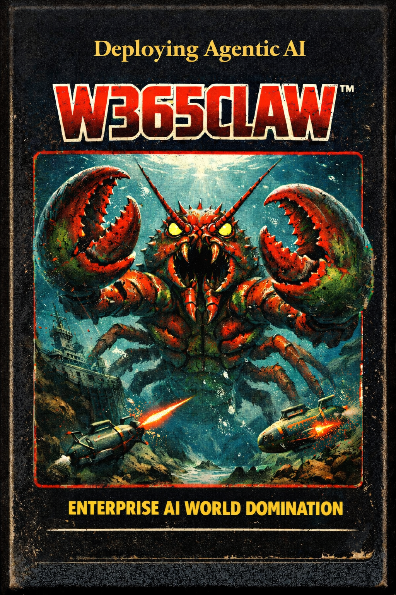
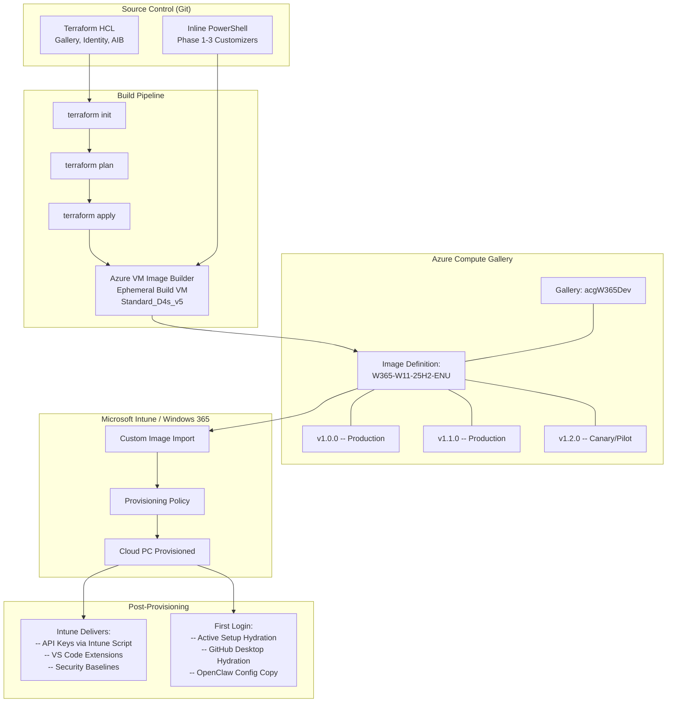
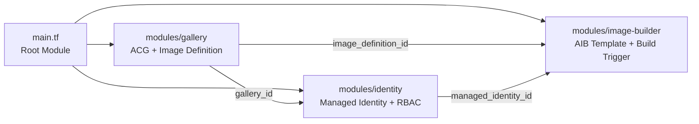
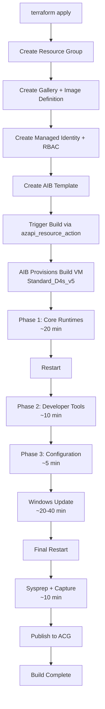
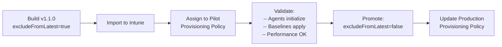
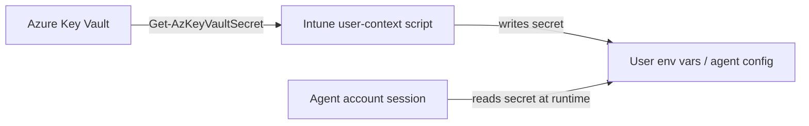
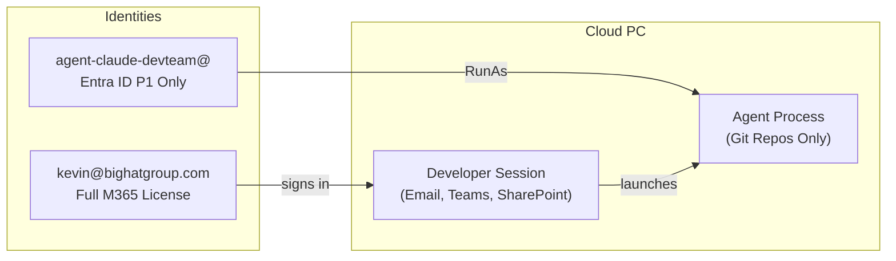

# 使用 Windows 365 部署 OpenClaw：自定义镜像工程与部署实践指南

**作者：** Kevin Kaminski，Microsoft MVP（Windows 365 方向）

---

## 关于本书

本书是一部面向 IT 管理员和平台工程师的全面技术指南，帮助他们将 AI 编码代理（特别是 OpenClaw 和 Claude Code）部署到 Windows 365 Cloud PC 上，使用通过 Azure Compute Gallery（Azure 计算库）和 Azure VM Image Builder（Azure 虚拟机镜像构建器）构建的自定义镜像。虽然 OpenClaw 是核心产品和主要关注点，但本书也涵盖了 Claude Code、OpenAI Codex CLI 和 OpenSpec 作为 AI 编码代理生态系统中的互补工具，每个工具都有其自身的安装、配置和安全注意事项。本书涵盖了从通过 Terraform 进行基础设施配置、到构建管道、到配置后操作、再到在企业环境中控制自主 AI 代理所需的安全架构的全部内容。

本书的受众是技术人员。如果你在寻找高层概述，这本书不适合你。这是当你需要理解以下问题时应该阅读的书：为什么 Node.js MSI 安装程序不会更新 PowerShell 会话的 PATH，为什么 GitHub Desktop 使用"水合"（hydration）机制而非传统安装程序，以及为什么让 AI 代理使用你的主 Entra ID 身份运行是一个架构设计上的失败。

### 出版说明

本书设计为既可作为独立指南使用，也可作为 **[W365Claw 代码仓库](https://github.com/kkaminsk/W365Claw)** 的配套参考。该仓库包含本书中引用的完整 Terraform 模块、PowerShell 脚本和配置模板。该仓库在出版时应是公开的，且其代码与本书中展示的代码保持一致。

有些章节包含用于架构和工作流可视化的 Mermaid 图表。这些图表可在 GitHub、VS Code 和大多数现代 Markdown 阅读器中原生渲染。如果你的阅读环境不支持 Mermaid，图表内容在周围的文本中有描述。

### 如何使用本书

- 如果你是 Windows 365 或自定义镜像工程的新手，请阅读第一部分。
- 如果你已经在运行 Windows 365 并且需要镜像管道的详细信息，请跳至第二部分和第三部分。
- 在构建和部署过程中，将第四部分和第五部分作为操作手册使用。
- 当你需要论证、实施或审计安全控制时，请使用第六部分。
- 在执行构建时，保持第七部分作为参考随时查阅。

### 约定与标记

- 命令以围栏代码块的形式出现，可直接复制使用。
- 路径为 Windows 风格，除非另有说明。
- "构建工作站"指的是用于 Azure VM Image Builder 运行的临时虚拟机。
- "代理帐户"指的是 AI 代理使用的专用 Entra ID 身份。
- 代码示例与 W365Claw 仓库保持同步。

### 前提条件与假设

- 拥有 Windows 365 许可和 Microsoft Intune 的 Azure 租户。
- 具备创建应用注册、托管标识和组的 Entra ID 权限。
- 具备订阅级别的访问权限（Owner 或 Contributor），以及用于镜像导入和策略变更的 Intune 管理员权限。
- 能够创建 Azure Compute Gallery 资源和 Azure VM Image Builder 模板。
- 一台具有出站互联网访问权限的可信构建工作站，用于下载安装程序和 npm 包。

### 版本控制与偏差

本指南的内容截至 2026 年 2 月 25 日准确有效。Microsoft 服务、市场镜像和第三方工具变化频繁。在进行生产变更之前，请在相关仓库和发行说明中验证版本、定价和功能状态。

---

## 目录

- [第一部分：基础](#part-i-foundation)
  - [第 1 章：引言](#chapter-1-introduction)
  - [第 2 章：架构概述](#chapter-2-architecture-overview)
  - [第 3 章：架构边界](#chapter-3-the-architectural-boundary)
- [第二部分：基础设施](#part-ii-infrastructure)
  - [第 4 章：面向 Windows 365 的 Azure Compute Gallery](#chapter-4-azure-compute-gallery-for-windows-365)
  - [第 5 章：身份与 RBAC](#chapter-5-identity-and-rbac)
  - [第 6 章：Terraform 解决方案架构](#chapter-6-terraform-solution-architecture)
- [第三部分：构建管道](#part-iii-the-build-pipeline)
  - [第 7 章：准备构建工作站](#chapter-7-preparing-the-build-workstation)
  - [第 8 章：阶段 1 -- 核心运行时](#chapter-8-phase-1--core-runtimes)
  - [第 9 章：阶段 2 -- 开发者工具](#chapter-9-phase-2--developer-tools)
  - [第 10 章：阶段 3 -- 配置与策略](#chapter-10-phase-3--configuration-and-policy)
  - [第 12 章：Windows Update 与 Sysprep](#chapter-12-windows-update-and-sysprep)
  - [第 13 章：供应链完整性](#chapter-13-supply-chain-integrity)
- [第四部分：运维](#part-iv-operations)
  - [第 14 章：构建镜像](#chapter-14-building-the-image)
  - [第 15 章：验证检查清单](#chapter-15-verification-checklist)
  - [第 16 章：镜像版本控制与分阶段部署](#chapter-16-image-versioning-and-staged-rollout)
  - [第 17 章：导入到 Windows 365](#chapter-17-importing-into-windows-365)
  - [第 18 章：重新配置的现实](#chapter-18-the-reprovisioning-reality)
  - [第 19 章：拆除构建资源](#chapter-19-tearing-down-build-resources)
  - [第 20 章：版本保留与成本管理](#chapter-20-version-retention-and-cost-management)
  - [第 21 章：CI/CD 管道集成](#chapter-21-cicd-pipeline-integration)
- [第五部分：配置后操作](#part-v-post-provisioning)
  - [第 22 章：首次登录体验](#chapter-22-first-login-experience)
  - [第 23 章：API 密钥交付](#chapter-23-api-key-delivery)
  - [第 24 章：VS Code 扩展](#chapter-24-vs-code-extensions)
  - [第 25 章：无需重新配置即可更新代理](#chapter-25-agent-updates-without-reprovisioning)
- [第六部分：安全](#part-vi-security)
  - [第 26 章：代理威胁模型](#chapter-26-the-agent-threat-model)
  - [第 27 章：身份架构 -- 辅助用户的必要性](#chapter-27-identity-architecture--the-secondary-user-imperative)
  - [第 28 章：加固 Claude Code](#chapter-28-hardening-claude-code)
  - [第 29 章：加固 OpenClaw](#chapter-29-hardening-openclaw)
  - [第 30 章：网络隔离](#chapter-30-network-segmentation)
  - [第 31 章：终端保护](#chapter-31-endpoint-protection)
  - [第 32 章：Intune 配置文件](#chapter-32-intune-configuration-profiles)
  - [第 33 章：监控与取证](#chapter-33-monitoring-and-forensics)
- [第七部分：参考](#part-vii-reference)
  - [第 34 章：故障排除与常见问题](#chapter-34-troubleshooting-and-faq)
  - [第 35 章：PowerShell 脚本](#chapter-35-powershell-scripts)
  - [第 36 章：Windows 365 镜像要求检查清单](#chapter-36-windows-365-image-requirements-checklist)
  - [第 37 章：组件汇总矩阵](#chapter-37-component-summary-matrix)

- [附录：运维快速参考](#appendix-operational-quick-reference)
- [附录：反馈与勘误](#appendix-feedback-and-errata)

---

# 第一部分：基础

---

## 第 1 章：引言

### 为什么在 Windows 365 上部署 AI 代理

以 OpenClaw 和 Claude Code 为代表的 AI 编码代理的出现，正在重塑软件开发人员的工作方式。这些工具不仅仅是自动补全代码行；它们读取代码仓库、执行命令、管理文件并推理架构。实际上，它们是驻留在用户机器内部的自主协作者。

对于运行 Windows 365 Cloud PC 的组织来说，大规模部署这些代理带来了一个全新的挑战：如何构建一个自定义操作系统镜像，使其预装、预配置 AI 代理，并在开发人员登录时即刻可用？如何以可重复、安全、版本受控且与 Windows 365 特定导入要求兼容的方式做到这一点？

本书从头到尾回答了这个问题。

### 为什么选择 Windows 365

在深入探讨"如何做"之前，有必要先谈谈"为什么"。为什么特别选择 Windows 365？为什么不用传统虚拟机、本地工作站或 Linux 容器？

答案是 Windows 365 Cloud PC 处于三个难以同时满足的需求交汇处：**完整的开发者体验**、**企业安全态势**和**运维弹性**。没有其他平台能在不做重大妥协的情况下同时提供这三者。

#### 完整的 Windows 桌面体验

Cloud PC 不是瘦客户端、沙盒容器或基于浏览器的 IDE。它是 Windows 11 Enterprise 的完整实例，在 Azure 中的专用计算资源上运行，具有持久磁盘、完整的用户配置文件以及与物理工作站相同的应用兼容性。开发人员通过 Windows 365 Web 门户、Windows App 或远程桌面客户端连接，获得的桌面与物理机器的行为完全一致。

这对 AI 代理部署很重要，因为像 OpenClaw 和 Claude Code 这样的代理不是简单的 CLI 工具；它们与文件系统交互、生成进程、管理 Git 仓库、调用 npm 和 Python，以及编排后台服务。它们需要一个具有真正进程隔离、真正环境变量和真正文件 I/O 的真实操作系统。Windows 365 Cloud PC 正好提供了这些，并以托管服务的形式交付。

开发者体验与本地机器无异。键盘快捷键正常工作。剪贴板重定向正常工作。多显示器正常工作。本地外设可以重定向。不存在"在云中表现不同"的附加条件。

#### 零信任设计

每台 Windows 365 Cloud PC 都是 **Microsoft Entra ID 加入**的。没有域控制器，没有 VPN 集中器，没有需要防御的网络边界。身份就是控制平面。

身份验证通过 Entra ID 进行，完整支持条件访问（Conditional Access）：你可以要求多因素身份验证、强制设备合规状态、将登录限制在特定位置或 IP 范围内，以及阻止传统身份验证协议。每次登录都有日志。每个令牌都有有效期。每个会话都可以撤销。

对于 AI 代理工作负载，这种架构尤其强大，因为你可以将 Cloud PC 放置在 **专用的、隔离的 Azure 网络连接**上——一个无法访问企业文件共享、无法连接生产数据库、也没有横向移动到其他工作负载路径的虚拟网络段。代理的网络边界由 Azure 网络规则定义，而非寄希望于防火墙设备能拦截一切。

结合第 2 章描述的专用代理帐户模型和第 30 章详述的网络隔离方案，这创建了一个真正的零信任部署：代理使用限定范围的身份进行认证，在隔离网络上运行，受其无法修改的安全策略约束，并生成其无法删除的审计日志。

#### 托管、补丁和策略治理

Windows 365 Cloud PC 通过 Microsoft Intune 进行管理。这意味着适用于你物理设备群的同一套安全基线、合规策略、配置文件和终端保护同样适用于你的 Cloud PC——具有相同的一致性和相同的报告能力。

操作系统通过 Windows Update for Business 打补丁，按你控制的计划进行，并通过 Intune 进行合规报告。不存在"开发人员禁用了 Windows Update"的场景。不存在"我们忘记给构建服务器打补丁"的场景。Cloud PC 是一个托管终端，就是这样。

具体到 AI 代理镜像，这意味着你可以强制应用控制策略（限制代理可以运行哪些可执行文件）、限制 PowerShell 执行策略、使用代理特定的检测规则配置 Defender for Endpoint，以及监控异常行为——所有这些都通过你已经用于管理其余资产的同一个 Intune 控制台完成。

#### 快照与灾难恢复

Windows 365 包含**时间点还原**功能：保存和恢复 Cloud PC 快照的能力。如果代理损坏了工作区、安装了破坏性内容，或进入了难以调试的状态，你可以在几分钟内回滚到已知良好的快照。这不是完整的虚拟机备份和恢复流程；它是一项可从 Intune 管理中心或通过 Windows 365 API 访问的平台原生功能。

对于需要地理弹性的组织，Windows 365 支持**跨区域灾难恢复**。在 Canada Central 配置的 Cloud PC 可以故障转移到 Canada East（或任何其他支持的区域对），无需构建自定义复制基础设施即可提供业务连续性。故障转移由平台管理：无需运维手册、无需 DNS 切换、无需存储帐户同步。

#### 跨区域灾难恢复与自定义镜像

配置 Windows 365 跨区域灾难恢复时，你的自定义镜像必须在故障转移区域可用。这意味着：

1. **将 ACG 镜像版本复制**到灾难恢复区域，使用手动 Azure CLI 复制（`az sig image-version update`），因为 Terraform 模块目前仅发布到构建区域（参见第 20 章）。
2. **在 Intune 中维护一个单独的导入**，指向复制后的镜像版本，用于灾难恢复区域。

在故障转移事件期间，Windows 365 使用配置策略在灾难恢复区域重新配置 Cloud PC。如果策略引用的自定义镜像在灾难恢复区域不可用，配置将失败。请通过将镜像版本复制到所有有 Azure 网络连接的区域来为此做好准备。

开发人员的数据通过 Git（主要）和 OneDrive（如果有许可）保留。Cloud PC 本身在设计上是无状态的；在灾难恢复区域重新配置会从同一镜像生成相同的环境。

综合来看，这些能力意味着运行 AI 代理的 Cloud PC 不是一个脆弱的、不可替代的环境。它是一个可丢弃的、可重现的、可恢复的计算单元，由平台级别的弹性能力支撑。如果出了问题，你从快照恢复。如果区域宕机，平台自动故障转移。如果镜像需要更新，你构建一个新版本并重新配置。Cloud PC 是"牲畜"而非"宠物"——但是带有安全网的"牲畜"。

#### 经济考量

还有一个实际的经济考虑因素。Windows 365 Cloud PC 在 Azure 计算资源上运行，按月付费，按用户计算，费用可预测。不会因为周末忘记关闭虚拟机而收到意外账单。不需要规划开发团队需要多少 D4s_v5 实例。许可很简单：每个用户一个 Windows 365 Enterprise 许可证，按工作负载配置大小（对于 AI 代理工作流，推荐配置为 4 vCPU / 16 GB）。

与配置和管理传统 Azure 虚拟机相比，运维开销大幅降低。无需操作系统磁盘管理，无需可用性集配置，无需 NSG 规则调试，不会出现"谁把 RDP 端口开着了"的事故。平台处理计算生命周期；你只需处理镜像和策略。

### 解决方案成本估算

对于评估总成本的决策者，以下是一个 10 名开发人员团队的代表性月度估算。每个用户和每个代理帐户都需要**最低基础许可证堆栈：Entra ID P1 + Windows 365 Enterprise + Intune P1**。如果用户需要 Microsoft 365 生产力服务（Exchange、Teams、SharePoint、Office），一个完整的 **Microsoft 365 E3** 许可证可替代独立的 Entra P1 和 Intune P1（两者都包含在 E3 中）。身份模型概述参见第 2 章，完整安全理由参见第 27 章。

- **选项 1（开发者自己的身份）：** 每位开发人员获得一台 Cloud PC，配备 M365 E3（假设这是他们的主要设备）。代理在他们的常规企业帐户下运行。最简单，但代理继承开发人员的全部权限，其行为在审计日志中与人类行为无法区分。
- **选项 2（专用代理 Cloud PC，最低许可证）：** 每位开发人员获得第二台用于代理工作的 Cloud PC，使用专门构建的代理帐户登录。代理帐户携带基础许可证堆栈（Entra P1 + W365 + Intune P1）并配置自己的 Cloud PC。无需 M365 E3（不需要电子邮件、Teams 或 Office 应用）。完全的会话和身份隔离。
- **选项 3（专用代理 Cloud PC，完整 M365 许可证）：** 与选项 2 相同，但代理帐户携带完整 M365 E3 许可证，适用于代理需要在自己的身份下访问 Microsoft 365 服务（Graph API、Teams、SharePoint）的场景。

| 组件 | 每用户月费用（美元） | 适用范围 |
|---|---|---|
| Microsoft 365 E3（开发者） | $36 x 10 = **$360** | 所有选项（包含 Entra P1、Intune P1） |
| Windows 365 Enterprise（4 vCPU / 16 GB，开发者） | $66 x 10 = **$660** | 所有选项（每位开发者一台 Cloud PC） |
| Entra ID P1（代理帐户，独立） | $6 x 10 = **$60** | 选项 2（代理身份） |
| Intune P1（代理帐户，独立） | $8 x 10 = **$80** | 选项 2（代理 Cloud PC 管理） |
| Windows 365 Enterprise（代理 Cloud PC） | $66 x 10 = **$660** | 选项 2 和 3（第二台 Cloud PC） |
| Microsoft 365 E3（代理帐户） | $36 x 10 = **$360** | 仅选项 3（替代独立 Entra P1 + Intune P1） |
| ACG 镜像存储（3 个版本，1 个区域） | **$5--15** | 所有选项 |
| AIB 构建计算（每月 1 次构建，约 2 小时） | **$2--5** | 所有选项 |
| AI API 使用费 | **因情况而异** | 所有选项；取决于使用量和模型 |
| | | |
| **合计（选项 1：开发者自己的身份）** | **约 $1,040/月** | 每位开发者 M365 E3 + W365 |
| **合计（选项 2：专用代理 PC，最低配置）** | **约 $1,840/月** | 每个代理增加 Entra P1 + W365 + Intune P1 |
| **合计（选项 3：专用代理 PC，完整 M365）** | **约 $2,060/月** | 每个代理增加 W365 + M365 E3 |

主要成本是 Windows 365 许可证。镜像构建基础设施（ACG、AIB）的费用可以忽略不计。选项 2 以最低增量成本提供完整的会话和身份隔离，使用基础许可证堆栈而无需 M365 E3。选项 3 为代理需要自己访问 Microsoft 365 服务的场景增加了 M365 E3。请根据你的威胁模型评估权衡取舍；第 27 章提供了完整的安全理由。

### 配套参考：Windows 365 概念架构

本书专注于为 AI 代理工作负载构建自定义镜像。它不打算涵盖 Windows 365 部署的全部范围：用户角色、Microsoft 365 Apps 服务、Teams 优化、Windows Autopatch 配置、监控仪表板，或生产 Cloud PC 环境中涉及的其他众多决策。

为此，有一份配套文档：**[Windows 365 Cloud PC 部署概念架构](https://github.com/kkaminsk/W365ConceptualReferenceArchitecture)**，这是一份由 Kevin Kaminski（Microsoft MVP）编写的 98 页参考设计文档。它涵盖了企业 Cloud PC 部署的完整端到端架构：

- **云原生身份**：无本地依赖的 Entra ID 加入
- **自动化配置**：基于组成员资格的配置策略
- **统一管理**：Intune 作为唯一管理权限机构
- **零信任安全**：条件访问、设备合规性、安全基线
- **应用策略**：现代应用交付、Win32 打包、Company Portal
- **服务**：Windows Autopatch、Microsoft 365 Apps 更新、Edge 和 Teams 服务
- **监控**：内置报告和 Azure Monitor 集成

该参考架构假设标准的信息工作者角色和基线应用堆栈（Microsoft 365 Apps、Edge、Company Portal）。本书将该应用堆栈替换为开发者工具链（Node.js、Python、Git、VS Code、OpenClaw、Claude Code），并添加了交付它所需的自定义镜像工程管道，但底层平台架构是相同的。参考架构中描述的网络模型、身份模型、安全态势和管理平面直接适用于 AI 代理 Cloud PC。

将参考架构视为地基，将本书视为在其之上建造的专用翼楼。如果你是 Windows 365 新手，请先阅读参考架构。当你准备好构建镜像时，再阅读本书。

PDF 可在 [GitHub 仓库](https://github.com/kkaminsk/W365ConceptualReferenceArchitecture/blob/main/W365Design1.0-Signed.pdf) 获取，全彩精装版可在 [Lulu.com](https://www.lulu.com/shop/kevin-kaminski/windows-365-cloud-pc-deployment-conceptual-architecture/hardcover/product-2m85w9r.html) 购买。还有一个交互式 [Windows 365 Design Advisor](https://chatgpt.com/g/g-6961758ef3c88191837503959cf2a48a-windows-365-design-advisor) ChatGPT 配套工具可用于引导式问答。

### 本书的目标读者（以及非目标读者）

本书面向**企业 IT 部门**，帮助他们将 AI 代理部署到由五人、五十人或五百人组成的开发团队的 Cloud PC 上，这些 Cloud PC 在统一的安全态势下管理，具有集中的镜像构建、Intune 策略强制执行和可审计的身份控制。

如果你是一名希望在 Cloud PC 上运行 OpenClaw 的个人开发者，Windows 365 是一个可行的平台。你可以获得一个持久的、强大的云端 Windows 桌面，随时随地都可以访问。但本书描述的大部分内容（Terraform 管理的基础设施、Azure Compute Gallery 管道、Intune 安全基线、网络隔离、专用代理身份）对于单个用户来说是严重过度工程化的。你最好直接配置一台 Windows 365 Business Cloud PC，手动安装 Node.js 和 OpenClaw，然后跳过其他 35 章。

本书中的复杂性存在是因为企业部署有企业需求：跨数十台机器的可重复镜像构建、构建镜像的人和使用镜像的人之间的职责分离、每台 Cloud PC 都已打补丁并受策略管理的合规证据，以及当自主代理做出意外操作时限制爆炸半径的控制保证。当你只有一台自己的机器时，这些都不重要。

如果你管理的是一个设备群，请继续阅读。如果你管理的只是你自己，安装 OpenClaw 然后开始工作吧。

### 挑战

技术挑战具有欺骗性的复杂度。Azure VM Image Builder 以 **NT AUTHORITY\SYSTEM** 身份运行脚本，这是一个具有完整机器访问权限但没有用户配置文件、没有 HKCU 注册表配置单元、没有浏览器会话且没有交互式桌面的帐户。大多数开发者工具在设计时假设存在交互式用户 Shell。它们默认将二进制文件安装到 `%APPDATA%`，将配置存储在 `~/.config`，并依赖基于浏览器的 OAuth 流程进行身份验证。

当你在无头构建管道中以 Local System 身份运行这些工具时，会出现以下几种失败模式：

1. **环境变量作用域隔离。** 对系统 PATH 的修改写入注册表，但不会传播到当前运行的 PowerShell 进程，导致后续的 `npm install` 等命令失败。
2. **配置文件重定向。** 面向"当前用户"的安装程序会填充系统配置文件（`C:\Windows\System32\config\systemprofile`），创建一个对实际开发人员不可见的"幽灵"安装。
3. **交互式阻塞。** 首次运行体验（如 `openclaw onboard` 向导或 `claude login` 命令）会阻塞执行直到收到用户输入。在无头构建中，这些命令会无限期挂起，直到 AIB 超时将其终止。

本书教你如何应对所有这些限制。

### 目标读者

本书面向以下读者：

- **Cloud PC 管理员**，管理 Windows 365 配置策略和自定义镜像
- **平台工程师**，为 AI 构建和维护开发者工具链镜像
- **DevOps 从业者**，需要理解镜像即代码的工作流程
- **安全架构师**，必须评估在企业终端上运行自主 AI 代理的风险特征

你应该熟悉 PowerShell、Terraform 和 Azure 管理。熟悉 Windows 365 配置概念会有帮助但不是必需的，本书会在相关概念出现时进行解释。

### 我们正在构建什么

一名软件开发人员获得一台新的 Windows 365 Cloud PC。他们登录后看到的桌面已经具备：

- **OpenClaw** 在配置后通过用户上下文交付；网关在安装后首次登录时启动，开发人员连接其 Anthropic API 密钥即可立即开始工作。
- **Claude Code** 在配置后通过 npm 在用户上下文中交付；CLI 在任何终端中都可用，并受企业管理设置的约束，这些设置控制权限和允许的 MCP 服务器。
- **OpenAI Codex CLI** 在配置后在用户上下文中交付，适用于同时使用 OpenAI 模型和 Anthropic 模型的开发人员。
- **Visual Studio Code**（系统安装），预装了 GitHub Copilot 和上下文菜单集成。
- **Node.js 22+**、**Python 3.14+**、**Git**、**GitHub Desktop**、**Azure CLI** 和 **PowerShell 7**，完整的运行时和工具基础，机器范围安装，使每个用户无需管理员权限即可访问。

无需手动设置。无需"先运行这个脚本"。无需等待 Intune 在 45 分钟内推送 15 个应用。繁重的工作在镜像中完成；个性化在登录时发生。

> **注意 -- 关于 Windows Subsystem for Linux (WSL)：** OpenClaw 的官方安装文档推荐 Windows Subsystem for Linux 作为在 Windows 上安装 OpenClaw 的途径。本书有意不遵循该建议。WSL 在 Windows 主机内引入了一个运行在轻量级虚拟机中的完整 Linux 发行版——这种配置为企业环境带来了安全模糊性。关于 Intune 策略强制执行边界、Defender for Endpoint 对 WSL 进程的可见性、网络隔离的适用性以及审计日志完整性的问题，在大多数企业安全框架中尚未得到充分解决。本书选择通过 Node.js 和 npm 在 Windows 上原生安装 OpenClaw，而非将这种复杂性叠加到部署中，这样代理完全处于 Intune、Defender 和条件访问以完整保真度运行的 Windows 安全边界内。

---

## 第 2 章：架构概述

### 端到端架构

该解决方案跨越四个层次：基础设施定义、镜像构建、Windows 365 导入和配置后操作。




### 四个层次

**第 1 层：源代码管理。** 所有基础设施和构建逻辑都存储在 Git 中。Terraform 配置定义了 Azure Compute Gallery、托管标识、RBAC 分配和 AIB 模板。构建脚本是 Terraform HCL 中的内联 PowerShell，不依赖外部存储帐户或 Blob。变更可追踪、可审查、有版本控制。

> **提示：为什么使用内联脚本？** 将 PowerShell 存储在外部文件中（Azure Blob Storage、Git 原始 URL）可以减少 HCL 文件大小，但会引入外部依赖：如果存储帐户配置错误、SAS 令牌过期或 Git URL 更改，构建将失败。内联脚本使整个构建定义自包含在单个 `terraform apply` 中。配套仓库包含一个设置脚本（`Initialize-TerraformVars.ps1`），用于填充所有变量并准备租户，因此即使脚本增长，内联方式仍然可管理。对于偏好外部脚本的团队，相同的 PowerShell 可以通过对 AIB 模板进行最小更改提取到 Blob 存储中。

**第 2 层：构建管道。** 手动执行 `terraform apply` 部署基础设施并触发 AIB 构建。构建虚拟机（默认为 Standard_D4s_v5）下载安装程序，运行三个阶段的 PowerShell 自定义，应用 Windows Updates，并运行 Sysprep。结果是发布到 Azure Compute Gallery 的通用化 VHD。构建时间：75--120 分钟。

> **提示：** 默认构建虚拟机为 `Standard_D4s_v5`（4 vCPU，16 GB），以提高构建可靠性和速度。如果成本是优先考虑因素且可以接受更长的构建时间，请在 `terraform.tfvars` 中降级为 `Standard_D2s_v5`（2 vCPU，8 GB RAM）。

**第 3 层：Windows 365 导入。** 管理员从 ACG 将镜像版本导入到 Intune（设备 > Windows 365 > 自定义镜像 > 添加 > Azure Compute Gallery）。导入的镜像被分配给面向开发者安全组的配置策略。新的 Cloud PC 从此镜像进行配置。

**第 4 层：配置后操作。** Intune 向运行中的 Cloud PC 交付 API 密钥、VS Code 扩展和安全基线。首次登录时，Active Setup 将 OpenClaw 配置模板复制到用户配置文件，GitHub Desktop 从机器范围的配置程序进行水合。

### "镜像构建与配置后操作"的拆分理念

这种拆分不是随意的。它是由 Azure Image Builder 执行上下文的约束和 Windows 365 运维现实驱动的架构决策。

**镜像中包含的内容：**
- 二进制安装（运行时和工具）
- 机器级别策略（managed-settings.json）
- 配置模板（在 ProgramData 中）
- Windows Updates

**配置后操作中包含的内容：**

- 代理
- 密钥和 API 密钥（绝不要烘焙到镜像中）
- 用户上下文配置（VS Code 扩展）
- 特定于身份的设置
- 频繁更新的组件（通过 npm 更新代理版本）
- 代理特定的技能更新（新技能或技能版本升级）
- MCP 服务器凭据配置（API 密钥、令牌）

理由很简单：镜像中的任何内容在构建时就被冻结。更新它需要新的镜像构建和重新配置（这会销毁 Cloud PC）。通过 Intune 交付的任何内容都可以在运行中的 Cloud PC 上更新而不造成中断。

### Microsoft Entra ID 与登录问题

如果你还不熟悉：**Microsoft Entra ID**（前身为 Azure Active Directory）是支撑 Microsoft 365、Azure 和 Windows 365 的云身份平台。每台 Cloud PC 都是 Entra 加入的，因此当开发人员通过 Windows 365 Web 门户、Windows App 或远程桌面客户端登录 Cloud PC 时，他们通过 Entra ID 进行身份验证。他们的身份决定了他们可以访问什么：电子邮件、Teams、SharePoint、Azure 订阅、Git 仓库，以及受条件访问策略管理的所有其他资源。

这为 AI 代理部署提出了一个重要的架构问题：**代理以哪个身份运行，在哪台机器上？**

有三种可行的模型，每种在成本、安全和运维方面的权衡不同。所有模型都要求每个用户和代理帐户具有**最低基础许可证堆栈**：**Entra ID P1 + Windows 365 Enterprise + Intune P1**。如果用户需要 Microsoft 365 生产力服务（Exchange Online、Teams、SharePoint、Office 应用），完整的 **Microsoft 365 E3** 许可证可替代独立的 Entra P1 和 Intune P1（两者都包含在 E3 中）。

#### 选项 1：开发者自己的 Entra ID（简单模型）

开发人员用他们正常的企业帐户登录 Cloud PC，即他们用于电子邮件和 Teams 的同一个 `kevin@bighatgroup.com`。AI 代理（OpenClaw、Claude Code）在此身份下运行。开发人员可以访问的一切，代理都可以访问。

**许可证：** 基础堆栈是 Entra P1 + W365 + Intune P1。如果 Cloud PC 是开发人员的**主要设备**（替代物理工作站），开发人员需要完整的 **Microsoft 365 E3** 许可证来覆盖 Exchange Online、Teams、SharePoint 和 Office 应用（M365 E3 包含 Entra P1 和 Intune P1）。

这是最简单的模型。在以下情况下效果良好：

- 代理以交互方式使用（开发人员在执行前审查每个操作）
- 开发人员的访问权限已经适当限定范围
- 审计要求不要求区分人类和代理的行为

**安全风险：** 被入侵的代理继承开发人员的全部权限集，包括电子邮件、Teams、SharePoint 以及开发人员访问过的任何其他服务的 SSO 令牌。代理行为在审计日志中与人类行为无法区分。

#### 选项 2：在单独的 Cloud PC 上使用专用代理帐户（完全隔离，最低许可证）

组织配置一个**辅助 Entra ID 帐户**，专门用于代理辅助工作（例如 `agent-kevin@bighatgroup.com`）。开发人员在进行大量代理辅助编码时，使用此帐户登录**第二台专用 Cloud PC**。

此帐户具有：

- **没有电子邮件、没有 Teams、没有 SharePoint**，去除代理不需要的一切
- **仅可访问与开发工作相关的 Git 仓库和 Azure DevOps 项目**
- **独立的登录日志**，因此每个操作都归属于代理身份而非人类
- **最低许可证堆栈**：Entra ID P1 + Windows 365 Enterprise + Intune P1（不需要 M365 E3，因为代理不使用 Exchange、Teams 或 Office 应用）

开发人员的主 Cloud PC（以 `kevin@bighatgroup.com` 登录）仍可用于非代理工作。代理 Cloud PC 是一个专门构建的、网络隔离的环境，被入侵代理的爆炸半径在其中被完全控制。

此模型推荐用于以下情况：

- 代理自主运行（OpenClaw 运行后台任务，在无人监督的情况下访问 API）
- 合规要求人类和代理行为之间的不可否认性
- 组织需要完全的会话隔离（独立的机器、独立的身份、独立的网络段）
- 预算要求将代理帐户的许可证成本降至最低

**权衡：** 这增加了每位开发人员的第二个 Windows 365 许可证，但代理帐户避免了完整 M365 E3 许可证的成本。

#### 选项 3：在单独的 Cloud PC 上使用专用代理帐户（完全隔离，完整 M365 许可证）

与选项 2 完全相同，但代理帐户被分配了**完整的 Microsoft 365 E3 许可证**而非最低堆栈。这使代理帐户可以在自己的身份下访问 Exchange Online、Teams、SharePoint 和 Office 应用。

此模型适用于以下情况：

- 代理需要与 Microsoft 365 服务交互（例如读取 Teams 频道获取上下文、访问 SharePoint 文档库、发送电子邮件通知）
- 合规或工作流要求代理拥有自己的 M365 租户存在，而非依赖开发人员的凭据访问服务
- 组织在代理工作流中广泛使用 Microsoft 365 API（Graph API），需要代理独立进行身份验证

**权衡：** 这是最昂贵的模型。每个代理帐户携带完整的 M365 E3 许可证加上 Windows 365 许可证。仅在代理确实需要在自己的身份下访问 M365 服务的场景中使用此选项。

#### 选择模型

| | 选项 1：开发者身份 | 选项 2：专用 PC（最低配置） | 选项 3：专用 PC（完整 M365） |
|---|---|---|---|
| **代理身份** | 开发者自己的帐户 | 单独的代理帐户 | 单独的代理帐户 |
| **机器** | 开发者的 Cloud PC | 单独的 Cloud PC | 单独的 Cloud PC |
| **审计分离** | 无 | 完全 | 完全 |
| **会话隔离** | 无 | 完全 | 完全 |
| **代理的 M365 服务** | 通过开发者许可证 | 无 | 完全（自有 E3） |
| **开发者许可证** | M365 E3 + W365 | M365 E3 + W365 | M365 E3 + W365 |
| **代理帐户许可证** | 不适用 | Entra P1 + W365 + Intune P1 | M365 E3 + W365 |
| **最适合** | 交互式、有监督使用 | 自主工作流 | 代理需要 M365 服务访问 |

> **提示：** 你不必为整个组织选择一种模型。许多团队从选项 1 开始用于交互式编码辅助，然后在采用自主代理工作流时转向选项 2 或 3。镜像在所有情况下都是相同的；身份模型是一个运维决策，不是镜像构建决策。

第 27 章深入介绍了安全理由和实施细节，包括正在新兴的 **Microsoft Entra Agent ID**（预览版）功能，该功能将代理身份管理正式化。第 27 章还讨论了**本地管理员问题**：为什么向网络隔离的、使用专用帐户的 Cloud PC 授予管理员权限实际上是 AI 代理工作流的务实选择，以及为什么风险计算与向连接企业网络的笔记本电脑授予管理员权限根本不同。

---

## 第 3 章：架构边界

### Local System 与用户上下文

一个关键概念支撑着整个设计：**镜像构建处理二进制安装和机器级策略；所有特定于身份的操作在配置之后进行。**

Azure Image Builder 以 **NT AUTHORITY\SYSTEM**（Local System）身份运行脚本。此帐户拥有完整的机器访问权限，但：

- 没有用户配置文件（`%USERPROFILE%` 解析为 `C:\Windows\System32\config\systemprofile`）
- 没有 HKCU 注册表配置单元（从通常意义上说）
- 没有浏览器会话
- 没有交互式桌面（Session 0）

任何需要用户上下文的工具（WinGet 的 App Installer 依赖、VS Code 扩展安装到 `%USERPROFILE%`、OpenClaw 的入门向导、Claude Code 的 OAuth 登录流程）都会静默失败、安装到错误的配置文件中，或者无限期地阻塞构建。

### 职责矩阵

| 职责 | 时机 | 执行上下文 | 机制 |
|---|---|---|---|
| 运行时（Node.js、Python、PowerShell 7） | 镜像构建 | Local System | MSI/EXE 静默安装程序 |
| 开发者工具（VS Code、Git、Azure CLI） | 镜像构建 | Local System | 带自动化标志的系统安装程序 |
| AI 代理二进制文件（OpenClaw、Claude Code、Codex） | 配置后 | 用户上下文 | Intune Win32 应用（必需，每用户） |
| OpenSpec | 配置后 | 用户上下文 | Intune Win32 应用（必需，每用户） |
| 企业策略（managed-settings.json） | 镜像构建 | Local System | 文件写入 ProgramData |
| 配置模板 | 镜像构建 | Local System | 文件写入 ProgramData |
| 代理技能（策划的） | 镜像构建 | Local System | 文件复制到 ProgramData |
| MCP 服务器二进制文件 | 配置后 | 用户上下文 | Intune Win32 应用（可用，每用户） |
| MCP 服务器配置 | 镜像构建 | Local System | ProgramData 中的模板 |
| API 密钥和凭据 | 配置后 | 用户上下文（Intune） | 通过 Intune 脚本设置环境变量 |
| VS Code 扩展 | 配置后 | 用户上下文 | Intune 脚本 |
| OpenClaw 配置水合 | 首次登录 | 用户上下文 | Active Setup 注册表条目 |
| 技能 + MCP 配置水合 | 首次登录 | 用户上下文 | Active Setup（复制到用户配置文件） |
| GitHub Desktop 应用程序 | 首次登录 | 用户上下文 | 机器范围 MSI 配置程序 |


### "休眠就绪"理念

目标是生成一个 Windows 11 镜像，其中 AI 代理不仅仅是存在的，而是处于**休眠就绪**状态：

- **二进制文件是机器范围的。** 可执行文件位于 `C:\Program Files` 或全局可访问的 PATH 位置，而非隐藏在特定用户的 AppData 中。
- **依赖项已预先解析。** 复杂的依赖链已完全安装和验证，消除了开发人员需要管理员权限的必要性。
- **配置已注入。** 基础配置文件已预先植入系统位置，在用户启动代理之前就强制执行企业安全策略。

安装二进制文件。注入配置模板。将初始化推迟到首次登录。

> **警告：** 绝不要在镜像构建期间运行 `openclaw onboard` 或 `claude login`。这些命令会启动交互式向导，导致构建挂起直到 AIB 超时将其终止。更重要的是，如果它们以某种方式完成了，它们会生成唯一的会话令牌和设备标识符，这些将被烘焙到从此镜像配置的每台 Cloud PC 中，导致身份冲突和安全故障。

---

# 第二部分：基础设施

---

## 第 4 章：面向 Windows 365 的 Azure Compute Gallery

### 为什么选择 Azure Compute Gallery

> **预览集成注意：** Azure Compute Gallery 本身是一项**正式发布**的 Azure 服务，具有完整的 SLA 覆盖。然而，**ACG 与 Windows 365 之间的集成**（将 ACG 镜像版本作为自定义镜像导入 Intune 用于 Cloud PC 配置）在撰写本文时处于**公开预览**状态。这意味着 ACG 到 W365 的导入工作流可能在达到正式发布之前改变行为、要求不同的权限或引入破坏性更改。预览状态特别对该集成路径不提供 SLA。拥有严格变更管理策略的组织应评估此预览依赖对于生产镜像管道是否可接受，或者是否应继续使用托管镜像直到 ACG 集成达到正式发布。请在 [learn.microsoft.com/windows-365](https://learn.microsoft.com/windows-365/) 监控状态更新。

如果你一直在使用 Azure 托管镜像管理 Windows 365 自定义镜像，你一定感受到了其局限性：没有版本控制、不支持 Trusted Launch、没有复制功能，也没有分阶段部署能力。Azure Compute Gallery 从根本上改变了这一局面。

对于此开发者镜像场景，ACG 提供了三项重要功能：

1. **Trusted Launch 兼容性。** Windows 365 现在要求 ACG 镜像定义声明 Trusted Launch 支持。托管镜像无法参与此安全模型，而 Microsoft 正在积极推动生态系统将 Trusted Launch 作为默认选项。

2. **语义化版本控制和分阶段部署。** 当你的镜像包含具有快速演进依赖关系的 AI 代理时，你需要能够发布新版本、在试点组中测试并推广到生产环境——而不需要维护一个命名约定的电子表格。ACG 的 `Major.Minor.Patch` 版本控制和 `excludeFromLatest` 标志为你原生提供了这一工作流。

3. **管道集成。** Azure VM Image Builder 和 HashiCorp Packer 都具有发布到 ACG 的一流支持。你的开发者镜像成为"镜像即代码"的产物：源代码控制的模板、自动化构建和完整的审计跟踪。

### 为什么选择 AIB 而非 Packer

Azure VM Image Builder (AIB) 和 HashiCorp Packer 都可以生成 ACG 镜像版本。本书使用 AIB 有三个原因：

1. **无需管理构建基础设施。** AIB 是完全托管的 Azure 服务；它配置构建虚拟机、运行你的自定义程序、捕获镜像并自动拆除虚拟机。使用 Packer，你需要自行管理构建虚拟机的生命周期、网络和凭据。
2. **通过 azapi 的原生 Terraform 集成。** AIB 模板被定义为 Terraform 资源，因此整个管道（从库创建到构建触发）是一个单独的 `terraform apply`。Packer 需要在 Terraform 之外进行单独的构建步骤。
3. **成本。** AIB 仅对临时构建虚拟机的计算时间收费。没有 AIB 服务费。Packer 本身免费，但你需要为虚拟机基础设施付费并管理其生命周期。

如果你需要跨云镜像构建（从相同模板生成 AWS AMI + Azure VHD）或你的团队已经具备 Packer 专业知识，Packer 仍然是一个不错的选择。对于仅限 Windows 365 的管道，AIB 更简单且更具成本效益。

### Windows 365 的镜像定义要求

在构建任何内容之前，ACG 镜像定义必须满足 Windows 365 的兼容性要求。镜像定义**必须**包含以下全部五个功能：

| Terraform 属性 | 用途 |
|---------|---------|
| `trusted_launch_enabled = true` | 启用 Trusted Launch（安全启动 + vTPM） |
| `hibernation_enabled = true` | Cloud PC 休眠所需 |
| `disk_controller_type_nvme_enabled = true` | 支持 NVMe 磁盘控制器 |
| `accelerated_network_support_enabled = true` | 加速网络所需 |

> **警告：** 缺少任何一个功能属性都会导致导入到 Windows 365 失败。这是不可协商的。Intune 返回的错误消息通常无用；如果你的导入失败，请先检查这些属性。注意 AzureRM provider 4.x 使用专用的布尔属性代替了旧版的 `features {}` 块。

此外，镜像定义必须声明：

- **架构：** x64
- **操作系统类型：** Windows
- **Hyper-V 代：** V2
- **操作系统状态：** Generalized（通用化）

### 为什么仅使用 Terraform

你可以使用 Bicep、ARM 模板或 Azure CLI 来完成库的设置。本书专门使用 Terraform，因为整个镜像构建管道（库、身份、RBAC、AIB 模板和构建触发器）作为单一 Terraform 状态进行管理。混合使用 IaC 工具会将生命周期管理分散到两个工具链中，使初始部署和后续版本升级都变得复杂。下面的 Azure CLI 示例仅用于验证和一次性操作，不作为替代部署路径。

### 使用 Terraform 设置库

```hcl
resource "azurerm_shared_image_gallery" "this" {
  name                = var.gallery_name
  resource_group_name = var.resource_group_name
  location            = var.location
  tags                = var.tags

  lifecycle {
    prevent_destroy = true
  }
}

resource "azurerm_shared_image" "this" {
  name                = var.image_definition_name
  gallery_name        = azurerm_shared_image_gallery.this.name
  resource_group_name = var.resource_group_name
  location            = var.location
  os_type             = "Windows"
  hyper_v_generation  = "V2"
  architecture        = "x64"

  identifier {
    publisher = var.image_publisher
    offer     = var.image_offer
    sku       = var.image_sku
  }

  # -- Windows 365 ACG 导入要求 --
  # 这些功能是 Windows 365 导入所必需的。
  trusted_launch_enabled              = true
  hibernation_enabled                 = true
  disk_controller_type_nvme_enabled   = true
  accelerated_network_support_enabled = true

  tags = var.tags

  lifecycle {
    prevent_destroy = true
  }
}
```

### 使用 Azure CLI 设置库

```bash
az sig create \
  --resource-group rg-w365-images \
  --gallery-name acgW365Dev

az sig image-definition create \
  --resource-group rg-w365-images \
  --gallery-name acgW365Dev \
  --gallery-image-definition W365-W11-25H2-ENU \
  --publisher BigHatGroupInc \
  --offer W365-W11-25H2-ENU \
  --sku W11-25H2-ENT-Dev \
  --os-type Windows \
  --os-state Generalized \
  --hyper-v-generation V2 \
  --architecture x64 \
  --features "SecurityType=TrustedLaunchSupported" \
             "IsHibernateSupported=True" \
             "DiskControllerTypes=SCSI,NVMe" \
             "IsAcceleratedNetworkSupported=True" \
             "IsSecureBootSupported=True"
```


### 针对不同团队角色的多镜像定义

本书假设使用单一镜像定义（`W365-W11-25H2-ENU`）和一套工具链。实际上，拥有多样化开发团队（前端、后端、数据科学、基础设施）的组织可能会受益于**多个镜像定义**，每个定义针对特定团队的需求进行定制。

可以考虑将镜像定义映射到 AI 代理角色。OpenClaw 通过其 `SOUL.md` 和代理配置文件支持角色配置。前端团队的代理可能专注于 React 和 TypeScript，而数据科学团队的代理则专注于 Python、Jupyter 和 pandas。这些角色差异通常与基础镜像中不同的运行时和工具需求一致：

| 镜像定义 | 目标团队 | 附加运行时 | 代理角色 |
|---|---|---|---|
| `W365-W11-25H2-W365` | 生产力工作者 | Office, Pandoc | 信息工作者 |
| `W365-W11-25H2-Frontend` | 前端开发人员 | Node.js, Bun | React/TypeScript 专家 |
| `W365-W11-25H2-Backend` | 后端开发人员 | Node.js, Python, Docker | API 和微服务方向 |
| `W365-W11-25H2-DataSci` | 数据科学 | Python, Conda, CUDA drivers | 机器学习/分析方向 |
| `W365-W11-25H2-Platform` | 平台工程 | Terraform, kubectl, Helm | 基础设施即代码方向 |

每个镜像定义都位于同一个 Azure Compute Gallery 中，并遵循相同的构建流水线模式；只有 Phase 1--3 的自定义器不同。Terraform 模块可以通过 `team_profile` 变量进行参数化，以选择适当的工具链。这种方法将"镜像即代码"的模式扩展到服务整个工程组织的全部范围，同时保持统一、一致的构建和治理流程。

### Windows 365 使用的 RBAC

要通过 Intune 将 ACG 镜像导入 Windows 365，管理员账户需要在 Gallery 上拥有 **Compute Gallery Image Reader** 角色。这是有意设计为窄权限的：您的镜像工程团队管理 Gallery，而您的 Cloud PC 管理员从中消费，但无法修改或删除 Gallery 资源。

> **提示：** 将镜像工程团队（负责构建和发布）与 Cloud PC 运维团队（负责消费和分配）的职责分开。ACG 中的 RBAC 模型可以很好地支持这一点。

---

## 第 5 章：身份与 RBAC

### AIB 的托管标识

Azure VM Image Builder 需要托管标识（Managed Identity）来执行其工作。本方案使用**用户分配的托管标识**而非系统分配的标识，原因如下：

1. 标识必须在 AIB 模板引用它之前创建
2. 它可以在多个镜像模板版本之间复用
3. RBAC 分配独立于 AIB 模板的生命周期而持续存在

```hcl
resource "azurerm_user_assigned_identity" "aib" {
  name                = "id-aib-w365-dev"
  resource_group_name = var.resource_group_name
  location            = var.location
  tags                = var.tags
}
```

### 最小权限角色分配

本方案不授予宽泛的 `Contributor` 角色，而是精确分配四个角色——这是 AIB 正常运行所需的最低权限：

```hcl
# 1. Virtual Machine Contributor -- 创建/管理构建 VM
resource "azurerm_role_assignment" "aib_vm_contributor" {
  scope                            = var.resource_group_id
  role_definition_name             = "Virtual Machine Contributor"
  principal_id                     = azurerm_user_assigned_identity.aib.principal_id
  skip_service_principal_aad_check = true

  lifecycle {
    ignore_changes = [skip_service_principal_aad_check]
  }
}

# 2. Network Contributor -- 为构建 VM 创建临时网络
resource "azurerm_role_assignment" "aib_network_contributor" {
  scope                            = var.resource_group_id
  role_definition_name             = "Network Contributor"
  principal_id                     = azurerm_user_assigned_identity.aib.principal_id
  skip_service_principal_aad_check = true

  lifecycle {
    ignore_changes = [skip_service_principal_aad_check]
  }
}

# 3. Managed Identity Operator -- 将标识分配给构建 VM
resource "azurerm_role_assignment" "aib_identity_operator" {
  scope                            = var.resource_group_id
  role_definition_name             = "Managed Identity Operator"
  principal_id                     = azurerm_user_assigned_identity.aib.principal_id
  skip_service_principal_aad_check = true

  lifecycle {
    ignore_changes = [skip_service_principal_aad_check]
  }
}

# 4. Compute Gallery Artifacts Publisher -- 将镜像版本写入 Gallery
resource "azurerm_role_assignment" "aib_gallery_contributor" {
  scope                            = var.gallery_id
  role_definition_name             = "Compute Gallery Artifacts Publisher"
  principal_id                     = azurerm_user_assigned_identity.aib.principal_id
  skip_service_principal_aad_check = true

  lifecycle {
    ignore_changes = [skip_service_principal_aad_check]
  }
}
```

| 角色 | 作用域 | 用途 |
|------|-------|---------|
| Virtual Machine Contributor | 资源组 | 创建/管理临时构建 VM |
| Network Contributor | 资源组 | 为构建 VM 创建临时 vNIC/NSG |
| Managed Identity Operator | 资源组 | 将标识分配给构建 VM |
| Compute Gallery Artifacts Publisher | Gallery | 将镜像版本写入 ACG |

> **提示：** 在同一次 `terraform apply` 中创建托管标识并分配角色时，Entra ID 主体可能尚未完成传播，导致间歇性失败。本方案在每个 `azurerm_role_assignment` 上包含 `skip_service_principal_aad_check = true` 来处理此问题，并使用 `lifecycle { ignore_changes }` 来防止持续的差异报告。

### 为什么不使用 Contributor？

`Contributor` 角色授予对作用域内每种资源类型的写入权限。对于仅需要创建 VM、网络和写入 Gallery 镜像的 AIB 标识来说，`Contributor` 权限严重过大。如果该标识被泄露，`Contributor` 将允许攻击者部署任何资源类型、修改现有资源或窃取数据。四角色方案将爆炸半径限制在 AIB 实际执行的操作范围内。

---

## 第 6 章：Terraform 解决方案架构

### 什么是 Terraform

Terraform 是由 HashiCorp 创建的开源基础设施即代码（IaC）工具。您编写声明式配置文件（`.tf` 文件）来描述基础设施的期望状态，Terraform 会找出如何创建、修改或销毁 Azure 资源以匹配该状态。它通过**提供者**（Provider）与 Azure（以及数百个其他云提供商）通信，这些插件将 Terraform 的资源定义转换为 API 调用。

核心工作流程包含三个命令：

1. **`terraform init`**：下载所需的提供者并初始化工作目录。
2. **`terraform plan`**：将期望状态（您的 `.tf` 文件）与实际状态（Azure 中现有的资源）进行比较，并显示将要发生的变更。
3. **`terraform apply`**：执行计划，创建或修改资源。

Terraform 在**状态文件**（`terraform.tfstate`）中跟踪它已创建的内容。这就是它区分"创建新资源组"和"资源组已存在"的方式。在本方案中，状态存储在本地；对于单操作员的镜像构建工作流，不需要远程后端。

### 为什么本方案选择 Terraform

您可以通过在 Azure 门户中点击操作来构建本书中的所有内容。您也可以使用 Azure CLI 编写脚本或编写 Bicep 模板。选择 Terraform 有三个针对开发者镜像工作流的具体原因：

**1. 统一的生命周期管理。** 镜像构建流水线跨越多种 Azure 资源类型（资源组、计算库、镜像定义、托管标识、RBAC 分配、VM Image Builder 模板和构建触发器）。在门户中，这些分布在六个不同的页面上。在 Terraform 中，它们是一次 `terraform apply`，按正确的依赖顺序创建所有内容，以及一次 `terraform destroy` 完成清理。

**2. 先计划后执行的安全网。** 当您构建的镜像将要部署到生产环境的 Cloud PC 时，您希望在变更发生之前确切地了解将要变更的内容。`terraform plan` 在任何 API 调用之前为您提供差异对比（"将添加此 RBAC 分配，将创建此镜像版本，将触发此构建"）。当升级软件版本时，这尤其有价值：您可以看到只有镜像版本和构建模板发生了变化，其他内容未受影响。

**3. 模块化、参数化的配置。** 每个版本号、每个 Azure 区域、每个 Gallery 名称都是变量。`terraform.tfvars` 文件（由 `Initialize-TerraformVars.ps1` 填充）是整个构建的唯一事实来源。当您需要将 Node.js 从 v24.13.1 升级到 v24.14.0 时，只需在 `terraform.tfvars` 中更改一行并运行 `terraform apply`。Terraform 会自动重新计算下游影响（新的下载 URL、需要验证的新 SHA256 校验和、新的 SBOM 条目）。

**Terraform 在此方案中不做的事情：** Terraform 不管理 Windows 365 预配策略、Intune 配置文件或 Entra ID 组。这些通过各自的管理门户或 Microsoft Graph 进行管理。Terraform 在本方案中的范围止于"Azure Compute Gallery 中存在经过验证的镜像版本"。之后的所有操作（导入 Windows 365、分配给用户、预配后配置）都在 Terraform 之外进行。

> **提示：** 如果您是 Terraform 新手，[官方教程](https://developer.hashicorp.com/terraform/tutorials)非常优秀。对于本书，您需要理解 `resource`、`variable`、`module`、`output`、`plan` 和 `apply`。本方案避免使用远程状态、工作区和动态块等高级功能，以降低学习曲线。

完整的 Terraform 解决方案，包括所有模块、脚本和变量定义，可在 **[github.com/kkaminsk/W365Claw](https://github.com/kkaminsk/W365Claw)** 获取。本书中的代码摘录均来自该仓库。克隆它并将其作为您的起点。

### 目录结构

```text
terraform/
|---- main.tf                          # 根模块 -- 协调 gallery、identity、image-builder
|---- variables.tf                     # 所有可配置的输入及默认值
|---- outputs.tf                       # Gallery ID、构建日志信息、后续步骤指南
|---- versions.tf                      # 提供者要求 (azurerm, azapi, time)
|---- terraform.tfvars                 # 环境特定值 (git-ignored)
|---- ../scripts/
|--   |---- Initialize-BuildWorkstation.ps1  # 先决条件安装脚本
|--   |---- Initialize-TerraformVars.ps1     # 交互式 tfvars 填充脚本
|--   \---- Teardown-BuildResources.ps1      # 定向资源清理脚本
\---- modules/
    |---- gallery/
    |--   |---- main.tf                  # ACG + 镜像定义
    |--   |---- variables.tf
    |--   \---- outputs.tf
    |---- identity/
    |--   |---- main.tf                  # 托管标识 + RBAC
    |--   |---- variables.tf
    |--   \---- outputs.tf
    \---- image-builder/
        |---- main.tf                  # AIB 模板 + 触发器 (内联脚本)
        |---- variables.tf
        |---- outputs.tf
        \---- versions.tf             # azapi + time 提供者要求
```

### 模块设计

本方案使用三个模块，每个模块具有单一职责：




**Gallery 模块** 创建 Azure Compute Gallery 和镜像定义，包含 Windows 365 功能标志（Trusted Launch、休眠、NVMe 磁盘控制器、加速网络）。这两个资源都设置了 `lifecycle { prevent_destroy = true }` 以防止意外删除。

**Identity 模块** 创建用户分配的托管标识和四个 RBAC 分配。它接受资源组 ID（用于 VM/Network/Identity 角色）和 Gallery ID（用于镜像贡献者角色）作为输入。

**Image Builder 模块** 通过 `azapi` 提供者定义 AIB 模板并触发构建。所有 PowerShell 脚本均为内联方式，无需存储账户。

### 提供者选择

```hcl
terraform {
  required_version = ">= 1.5.0"

  required_providers {
    azurerm = {
      source  = "hashicorp/azurerm"
      version = "~> 4.0"
    }
    azapi = {
      source  = "azure/azapi"
      version = "~> 2.0"
    }
    time = {
      source  = "hashicorp/time"
      version = "~> 0.11"
    }
  }

  backend "local" {}
}
```

### 为什么 AIB 使用 azapi？

`azurerm` 提供者对 `Microsoft.VirtualMachineImages/imageTemplates` 资源的覆盖不完整。`azapi` 提供者为 AIB 模板提供直接的 ARM API 访问，这是定义自定义器、分发目标和构建 VM 配置最可靠的方式。这避免了等待提供者更新以支持新 AIB 功能的常见陷阱。

### 状态管理：推荐远程后端

对于生产部署，请使用带有状态锁定的 **Azure Storage 远程后端**。这提供了静态加密、状态变更审计追踪，并防止并发构建破坏状态：

```hcl
terraform {
  backend "azurerm" {
    resource_group_name  = "rg-terraform-state"
    storage_account_name = "stw365clawstate"
    container_name       = "tfstate"
    key                  = "w365claw.tfstate"
  }
}
```

在首次 `terraform init` 之前创建存储账户和容器。启用 Blob 版本控制以保留状态历史记录，并配置存储账户防火墙以限制访问。

本书中的代码示例显示 `backend "local" {}` 以便在初始学习和实验阶段保持简单。当您转向团队使用或 CI/CD 流水线时，切换到远程后端；只需在 `versions.tf` 中更改一行，然后执行 `terraform init -migrate-state`。

> **警告：** 本地后端不提供锁定、静态加密和审计追踪。它仅适用于单操作员的学习环境。

### 变量

本方案暴露了超过 30 个变量，所有变量都有合理的默认值。关键变量如下：

| 变量 | 默认值 | 用途 |
|----------|---------|---------|
| `subscription_id` | *（必填）* | 目标 Azure 订阅 |
| `image_version` | `1.0.0` | 镜像的语义版本号 |
| `build_vm_size` | `Standard_D4s_v5` | AIB 构建 VM 大小（速度/成本权衡） |
| `os_disk_size_gb` | `128` | 构建 VM 的操作系统磁盘大小 |
| `build_timeout_minutes` | `120` | AIB 运行失败前的构建超时时间 |
| `exclude_from_latest` | `true` | 用于分阶段发布的金丝雀标志 |
| `node_version` | `v24.13.1` | 固定的 Node.js 版本 |
| `python_version` | `3.14.3` | 固定的 Python 版本（请在 python.org 验证最新补丁版本） |
| `source_image_version` | `26200.7840.260206` | 固定的 Windows 11 25H2 Marketplace 镜像 |

每个软件版本都固定到特定发布版本。`source_image_version` 变量包含一个验证规则，拒绝 `"latest"`：

```hcl
variable "source_image_version" {
  description = "Marketplace image version -- MUST be pinned"
  type        = string
  default     = "26200.7840.260206"

  validation {
    condition     = var.source_image_version != "latest"
    error_message = "Source image version must be pinned (not 'latest') for build reproducibility."
  }
}
```

> **注意：** 源 Marketplace 镜像为 Windows 11 25H2（`win11-25h2-ent` / `26200.7840.260206`），与镜像定义的命名约定一致。

---

# 第三部分：构建流水线

---

## 第 7 章：准备构建工作站

### 先决条件

在运行 `terraform apply` 之前，您的工作站需要：

| 工具 | 最低版本 | 安装方式 | 用途 |
|------|----------------|-------------------|---------|
| Terraform CLI | >= 1.5.0 | `winget install Hashicorp.Terraform` | 基础设施即代码 |
| Azure CLI | >= 2.60 | `winget install Microsoft.AzureCLI` | Terraform 的身份验证 |
| Git | >= 2.40 | `winget install Git.Git` | 仓库管理 |
| Az PowerShell Module | >= 12.0 | `Install-Module -Name Az` | 构建后验证 |

### Azure 资源提供者注册

您的订阅需要注册四个资源提供者：

| 资源提供者 | 用途 | 默认状态 |
|-------------------|---------|--------------|
| `Microsoft.Compute` | Gallery、镜像定义、镜像版本 | 通常已注册 |
| `Microsoft.VirtualMachineImages` | Azure VM Image Builder | **通常未注册** |
| `Microsoft.Network` | 构建 VM 的临时网络 | 通常已注册 |
| `Microsoft.ManagedIdentity` | 用户分配的托管标识 | 通常已注册 |

`Microsoft.VirtualMachineImages` 是最容易出问题的。大多数订阅默认未注册它，且缺失时的错误消息并不总是很明显。

### Initialize-BuildWorkstation.ps1 脚本

仓库包含一个全面的先决条件安装脚本，可自动完成所有操作：

```powershell
# 交互式 -- 每次安装前提示确认
.\scripts\Initialize-BuildWorkstation.ps1

# 非交互式 -- 无需提示直接安装所有内容
.\scripts\Initialize-BuildWorkstation.ps1 -Force
```

该脚本执行三个阶段：

**阶段 1：飞行前检查**：验证操作系统、管理员权限和每个先决条件。输出汇总表：

```text
=======================================================
  W365Claw Build Prerequisites -- Pre-Flight Check
=======================================================

  ✅ OS                Windows Desktop (x64)
  ✅ Administrator      Running elevated
  ✅ Terraform          1.9.5 (>= 1.5.0)
  ✅ Azure CLI          2.83.0 (>= 2.60)
  ✅ Git                2.53.0 (>= 2.40)
  ❌ Az Module          MISSING
  ✅ Azure Login        Subscription: rg-w365-images
  ✅ RP: Compute        Registered
  ❌ RP: VMImages       NotRegistered
  ✅ RP: Network        Registered
  ✅ RP: ManagedId      Registered
  ✅ terraform init     Initialized
```

**阶段 2：安装**：对于每个缺失的先决条件，提示操作员并通过 `winget`（首选）、ZIP 下载（Terraform 的备用方案）或 `Install-Module`（用于 Az）进行安装。

**阶段 3：验证**：重新运行所有飞行前检查以确认全部通过。

该脚本完全幂等；在已配置的机器上运行它是无操作的。它不会降级现有软件，也不会重新注册已注册的提供者。

关键实现细节：

- **PATH 传播：** 每次 `winget install` 之后，脚本调用 `Update-SessionPath` 从注册表刷新 PowerShell 会话的 PATH。
- **订阅选择：** 如果在 `az login` 后检测到多个 Azure 订阅，脚本会提示选择并进行边界验证。
- **资源提供者轮询：** 注册是异步的。脚本每 10 秒轮询一次，超时时间为 5 分钟。

> **提示：** 该脚本在 Windows PowerShell 5.1 和 PowerShell 7+ 中均可运行。它使用 `winget` 作为首选包管理器，如果 `winget` 不可用则回退到直接下载。

---

## 第 8 章：Phase 1 -- 核心运行时

Phase 1 安装 Node.js、Python 和 PowerShell 7——所有后续组件的运行时基础。

> **注意：** 如果您的开发团队还需要 .NET 运行时，可以使用类似的模式（带 `ALLUSERS=1` 的静默 MSI 安装）将其添加到构建流水线中。.NET 不在本书的讨论范围内，但同样的原则适用：固定版本、验证校验和、刷新会话 PATH。

### Node.js：主要执行引擎

OpenClaw 和 Claude Code 都是 Node.js 应用程序。OpenClaw 要求 **Node.js 22 或更高版本**。安装使用带有 `ALLUSERS=1` 的 MSI 安装程序，以确保机器范围内安装到 `C:\Program Files\nodejs`。

```powershell
$NodeVersion = "${var.node_version}"
$NodeMsiUrl = "https://nodejs.org/dist/$NodeVersion/node-$NodeVersion-x64.msi"
$NodeInstaller = "$env:TEMP\node-$NodeVersion-x64.msi"

Write-Host "=== Installing Node.js $NodeVersion ==="
Get-InstallerWithRetry -Uri $NodeMsiUrl -OutFile $NodeInstaller

$proc = Start-Process -FilePath "msiexec.exe" `
    -ArgumentList "/i `"$NodeInstaller`" /qn /norestart ALLUSERS=1 ADDLOCAL=ALL" `
    -Wait -PassThru
if ($proc.ExitCode -ne 0) {
    Write-Error "Node.js installation failed ($($proc.ExitCode))"
    exit 1
}
```

关键的 MSI 属性：

| 属性 / 开关 | 值 | 用途 |
|---|---|---|
| `/i` | `<path>` | 安装模式 |
| `/qn` | -- | 安静无界面 -- 抑制所有对话框 |
| `/norestart` | -- | 防止构建过程中自动重启 |
| `ALLUSERS` | `1` | 强制机器范围安装到 `C:\Program Files` |
| `ADDLOCAL` | `ALL` | 安装所有功能（npm、运行时、PATH 注册） |

### 环境变量传播问题

这是整个构建流水线中最重要的一个陷阱。

当 Node.js MSI 更新注册表中的系统 PATH（`HKLM\SYSTEM\CurrentControlSet\Control\Session Manager\Environment`）时，该变更**不会**反映在当前运行的 PowerShell 会话中。如果脚本立即尝试运行 `npm install`，它会因 `CommandNotFoundException` 而失败，因为 `$env:Path` 仍然反映的是安装前的状态。

解决方案是以编程方式刷新会话环境：

```powershell
function Update-SessionEnvironment {
    $machinePath = [Environment]::GetEnvironmentVariable("Path", "Machine")
    $userPath = [Environment]::GetEnvironmentVariable("Path", "User")
    $env:Path = "$machinePath;$userPath"
    Write-Host "[PATH] Session environment refreshed"
}
```

此函数直接从注册表读取 Machine 和 User PATH 值并重建 `$env:Path`。在每次修改系统 PATH 的 MSI/EXE 安装之后都必须调用它。

> **警告：** 依赖系统重启来传播 PATH 变更是一种常见但脆弱的方法。AIB 构建中的重启编排复杂且会显著增加时间。`Update-SessionEnvironment` 函数让您在同一脚本块中即可访问新安装的二进制文件。

### Python

Python 支持原生模块编译（通过 `node-gyp`），并且是 OpenClaw 的 MCP 服务器生态系统经常需要的。安装程序使用 `InstallAllUsers=1` 和 `PrependPath=1`：

```powershell
$PythonVersion = "${var.python_version}"
$PythonUrl = "https://www.python.org/ftp/python/$PythonVersion/python-$PythonVersion-amd64.exe"
$PythonInstaller = "$env:TEMP\python-$PythonVersion-amd64.exe"

Write-Host "=== Installing Python $PythonVersion ==="
Get-InstallerWithRetry -Uri $PythonUrl -OutFile $PythonInstaller

$proc = Start-Process -FilePath $PythonInstaller `
    -ArgumentList "/quiet InstallAllUsers=1 PrependPath=1 Include_pip=1 Include_test=0 Include_launcher=1" `
    -Wait -PassThru
if ($proc.ExitCode -ne 0) {
    Write-Error "Python installation failed ($($proc.ExitCode))"
    exit 1
}
Update-SessionEnvironment
```

关键标志：

| 标志 | 用途 |
|------|---------|
| `InstallAllUsers=1` | 安装到 `C:\Program Files\Python314` 而不是 `%LocalAppData%` |
| `PrependPath=1` | 将 Python 和 Scripts 目录添加到系统 PATH |
| `Include_pip=1` | 包含 pip 包管理器 |
| `Include_test=0` | 排除测试套件以减小镜像大小 |
| `Include_launcher=1` | 包含 `py` 启动器 |

> **提示：** Python 3.14.3 是截至本文撰写时的当前稳定版本。Python 补丁版本定期发布，因此请在构建镜像之前到 [python.org/downloads](https://www.python.org/downloads/) 验证最新的 3.14.x 补丁版本。安装程序的 URL 结构在各补丁版本之间保持一致，因此更新只需在 `terraform.tfvars` 中更改一个变量。

### PowerShell 7

```powershell
$PwshVersion = "${var.pwsh_version}"
$PwshUrl = "https://github.com/PowerShell/PowerShell/releases/download/v$PwshVersion/PowerShell-$PwshVersion-win-x64.msi"
$PwshInstaller = "$env:TEMP\PowerShell-$PwshVersion-win-x64.msi"

Get-InstallerWithRetry -Uri $PwshUrl -OutFile $PwshInstaller

$proc = Start-Process -FilePath "msiexec.exe" `
    -ArgumentList "/i `"$PwshInstaller`" /qn /norestart ADD_EXPLORER_CONTEXT_MENU_OPENPOWERSHELL=1 ADD_FILE_CONTEXT_MENU_RUNPOWERSHELL=1 ENABLE_PSREMOTING=0 REGISTER_MANIFEST=1 USE_MU=0 ENABLE_MU=0 ADD_PATH=1" `
    -Wait -PassThru
if ($proc.ExitCode -ne 0) {
    Write-Error "PowerShell 7 installation failed ($($proc.ExitCode))"
    exit 1
}
```

> **提示：** PowerShell 7 的下载 URL 必须使用特定的发布路径（`/download/v7.4.13/`），而不是 `/latest/` 重定向。使用 `/latest/` 加版本化的文件名在新版本发布时会返回 404。这在 Terraform 审计中被识别为高严重性发现。

### 重启

Phase 1 之后，AIB 模板包含一个 `WindowsRestart` 自定义器，以确保所有 PATH 变更和系统状态更新完全传播：

```json
{
  "type": "WindowsRestart",
  "restartCommand": "shutdown /r /f /t 5 /c \"Restart after runtime installation\"",
  "restartTimeout": "10m",
  "restartCheckCommand": "powershell -command \"node --version; python --version\""
}
```

`restartCheckCommand` 验证 Node.js 和 Python 在重启后是否正常工作，确保 Phase 2 拥有稳定的基础。

### 下载重试逻辑

所有安装程序下载都使用重试函数来处理临时网络故障：

```powershell
function Get-InstallerWithRetry {
    param([string]$Uri, [string]$OutFile, [int]$MaxRetries = 3)
    for ($i = 1; $i -le $MaxRetries; $i++) {
        try {
            Write-Host "[DOWNLOAD] Attempt $i of $MaxRetries : $Uri"
            Invoke-WebRequest -Uri $Uri -OutFile $OutFile -UseBasicParsing
            return
        } catch {
            if ($i -eq $MaxRetries) { throw }
            Write-Host "[DOWNLOAD] Attempt $i failed, retrying in 10 seconds..."
            Start-Sleep -Seconds 10
        }
    }
}
```

---

## 第 9 章：Phase 2 -- 开发者工具

Phase 2 安装 Visual Studio Code、Git、GitHub Desktop、Azure CLI 和 GitHub Copilot 扩展。

### Visual Studio Code：系统安装程序

VS Code **必须**使用**系统安装程序**（System Installer），而非用户安装程序（User Installer）。用户安装程序将二进制文件放置在 `%LocalAppData%` 中，在 Local System 上下文中意味着 `C:\Windows\System32\config\systemprofile`，对实际的开发人员不可见。

Inno Setup 安装程序包含一个"启动 VS Code"任务，该任务会导致脚本在无头构建中挂起。`!runcode` 合并任务明确禁用了此功能：

```powershell
$VSCodeUrl = "https://update.code.visualstudio.com/latest/win32-x64-system/stable"
$VSCodeInstaller = "$env:TEMP\VSCodeSetup-x64.exe"
Get-InstallerWithRetry -Uri $VSCodeUrl -OutFile $VSCodeInstaller

$proc = Start-Process -FilePath $VSCodeInstaller `
    -ArgumentList "/VERYSILENT /NORESTART /MERGETASKS=`"!runcode,addcontextmenufiles,addcontextmenufolders,addtopath`"" `
    -Wait -PassThru
if ($proc.ExitCode -ne 0) {
    Write-Error "VS Code installation failed ($($proc.ExitCode))"
    exit 1
}
```

> **注意：** URL 路径必须是 `win32-x64-system`（系统安装程序），而不是 `win32-x64`（用户安装程序）。W365Claw Terraform 代码目前使用 `win32-x64`——这是一个已知的 bug，应在生产构建之前更正为 `win32-x64-system`。用户安装程序在镜像构建期间将二进制文件放置在 Local System 配置文件中，使 VS Code 对实际开发人员不可见。

关键参数是 `/MERGETASKS="!runcode,addcontextmenufiles,addcontextmenufolders,addtopath"`：

| 任务 | 用途 |
|------|---------|
| `!runcode` | `!` 表示否定该任务 -- 防止安装后启动 VS Code |
| `addcontextmenufiles` | 在文件右键菜单中添加"用 Code 打开" |
| `addcontextmenufolders` | 在文件夹右键菜单中添加"用 Code 打开" |
| `addtopath` | 将 `code` CLI 添加到系统 PATH |

> **警告：** VS Code 从 `/latest/` URL 下载，有意未固定版本。这是一个已记录的例外；Microsoft 的自动更新重定向器不提供带有已发布校验和的稳定版本化 URL。VS Code 自身的自动更新机制会在首次登录时取代已安装的版本。完整的理由请参阅第 13 章。

### Git for Windows

```powershell
$GitVersion = "${var.git_version}"
$GitUrl = "https://github.com/git-for-windows/git/releases/download/v${GitVersion}.windows.1/Git-${GitVersion}-64-bit.exe"
$GitInstaller = "$env:TEMP\Git-${GitVersion}-64-bit.exe"
Get-InstallerWithRetry -Uri $GitUrl -OutFile $GitInstaller

$proc = Start-Process -FilePath $GitInstaller `
    -ArgumentList "/VERYSILENT /NORESTART /PathOption=Cmd /NoAutoCrlf /SetupType=default" `
    -Wait -PassThru
if ($proc.ExitCode -ne 0) {
    Write-Error "Git installation failed ($($proc.ExitCode))"
    exit 1
}
Update-SessionEnvironment
```

关键标志：

| 标志 | 用途 |
|------|---------|
| `/VERYSILENT` | 无界面 -- 无头安装 |
| `/PathOption=Cmd` | 将 `git.exe` 添加到系统 PATH |
| `/NoAutoCrlf` | 不设置 `core.autocrlf` -- 让开发人员自行选择 |

### GitHub Desktop：水合机制

GitHub Desktop 具有独特的安装架构，值得详细了解。标准 `.exe` 安装程序设计为按用户安装（ClickOnce 风格）到 AppData。对于企业/镜像部署，GitHub 提供了**机器范围的 MSI 安装程序**。

重要的是要理解，此 MSI **并不**将应用程序安装到 Program Files。相反，它将一个**预配器**安装到 `C:\Program Files (x86)\GitHub Desktop Deployment`。当用户登录时，预配器检测到登录并将实际的 GitHub Desktop 应用程序"水合"（安装）到用户的 `%LocalAppData%` 文件夹中。

这正是 Cloud PC 镜像所需的行为：

- MSI 在镜像构建期间以 Local System 身份运行 ✅
- 实际应用程序在首次登录时安装到正确的用户配置文件中 ✅
- 每个用户获得一份干净的、可更新的副本，无需管理员权限 ✅

```powershell
$GHDesktopUrl = "https://central.github.com/deployments/desktop/desktop/latest/GitHubDesktopSetup-x64.msi"
$GHDesktopInstaller = "$env:TEMP\GitHubDesktop-x64.msi"
Get-InstallerWithRetry -Uri $GHDesktopUrl -OutFile $GHDesktopInstaller

$proc = Start-Process -FilePath "msiexec.exe" `
    -ArgumentList "/i `"$GHDesktopInstaller`" /qn /norestart ALLUSERS=1" `
    -Wait -PassThru
if ($proc.ExitCode -ne 0) {
    Write-Error "GitHub Desktop installation failed ($($proc.ExitCode))"
    exit 1
}
```

> **提示：** 与 VS Code 类似，GitHub Desktop 有意未固定版本。GitHub 的 CDN 始终提供最新版本，自动更新机制会立即取代已安装的版本。这是一个已记录且被接受的例外。

### Azure CLI

```powershell
$AzCliVersion = "${var.azure_cli_version}"
$AzCliUrl = "https://azcliprod.blob.core.windows.net/msi/azure-cli-$AzCliVersion-x64.msi"
$AzCliInstaller = "$env:TEMP\azure-cli-$AzCliVersion-x64.msi"
Get-InstallerWithRetry -Uri $AzCliUrl -OutFile $AzCliInstaller

$proc = Start-Process -FilePath "msiexec.exe" `
    -ArgumentList "/i `"$AzCliInstaller`" /qn /norestart ALLUSERS=1" `
    -Wait -PassThru
if ($proc.ExitCode -ne 0) {
    Write-Error "Azure CLI installation failed ($($proc.ExitCode))"
    exit 1
}
Update-SessionEnvironment
```

### GitHub Copilot 扩展

安装好 VS Code 后，可以使用 `code.cmd` CLI 进行机器范围的 Copilot 扩展安装：

```powershell
$codeBin = "C:\Program Files\Microsoft VS Code\bin\code.cmd"
if (Test-Path $codeBin) {
    & $codeBin --install-extension GitHub.copilot --force 2>&1 | Write-Host
    & $codeBin --install-extension GitHub.copilot-chat --force 2>&1 | Write-Host
    Write-Host "[VERIFY] GitHub Copilot extensions installed"
} else {
    Write-Error "VS Code not found at expected path"
    exit 1
}
```

> **警告：** 在镜像构建期间安装 VS Code 扩展时，会安装到**默认扩展目录**中，在 Local System 下可能解析到系统配置文件。这对通过系统安装程序中 `code.cmd --install-extension` 安装的扩展有效，因为 VS Code 的系统安装程序使用共享扩展位置。但是，对于用户特定的扩展，请使用第 24 章中讨论的预配后交付方式。

---
---

## 第10章：阶段3 -- 配置与策略

阶段3是镜像从"工具已安装"转变为"企业就绪"的关键环节。此阶段配置 Claude Code 企业策略、创建 OpenClaw 配置模板、注册 Active Setup 以实现首次登录时的配置填充、设置 Teams 优化先决条件、生成 SBOM，并清理镜像。

> **💡 注意：** 在本方案的早期版本中，有一个单独的构建阶段用于将 OpenSpec 和 MCP 服务器 npm 包安装到镜像中。这些内容已移至**后置配置**阶段，并通过 Intune 交付：
>
> - **AI 代理**（OpenClaw、Claude Code、Codex CLI）和 **OpenSpec** 作为**必需**的 Win32 应用按用户目标部署，确保每个开发者 Cloud PC 上自动安装。
> - **MCP 服务器**作为**可选**的 Win32 应用按用户目标部署，允许开发者按需从 Intune 公司门户安装。这确保代理在 MCP 服务器配置发生之前已完全安装。
>
> 这使镜像专注于运行时、开发工具和企业策略。有关后置配置交付模型，请参阅第22章和第25章。

### Claude Code 企业托管设置

`managed-settings.json` 文件在计算机级别强制执行企业策略。开发者无法覆盖这些设置：

```powershell
$claudeConfigDir = "C:\ProgramData\ClaudeCode"
New-Item -ItemType Directory -Path $claudeConfigDir -Force | Out-Null

$managedSettings = @{
    autoUpdatesChannel = "stable"
    permissions = @{
        defaultMode = "allowWithPermission"
    }
} | ConvertTo-Json -Depth 5

$managedSettingsPath = "$claudeConfigDir\managed-settings.json"
Set-Content -Path $managedSettingsPath -Value $managedSettings -Encoding UTF8
```

默认的 `defaultMode` 为 `"allowWithPermission"`，允许 Claude Code 执行命令，但在需要提升权限的操作时提示用户明确批准。这在开发者生产力和安全性之间取得了平衡：常规操作无阻碍地进行，而敏感操作仍需确认。对于希望实现最大控制的团队，可以在 `managed-settings.json` 模板中将此值更改为 `"ask"`（所有操作都需要批准）。有关所有可用设置的深入探讨，包括高风险命令的拒绝列表，请参阅第28章。

> **💡 提示：** `"allowWithPermission"` 默认值假定您的网络分段（第30章）和代理身份隔离（第27章）已就位。如果这些控制尚未部署，请考虑在容器化架构验证完成之前先使用 `"ask"` 模式。

### OpenClaw 配置模板

OpenClaw 期望配置位于 `~/.openclaw/openclaw.json`。由于 `~` 在构建期间解析为 Local System 配置文件，我们在 ProgramData 中创建一个**模板**，并在首次登录时将其复制到用户的配置文件中：

```powershell
$openclawTemplateDir = "C:\ProgramData\OpenClaw"
New-Item -ItemType Directory -Path $openclawTemplateDir -Force | Out-Null

$openclawConfig = @{
    agent = @{
        model = "${var.openclaw_default_model}"
        defaults = @{
            workspace = "~/Documents/OpenClawWorkspace"
        }
    }
    gateway = @{
        mode = "local"
        port = ${var.openclaw_gateway_port}
    }
    channels = @{
        web = @{ enabled = $true }
    }
} | ConvertTo-Json -Depth 5

$templatePath = "$openclawTemplateDir\template-config.json"
Set-Content -Path $templatePath -Value $openclawConfig -Encoding UTF8
```

### 代理技能（精选）

OpenClaw 和 Claude Code 都支持**技能**（Skills），即捆绑的指令集，用于教代理如何执行特定任务（Terraform 工作流、Jira 集成、编码标准等）。技能是包含 `SKILL.md` 文件以及可选脚本、参考资料和资产的目录。

在镜像构建过程中，精选技能会预装到计算机范围的位置。在首次登录时，它们被复制到用户的配置文件中。

```powershell
# -- 预置精选代理技能 --
$skillsSourceDir = "C:\ProgramData\OpenClaw\skills"
New-Item -ItemType Directory -Path $skillsSourceDir -Force | Out-Null

# 克隆组织的精选技能仓库
# 此仓库已通过 Cisco Skill Scanner 审查（参阅第29章）
Write-Host "=== Cloning curated agent skills ==="
git clone --depth 1 "https://github.com/bighatgroup/approved-agent-skills.git" "$skillsSourceDir\approved" 2>&1 | Write-Host
if ($LASTEXITCODE -ne 0) {
    Write-Warning "Skills clone failed -- skills will need to be installed post-provisioning"
}

# 或者，从构建产物或 Azure Blob 复制技能
# azcopy copy "https://stbuildartifacts.blob.core.windows.net/skills/*" "$skillsSourceDir\" --recursive
```

**为什么要将技能烘焙到镜像中？** 技能是静态文件（Markdown、脚本、JSON）。与 API 密钥不同，它们不包含密钥。预装意味着开发者从登录的那一刻起就拥有精选的工具包，无需逐个发现和安装技能。

**不应包含的内容：** 切勿将公共 ClawHub 市场中的技能包含在镜像中。所有技能必须先通过您的内部审查流程（参阅第29章）。

> **⚠️ 警告：** 技能可以在其 `scripts/` 子目录中包含可执行脚本。精选仓库中的每个技能都必须在纳入镜像之前审查是否存在数据泄露、提示注入和混淆有效负载。

### MCP 服务器

Model Context Protocol（MCP，模型上下文协议）使 Claude Code 和 OpenClaw 能够与外部服务交互，例如 Jira、Microsoft Docs、Perplexity 和内部 API。MCP 服务器可以是 npm 包（stdio 传输）或 HTTP 端点（SSE 传输）。

**Stdio MCP 服务器**（npm 包）作为 Intune 中**可选**的 Win32 应用按用户目标在**后置配置**阶段交付。开发者按需从 Intune 公司门户安装。将 MCP 服务器部署为可选（而非必需）确保 AI 代理和 OpenSpec 首先完全安装 -- MCP 服务器依赖于代理的存在以进行配置和运行时调用。

**HTTP/SSE MCP 服务器**（远程端点）不需要二进制安装；它们通过 MCP 配置文件进行配置。

**MCP 配置**作为模板预置在 ProgramData 中，并在首次登录时填充到用户配置文件中（与 OpenClaw 配置一起）：

```powershell
$mcpConfigDir = "C:\ProgramData\OpenClaw\mcp"
New-Item -ItemType Directory -Path $mcpConfigDir -Force | Out-Null

# mcporter 配置模板
# API 密钥为占位符值 -- 通过 Intune 在后置配置阶段替换
$mcpConfig = @{
    servers = @{
        "perplexity" = @{
            transport = "stdio"
            command   = "npx"
            args      = @("-y", "@perplexity-ai/mcp-server")
            env       = @{
                PERPLEXITY_API_KEY = "__PERPLEXITY_API_KEY__"
            }
        }
        "microsoft-docs" = @{
            transport = "http"
            url       = "https://learn.microsoft.com/api/mcp"
        }
    }
} | ConvertTo-Json -Depth 5

Set-Content -Path "$mcpConfigDir\mcporter.json" -Value $mcpConfig -Encoding UTF8
```

> **💡 提示：** MCP 服务器配置通常包含 API 密钥。在镜像模板中使用占位符值（例如 `__PERPLEXITY_API_KEY__`），并在后置配置阶段通过 Intune 环境变量或读取 Azure Key Vault 的用户上下文脚本替换它们。`microsoft-docs` MCP 服务器是一个值得注意的例外；它是一个不需要身份验证的公共 API。

### Active Setup：首次登录配置填充

Active Setup 是一种 Windows 机制，在每个用户首次登录时执行一次命令。我们使用它将 OpenClaw 配置模板复制到用户的配置文件中：

```powershell
$hydrationScript = @'
$openclawDir = "$env:USERPROFILE\.openclaw"
$configFile = "$openclawDir\openclaw.json"
$templateFile = "C:\ProgramData\OpenClaw\template-config.json"

if (Test-Path $templateFile) {
    New-Item -ItemType Directory -Path $openclawDir -Force | Out-Null
    $workspaceDir = "$env:USERPROFILE\Documents\OpenClawWorkspace"
    New-Item -ItemType Directory -Path $workspaceDir -Force | Out-Null
    Copy-Item -Path $templateFile -Destination $configFile -Force
}

# 填充精选代理技能
$skillsSource = "C:\ProgramData\OpenClaw\skills"
$skillsDest = "$env:USERPROFILE\.agents\skills"
if (Test-Path $skillsSource) {
    New-Item -ItemType Directory -Path $skillsDest -Force | Out-Null
    Copy-Item -Path "$skillsSource\*" -Destination $skillsDest -Recurse -Force
}

# 填充 MCP 服务器配置
$mcpSource = "C:\ProgramData\OpenClaw\mcp\mcporter.json"
$mcpDest = "$openclawDir\workspace\config"
if (Test-Path $mcpSource) {
    New-Item -ItemType Directory -Path $mcpDest -Force | Out-Null
    Copy-Item -Path $mcpSource -Destination "$mcpDest\mcporter.json" -Force
}
'@

$hydrationScriptPath = "$openclawTemplateDir\hydrate-config.ps1"
Set-Content -Path $hydrationScriptPath -Value $hydrationScript -Encoding UTF8

# 通过 Active Setup 注册
$activeSetupKey = "HKLM:\SOFTWARE\Microsoft\Active Setup\Installed Components\OpenClaw-ConfigHydration"
New-Item -Path $activeSetupKey -Force | Out-Null
Set-ItemProperty -Path $activeSetupKey -Name "(Default)" -Value "OpenClaw Configuration Hydration"
Set-ItemProperty -Path $activeSetupKey -Name "StubPath" -Value "powershell.exe -ExecutionPolicy Bypass -WindowStyle Hidden -File `"$hydrationScriptPath`""
Set-ItemProperty -Path $activeSetupKey -Name "Version" -Value "1,0,0,0"
```

填充脚本在每次执行时使用 `-Force` 覆盖 OpenClaw 配置、技能和 MCP 配置。这确保企业强制设置在所有 Cloud PC 上一致应用。Active Setup 的 `Version` 属性控制重新执行：如果您在未来的镜像中增加版本号，Active Setup 将为已登录过的用户重新运行，将其配置、技能和 MCP 设置刷新到与最新企业模板一致。开发者对 `openclaw.json` 的自定义设置将被替换；需要持久自定义设置的开发者应在模板路径之外管理它们，或使用 Intune 交付的覆盖配置。

> **💡 提示：** Active Setup 在用户登录时以用户的安全上下文运行，这正是我们所需要的。该命令在桌面完全加载之前执行，因此当开发者打开终端时，OpenClaw 配置已就位。

### Teams VDI 优化

如果您从市场基础镜像而非 Windows 365 图库镜像构建，请包含 Teams 优化先决条件：

```powershell
$teamsRegPath = "HKLM:\SOFTWARE\Microsoft\Teams"
if (-not (Test-Path $teamsRegPath)) {
    New-Item -Path $teamsRegPath -Force | Out-Null
}
Set-ItemProperty -Path $teamsRegPath -Name "IsWVDEnvironment" -Value 1 -Type DWord -Force
```

> **⚠️ 警告：** 请**不要**安装 Teams 桌面应用本身。通过 Intune 后置配置交付 Microsoft 365 Apps（不含 Teams）。Teams 应使用新版 Teams 应用，通过其自身的部署渠道并启用媒体优化进行交付。

### 镜像清理和 DISM

最后一步通过清理临时文件和 Windows 组件存储来减小镜像大小：

```powershell
# 清理临时文件
Remove-Item -Path "$env:TEMP\*" -Recurse -Force -ErrorAction SilentlyContinue

# 清理 Windows Update 下载缓存
Stop-Service -Name wuauserv -Force -ErrorAction SilentlyContinue
Remove-Item -Path "C:\Windows\SoftwareDistribution\Download\*" -Recurse -Force -ErrorAction SilentlyContinue
Start-Service -Name wuauserv -ErrorAction SilentlyContinue

# 清理 npm 缓存
npm cache clean --force 2>&1 | Out-Null

# DISM 组件存储清理
Start-Process -FilePath "dism.exe" `
    -ArgumentList "/Online /Cleanup-Image /StartComponentCleanup /ResetBase" `
    -Wait -NoNewWindow
```

---

## 第12章：Windows Update 和 Sysprep

### 为什么要在镜像中运行 Windows Update

AIB 模板包含 Windows Update 自定义器，用于在构建期间应用累积更新：

```json
{
  "type": "WindowsUpdate",
  "searchCriteria": "IsInstalled=0",
  "filters": [
    "exclude:$_.Title -like '*Preview*'",
    "include:$true"
  ],
  "updateLimit": 40
}
```

如果没有此步骤，新配置的 Cloud PC 将以过时的镜像启动，并依赖后置配置阶段的 Windows Update，这会将首次登录时间增加30至60分钟，并留下一个安全窗口期，在此期间机器容易受到已修补漏洞的攻击。

`exclude:Preview` 过滤器防止安装预览版/测试版更新，这些更新可能引入不稳定性。

### Windows Update 重试指南

AIB 中的 Windows Update 可能不可预测。新镜像上的累积更新偶尔会在首次尝试时失败，特别是当多个更新争夺重启需求时。如果您的构建在 Windows Update 阶段失败：

1. **检查构建日志**以获取特定 KB 失败代码。常见原因是超时（更新耗时超过自定义器的内部限制）和临时下载失败。
2. **增加构建超时时间**：在 `terraform.tfvars` 中设置 `build_timeout_minutes = 150`（或更高），以适应大型累积更新。
3. **重新运行构建。** AIB 构建是幂等的；新的构建 VM 从干净状态开始。临时失败通常在重试时成功。
4. **如果特定更新持续失败**，将其添加到 `filters` 排除列表中（例如 `"exclude:$_.Title -like '*KB5034567*'"`），并通过 Windows Update for Business 在后置配置阶段应用。

> **💡 提示：** 在 Patch Tuesday（补丁星期二）发布的每月累积更新在新镜像上可能需要45至60分钟以上。请相应规划您的构建时间窗口，不要在 Patch Tuesday 当天安排构建；等待2至3天让更新 CDN 稳定。

### Sysprep 约束

Sysprep 在 AIB 构建结束时自动运行。有三个不可协商的约束：

1. **镜像必须被通用化。** Sysprep 移除机器特定信息（SID、计算机名称等），以便每个 Cloud PC 获得唯一身份。
2. **镜像绝不能已加入 Entra、加入 AD 或已注册 Intune。** Windows 365 在配置过程中处理域加入和 Intune 注册。预加入的镜像将导致失败。
3. **没有恢复分区。** Windows 365 管理其自身的恢复机制。

这些约束由 Windows 365 强制执行，不可协商。市场源镜像满足所有这些约束，只要您的构建脚本不加入域或注册 Intune，生成的镜像就是合规的。

### 最终重启

在 Windows Update 之后，AIB 模板包含最终重启，以确保在 Sysprep 之前所有更新完全应用：

```json
{
  "type": "WindowsRestart",
  "restartTimeout": "10m"
}
```

---

## 第13章：供应链完整性

### 问题

镜像构建过程从公共互联网下载软件安装程序和 npm 包。如果没有完整性验证，被入侵的上游发布（供应链攻击）将被静默地烘焙到每个配置的 Windows 365 开发者镜像中。

这不是理论风险。根据社区报告的事件，"ClawHavoc" 活动表明 OpenClaw 生态系统的 ClawHub 注册表中约12%的技能是恶意的（参阅第29章）。虽然对确切数字的独立验证因来源而异，但该模式与更广泛的针对 npm 包和二进制安装程序的供应链攻击一致，这些攻击已有充分记录且频率不断增加。

### SHA256 校验和验证

`Test-InstallerHash` 函数在执行之前验证每个二进制安装程序：

```powershell
function Test-InstallerHash {
    param([string]$FilePath, [string]$ExpectedHash)
    if ([string]::IsNullOrWhiteSpace($ExpectedHash)) {
        Write-Host "[INTEGRITY] No SHA256 provided for $(Split-Path $FilePath -Leaf) -- skipping verification"
        return
    }
    $actual = (Get-FileHash -Path $FilePath -Algorithm SHA256).Hash
    if ($actual -ne $ExpectedHash.ToUpper()) {
        Write-Error "[INTEGRITY] SHA256 MISMATCH for $(Split-Path $FilePath -Leaf)! Expected: $ExpectedHash Got: $actual"
        exit 1
    }
    Write-Host "[INTEGRITY] SHA256 verified for $(Split-Path $FilePath -Leaf)"
}
```

该行为是可选启用的：如果提供了 SHA256 哈希值，验证是强制性的，不匹配将**使构建失败**。如果未提供哈希值（空字符串），函数记录警告并继续。

五个 Terraform 变量控制校验和：

| 变量 | 描述 |
|----------|-------------|
| `node_sha256` | Node.js MSI 安装程序的 SHA256 |
| `python_sha256` | Python 安装程序的 SHA256 |
| `pwsh_sha256` | PowerShell 7 MSI 安装程序的 SHA256 |
| `git_sha256` | Git for Windows 安装程序的 SHA256 |
| `azure_cli_sha256` | Azure CLI MSI 安装程序的 SHA256 |

### 如何获取校验和

在升级软件版本时，从官方发布获取 SHA256：

| 工具 | 校验和来源 |
|------|----------------|
| Node.js | `https://nodejs.org/dist/v24.13.1/SHASUMS256.txt` |
| Python | 发布页面 -> Files -> SHA256 列 |
| PowerShell 7 | GitHub 发布 -> `hashes.sha256` 资产 |
| Git | GitHub 发布说明或从下载计算 |
| Azure CLI | Microsoft 文档中的 MSI 发布 |

示例 `terraform.tfvars`：

```hcl
node_sha256      = "abc123..."
python_sha256    = "def456..."
pwsh_sha256      = "789ghi..."
git_sha256       = "jkl012..."
azure_cli_sha256 = "mno345..."
```

### 有意的例外

两个工具被有意排除在 SHA256 验证之外：

| 工具 | 原因 |
|------|--------|
| VS Code | Microsoft 自动更新重定向器；没有带校验和的稳定版本化 URL |
| GitHub Desktop | GitHub 的 CDN 始终提供最新版本；没有带校验和的版本化下载 |

两者都是来自 Microsoft/GitHub 的签名二进制文件。接受此风险的原因是：它们是面向用户的 GUI 工具（不是安全关键基础设施），固定版本需要维护镜像站，且它们的自动更新机制会在首次登录时取代已安装的版本。

### npm 包完整性

npm 包使用不同的完整性机制：

1. **版本固定**：所有包固定到精确版本（不使用 `latest`、`^` 或 `~`）
2. **SBOM 生成**：完整的包树记录在 `C:\ProgramData\ImageBuild\sbom-npm-global.json`
3. **构建审计**：每次构建记录 `npm list -g --depth=0` 输出

npm 内置的完整性检查（通过 `package-lock.json` SHA512 哈希）不适用于全局安装。版本固定加 SBOM 是主要控制措施。

### 固定版本

软件版本在两个层级固定：**Terraform 变量**用于镜像构建组件，**Intune 脚本版本**用于后置配置代理。

**镜像构建固定（Terraform 变量）：**

| 包 | 版本 | 固定方法 |
|---------|---------|-----------|
| Node.js | v24.13.1 | MSI URL 路径中包含版本 |
| Python | 3.14.3 | EXE URL 路径中包含版本 |
| PowerShell 7 | 7.4.13 | MSI URL 路径中包含版本 |
| Git | 2.53.0 | EXE URL 路径中包含版本 |
| Azure CLI | 2.83.0 | MSI URL 路径中包含版本 |

**后置配置固定（Intune 脚本版本）：**

| 包 | 版本 | 固定方法 |
|---------|---------|-----------|
| OpenSpec | 0.9.1 | `npm install -g @fission-ai/openspec@0.9.1` |
| OpenClaw | 2026.2.14 | `npm install -g openclaw@2026.2.14` |
| Claude Code | 2.1.42 | `npm install -g @anthropic-ai/claude-code@2.1.42` |
| Codex CLI | 0.101.0 | `npm install -g @openai/codex@0.101.0` |

后置配置固定在 Terraform 之外管理，位于 Intune 平台脚本中。这将代理和工具的发布周期与镜像构建解耦 -- 代理可以在运行中的 Cloud PC 上更新而无需重新配置（参阅第25章）。始终固定到精确版本；切勿使用 `latest`。

---

# 第四部分：运维

---

## 第14章：构建镜像

### 首次部署

```powershell
Set-Location terraform

# 填充 terraform.tfvars（自动检测版本、校验和、订阅）
..\scripts\Initialize-TerraformVars.ps1

# 初始化（本地后端 -- 无需远程状态配置）
terraform init

# 计划 -- 审查将要创建的内容
terraform plan -var-file="terraform.tfvars" -out tfplan

# 应用 -- 部署基础设施并触发镜像构建
terraform apply tfplan
```

`terraform apply` 在单次操作中创建所有资源并触发 AIB 构建。构建经历以下阶段：

> **磁盘大小指导：** 当添加大型工具链、大型包缓存或当 Windows Update 在构建期间持续消耗大部分默认 128 GB 磁盘时，请增加 `os_disk_size_gb`（例如，增加到 192 或 256）。



### 预期时间表

| 阶段 | 持续时间 |
|-------|----------|
| 基础设施部署 | 2--5分钟 |
| 阶段1：核心运行时 | ~15分钟 |
| 阶段2：开发工具 | ~10分钟 |
| 阶段3：配置与策略 | ~5分钟 |
| Windows Update | 20--40分钟（不等） |
| Sysprep + 捕获 | ~10分钟 |
| **总计** | **60--90分钟** |

构建超时设置为120分钟（`build_timeout_minutes = 120`），Terraform 超时设置为150分钟（`build_timeout_minutes + 30`），以允许 API 操作在构建完成后完成。

### 监控构建

在构建期间，您可以在 Azure Portal 中监控进度：

1. 导航到 **Resource Groups** -> `rg-w365-images`
2. 找到 AIB 模板资源（名为 `aib-w365-dev-ai-1-0-0`）
3. 检查 **Runs** -> 查看最新运行
4. 构建日志显示每个自定义器的实时输出

或者，使用 Azure CLI：

```powershell
az image builder show-runs `
    --name "aib-w365-dev-ai-1-0-0" `
    --resource-group "rg-w365-images" `
    --output table
```

---

## 第15章：验证清单

镜像构建完成后，导入 Windows 365 之前，请验证每个组件：

### ACG 中的镜像版本

```powershell
Get-AzGalleryImageVersion `
  -ResourceGroupName "rg-w365-images" `
  -GalleryName "acgW365Dev" `
  -GalleryImageDefinitionName "W365-W11-25H2-ENU" |
  Format-Table Name, ProvisioningState, PublishingProfile
```

### 软件验证（创建测试 VM）

从镜像创建临时 VM 并验证**构建时安装**的组件：

- [ ] `node --version` 返回 v24+
- [ ] `python --version` 返回 3.14+
- [ ] `pwsh --version` 返回 PowerShell 7.4+
- [ ] `git --version` 返回预期版本
- [ ] `az --version` 返回预期 Azure CLI 版本
- [ ] VS Code 已安装在 `C:\Program Files\Microsoft VS Code`
- [ ] `code --list-extensions` 包含 `GitHub.copilot` 和 `GitHub.copilot-chat`

后置配置代理交付（通过 Intune）完成后，额外验证：

- [ ] `openclaw --version` 返回预期版本
- [ ] `claude --version` 返回预期版本
- [ ] `codex --version` 返回预期版本

### 配置验证

- [ ] `C:\ProgramData\ClaudeCode\managed-settings.json` 存在且策略正确
- [ ] `C:\ProgramData\OpenClaw\template-config.json` 存在且模型正确
- [ ] OpenClaw 配置填充的 Active Setup 注册表项存在
- [ ] Teams `IsWVDEnvironment` 注册表项设置为 1
- [ ] SBOM 文件存在于 `C:\ProgramData\ImageBuild\`

### 镜像合规性

- [ ] 不存在恢复分区
- [ ] 镜像已通用化（Sysprep 成功完成）
- [ ] 镜像从未加入 Entra/AD 或注册 Intune
- [ ] `end_of_life_date` 设置为构建日期后90天

---

## 第16章：镜像版本控制和分阶段推出

### 版本控制约定

ACG 镜像版本遵循 `Major.Minor.Patch`（主版本.次版本.补丁）语义：

| 版本组件 | 含义 | 示例 |
|---|---|---|
| **Major** | 基础操作系统更改或破坏性工具链更改 | Windows 11 24H2 -> 25H2 |
| **Minor** | 包含更新代理和补丁的月度重建 | 新 OpenClaw 版本 |
| **Patch** | 针对特定问题的热修复 | 关键安全补丁 |

### excludeFromLatest 标志

发布新镜像版本时，最初设置 `excludeFromLatest=true`。这是一个治理信号，而非技术锁定。

> **💡 提示：** Windows 365 不会自动使用图库中的"最新"版本。在 Intune 中导入自定义镜像时，您手动选择特定版本。`excludeFromLatest` 标志不会阻止 Windows 365 看到该版本；它是为您的团队提供的图库级治理信号。

### 分阶段推出工作流




```powershell
# 步骤1：构建金丝雀版本
terraform apply `
  -var='image_version=1.1.0' `
  -var='exclude_from_latest=true'

# 步骤2：导入 Intune 并使用试点组测试

# 步骤3：验证后，提升
terraform apply `
  -var='image_version=1.1.0' `
  -var='exclude_from_latest=false'
```

---

## 第17章：导入 Windows 365

### Intune 门户操作指南

1. 登录 **Microsoft Intune 管理中心**（intune.microsoft.com）
2. 导航到 **Devices** -> **Windows 365** -> **Custom images**
3. 点击 **Add** -> **Azure Compute Gallery**
4. 选择：
   - **Subscription：** 包含图库的订阅
   - **Gallery：** `acgW365Dev`
   - **Image definition：** `W365-W11-25H2-ENU`
   - **Image version：** `1.0.0`（或您的目标版本）
5. 点击 **Add**；导入需要几分钟

### 配置策略设置

1. 导航到 **Devices** -> **Windows 365** -> **Provisioning policies**
2. 创建或编辑配置策略：
   - **Image：** 选择导入的自定义镜像
   - **Network：** Azure Network Connection（或 Microsoft 托管网络）
   - **Join type：** Entra join
   - **Assignment：** 目标为您的开发者安全组

> **⚠️ 警告：** Intune 中的 Windows 365 自定义镜像导入步骤仍然是**手动门户操作**。目前没有公共 Graph API 或 PowerShell cmdlet 可以自动化"从 ACG 添加自定义镜像"操作。您的自动化流水线止于"镜像版本已发布到 ACG"，管理员从那里接手。

---

## 第18章：重新配置的现实

这是 Windows 365 镜像管理中最重要的操作概念，它影响着关于什么放入镜像、什么通过 Intune 交付的每一个决策。

**当您更改配置策略中的镜像时，只有新配置的 Cloud PC 会收到新镜像。现有 Cloud PC 完全不受影响。**

没有机制可以将新镜像"推送"到正在运行的 Cloud PC。如果您需要现有 Cloud PC 使用更新的镜像，您必须**重新配置**它，而重新配置会**删除并重新创建 Cloud PC**，销毁所有用户数据、本地安装的应用和自定义设置。

### 对开发者镜像的影响

| 决策 | 理由 |
|----------|-----------|
| 保持镜像精简 | 烘焙进去的任何内容只能通过重新配置更新 |
| 在镜像中安装*运行时和二进制文件* | 这些很少更改 |
| 通过 Intune 交付*配置和扩展* | 这些可以在运行中的 Cloud PC 上更新 |
| 使用 `npm update -g` 进行代理版本升级 | 无需重新配置 |
| 规划通过 Git（主要）和 OneDrive（如已授权）进行数据保护 | 重新配置会销毁本地数据 |
| 与 Patch Tuesday 对齐的月度重建 | 新 Cloud PC 不应以过时的更新启动（见下文） |

### 月度重建运维工作量

月度重建节奏与 Patch Tuesday 对齐。实际上，每次重建的运维工作量为：

1. **运行 `Initialize-TerraformVars.ps1`**：该脚本自动检测所有固定包的最新版本、获取 SHA256 校验和，并检测最新的 Windows 11 市场镜像。审查更改并接受。
2. **升级 `image_version`**：递增次版本号（例如 `1.1.0` -> `1.2.0`）。
3. **运行 `terraform apply`**：等待75至120分钟完成构建。
4. **验证并导入**：检查 ACG 镜像版本，导入 Intune，使用试点组测试。
5. **提升**：设置 `exclude_from_latest=false` 并更新生产配置策略。

繁重的工作（版本检测、校验和计算和 API 查询）由 `Initialize-TerraformVars.ps1` 自动完成。完整脚本实现可在配套仓库的 `scripts/Initialize-TerraformVars.ps1` 中找到。操作人员的工作是审查检测到的更改、运行构建并验证结果。每次重建的总动手时间：大约30分钟，加上自动构建等待时间。

### "回滚"即重新部署

没有就地回滚。要"回滚"有问题的镜像：

1. 更新配置策略以引用之前已知良好的镜像版本
2. 重新配置受影响的 Cloud PC（这会删除并重新创建它们）

这就是为什么分阶段推出（第16章）和数据保护至关重要。

### 数据保护：Git 优于 OneDrive

对于 AI 代理 Cloud PC，主要的数据保护策略应该是 **Git**，而非 OneDrive 已知文件夹移动（Known Folder Move）。

代理工作区是代码仓库。每个有意义的产物（源代码、配置、文档、OpenSpec 提案）都应作为正常工作流的一部分提交并推送到远程仓库（GitHub、Azure DevOps）。如果 Cloud PC 被重新配置，开发者克隆仓库即可在几分钟内恢复工作。

OneDrive KFM 是否可用取决于用户的 Microsoft 365 许可权限（E3/E5 包含 OneDrive for Business；F3 和独立 Entra P1 许可证不包含）。如果专用代理帐户模型（第27章）使用不含 OneDrive 的最低许可证，KFM 根本不是一个选项。

即使 OneDrive 可用，也值得注意一个风险：**OneDrive 持续双向同步文件更改。** 如果代理在 Documents 或 Desktop 文件夹中写入大型构建产物、生成大量日志或创建临时文件，将触发持续的同步活动。这可能消耗带宽、达到 OneDrive 存储配额，并在开发者从其他设备访问同一 OneDrive 时造成同步冲突。

推荐方法：

- **Git 用于所有代码和配置。** 尽早提交，频繁提交，推送到远程。这是规范的备份。
- **OneDrive 用于非代码产物**（如已授权），例如个人笔记、下载的参考资料、不属于仓库的一次性文件。
- **将 Cloud PC 视为可丢弃的。** 如果重新配置销毁了您无法恢复的东西，那它应该已经在 Git 中。

> **💡 提示：** 将 OpenClaw 工作区目录配置在 OneDrive 同步文件夹之外（例如 `C:\Dev\` 或 `%USERPROFILE%\Code\`，而非 `%USERPROFILE%\Documents\`）。这可以防止 OneDrive 尝试同步代理工作区文件，其中可能包含大型 `node_modules` 目录和频繁更改的内存文件。

---

## 第19章：拆除构建资源


### 为什么不使用 `terraform destroy`？

Gallery 和 image definition 设置了 `lifecycle { prevent_destroy = true }` 以防止意外删除。运行 `terraform destroy` 会在这些受保护的资源上失败。

### Teardown-BuildResources.ps1 脚本

该解决方案包含一个定向拆除脚本，仅移除构建时资源：

```powershell
<#
.SYNOPSIS
    移除 AIB 构建资源，同时保留 Gallery 和镜像版本。
#>

[CmdletBinding()]
param(
    [switch]$Force,
    [string]$TerraformDir = (Join-Path $PSScriptRoot "..\terraform")
)

$ErrorActionPreference = "Stop"
$TerraformDir = (Resolve-Path $TerraformDir -ErrorAction Stop).Path

Write-Host "This will remove:" -ForegroundColor Yellow
Write-Host "  -- AIB image template" -ForegroundColor Yellow
Write-Host "  -- Build action" -ForegroundColor Yellow
Write-Host "  -- Build timestamp" -ForegroundColor Yellow
Write-Host ""
Write-Host "This will PRESERVE:" -ForegroundColor Green
Write-Host "  -- Azure Compute Gallery" -ForegroundColor Green
Write-Host "  -- Image definition" -ForegroundColor Green
Write-Host "  -- All image versions" -ForegroundColor Green
Write-Host "  -- Resource group" -ForegroundColor Green
Write-Host "  -- Managed identity + RBAC" -ForegroundColor Green

if (-not $Force) {
    $response = Read-Host "Continue? [Y/n]"
    if ($response -ne "" -and $response -ne "Y" -and $response -ne "y") {
        Write-Host "Aborted." -ForegroundColor Red
        exit 0
    }
}

Push-Location $TerraformDir
try {
    terraform destroy `
        -target="module.image_builder" `
        -var-file="terraform.tfvars" `
        -auto-approve
} finally {
    Pop-Location
}
```

关键是 `-target="module.image_builder"` 标志，它将销毁范围限制在 image builder 模块，保留 gallery、identity 和资源组不受影响。

### 成本优化工作流

```text
terraform apply -> 等待构建 (~60-90 分钟) -> 验证 -> Teardown-BuildResources.ps1
```

拆除后，仅剩以下资源（并产生费用）：

- Azure Compute Gallery（费用极低）
- Image definition（无费用）
- 镜像版本（按版本按副本的存储费用）
- 资源组（无费用）
- 托管标识（无费用）

---

## 第 20 章：版本保留与成本管理

### 存储费用

ACG 镜像版本按版本、按区域副本产生存储费用。对于单个 image definition 只有几个版本且仅一个区域的情况，通常每月只需几美元。

### 保留策略

保留最近 3 个版本。删除旧版本以降低存储费用：

```powershell
# 列出所有版本
Get-AzGalleryImageVersion `
  -ResourceGroupName "rg-w365-images" `
  -GalleryName "acgW365Dev" `
  -GalleryImageDefinitionName "W365-W11-25H2-ENU" |
  Format-Table Name, ProvisioningState, PublishingProfile

# 删除指定的旧版本
Remove-AzGalleryImageVersion `
  -ResourceGroupName "rg-w365-images" `
  -GalleryName "acgW365Dev" `
  -GalleryImageDefinitionName "W365-W11-25H2-ENU" `
  -Name "1.0.0" `
  -Force
```

### 生命周期结束日期

每个镜像版本都设置了 `end_of_life_date`，从构建之日起 90 天。这是一个治理信号；它不会自动删除版本，但能清晰地显示哪些版本已经过期。

### 复制策略

根据 Azure Network Connection 所在位置配置复制，而不是根据用户所在位置。Windows 365 在摄取镜像后会自行处理复制。该解决方案默认在构建区域中设置单个副本，这对于单区域部署已经足够。

Terraform 模块目前仅使用单区域复制（在 `var.location` 中设置一个副本）。

> **未来增强：** Terraform 原生支持多区域复制（`target_regions` 和每个区域的副本数量）已在计划中但尚未实现。

在此功能实现之前，可使用手动 Azure CLI 命令将镜像版本复制到其他区域（例如，`az sig image-version update` 配合 `--target-regions`）。

每增加一个区域副本都会产生存储费用（与镜像大小成正比，通常每个区域每月几美元）。复制是异步的；构建首先在主区域完成，然后副本会在接下来的 15--30 分钟内传播到目标区域。

---

## 第 21 章：CI/CD 流水线集成

### 当手动构建不再够用时

本书中描述的手动 `terraform apply` 工作流非常适合小团队和初始部署。但随着镜像日趋成熟（与 Patch Tuesday 对齐的每月重建、九个固定版本包的版本升级、多区域复制），手动工作流会成为瓶颈和错误来源。

本节概述如何将镜像构建迁移到 CI/CD 流水线中。核心的 Terraform 和 PowerShell 脚本不会改变；改变的是*谁来运行它们*以及*什么触发它们*。

### 流水线架构

```mermaid
graph LR
    PR[PR: Bump versions<br/>in terraform.tfvars] --> REVIEW[Code Review]
    REVIEW --> MERGE[Merge to main]
    MERGE --> PLAN[CI: terraform plan<br/>+ artifact upload]
    PLAN --> APPROVE[Manual Approval Gate]
    APPROVE --> APPLY[CD: terraform apply<br/>-> AIB Build ~90 min]
    APPLY --> VERIFY[Post-Build Verification<br/>-> Check ACG version]
    VERIFY --> TEARDOWN[Teardown Build Resources]
    TEARDOWN --> NOTIFY[Notify: Image ready<br/>for Intune import]
```




### 关键设计决策

**合并到 `main` 时触发，而非推送时触发。** 镜像构建开销大（60--90 分钟的计算资源），并且产生的制品可能被生产环境的 Cloud PC 使用。它们应仅在代码审查通过后运行，而非在每次功能分支推送时运行。

**在 `terraform apply` 之前设置手动审批关卡。** 应由人工审查 `terraform plan` 输出后再启动构建。这是发现错误版本固定或意外源镜像更改的最后机会。在 GitHub Actions 中，使用带有必需审查者的 `environment`。在 Azure DevOps 中，在发布阶段使用审批关卡。

**长时间运行的作业支持。** AIB 构建需要 60--90 分钟。大多数 CI/CD 运行器的默认超时为 30--60 分钟。请将构建步骤的超时时间配置为至少 150 分钟（与 Terraform 超时时间一致）。

**服务主体身份验证。** 流水线使用服务主体或工作负载标识联合（OIDC）向 Azure 进行身份验证，而非个人账户。服务主体需要与手动操作者相同的 RBAC 权限：资源组上的 `Contributor`（或第 5 章中描述的四个精细化角色），以及触发 AIB 构建的能力。

**状态管理。** 从本地后端迁移到具有状态锁定功能的 Azure Storage 后端：

```hcl
terraform {
  backend "azurerm" {
    resource_group_name  = "rg-terraform-state"
    storage_account_name = "stw365clawstate"
    container_name       = "tfstate"
    key                  = "w365claw.tfstate"
  }
}
```

这可以防止并发构建破坏状态，并提供状态变更的审计追踪。

### GitHub Actions 示例

```yaml
name: Build W365 Developer Image

on:
  push:
    branches: [main]
    paths:
      - 'terraform/**'
      - 'scripts/**'

permissions:
  id-token: write   # OIDC 联合
  contents: read

jobs:
  plan:
    runs-on: ubuntu-latest
    steps:
      - uses: actions/checkout@v4

      - uses: hashicorp/setup-terraform@v3
        with:
          terraform_version: "1.9.x"

      - name: Azure Login (OIDC)
        uses: azure/login@v2
        with:
          client-id: ${{ secrets.AZURE_CLIENT_ID }}
          tenant-id: ${{ secrets.AZURE_TENANT_ID }}
          subscription-id: ${{ secrets.AZURE_SUBSCRIPTION_ID }}

      - name: Terraform Init
        working-directory: terraform
        run: terraform init

      - name: Terraform Plan
        working-directory: terraform
        run: terraform plan -var-file="terraform.tfvars" -out=tfplan

      - name: Upload Plan
        uses: actions/upload-artifact@v4
        with:
          name: tfplan
          path: terraform/tfplan

  build:
    needs: plan
    runs-on: ubuntu-latest
    environment: production  # 需要手动审批
    timeout-minutes: 150
    steps:
      - uses: actions/checkout@v4

      - uses: hashicorp/setup-terraform@v3
        with:
          terraform_version: "1.9.x"

      - name: Azure Login (OIDC)
        uses: azure/login@v2
        with:
          client-id: ${{ secrets.AZURE_CLIENT_ID }}
          tenant-id: ${{ secrets.AZURE_TENANT_ID }}
          subscription-id: ${{ secrets.AZURE_SUBSCRIPTION_ID }}

      - name: Download Plan
        uses: actions/download-artifact@v4
        with:
          name: tfplan
          path: terraform

      - name: Terraform Init
        working-directory: terraform
        run: terraform init

      - name: Terraform Apply
        working-directory: terraform
        run: terraform apply -auto-approve tfplan

      - name: Verify Image Version
        working-directory: terraform
        run: |
          IMAGE_VERSION=$(terraform output -raw image_version 2>/dev/null || echo "unknown")
          echo "✅ Image version $IMAGE_VERSION published to ACG"

      - name: Teardown Build Resources
        working-directory: terraform
        run: |
          terraform destroy \
            -target="module.image_builder" \
            -var-file="terraform.tfvars" \
            -auto-approve
```

### Azure DevOps 流水线

相同的工作流可以通过多阶段 YAML 流水线转化为 Azure DevOps：

- **阶段 1：Plan**：每次提交到 `main` 时运行，生成 plan 制品
- **阶段 2：Build**：通过手动审批关卡控制，运行 `terraform apply`，等待 AIB 完成
- **阶段 3：Teardown**：构建后自动运行，清理 AIB 资源
- **阶段 4：Notify**：发送 Teams 通知或邮件，告知新镜像版本已准备好导入 Intune

与 GitHub Actions 的关键区别在于身份验证：Azure DevOps 使用通过服务主体或托管标识配置的**服务连接**，而不是 OIDC 联合。

### 流水线无法做到的事情

流水线到"镜像版本已发布到 ACG"就结束了。以下步骤仍需手动操作：

1. **导入 Windows 365**：目前没有公开 API 可将 ACG 镜像导入 Intune 的自定义镜像库
2. **更新预配策略**：在预配策略中选择新镜像版本是一个门户操作
3. **重新预配 Cloud PC**：触发现有 Cloud PC 的重新预配需要管理员操作

当 Microsoft 提供 Graph API 支持自定义镜像导入时，流水线可以扩展为自动化完整生命周期。在此之前，流水线的职责是确保经过验证的镜像版本在 ACG 中可用，等待管理员处理。

> **提示：** 使用流水线的通知步骤发送消息（Teams、邮件、Slack），包含确切的镜像版本号、变更摘要（版本升级、安全补丁）以及 Intune 自定义镜像导入页面的链接。这可以将手动步骤减少为单次点击。

---

# 第五部分：预配后

---

## 第 22 章：首次登录体验

当开发者首次登录新预配的 Cloud PC 时，会自动执行以下操作：

### Active Setup 初始化

镜像构建期间注册的 Active Setup 条目会在用户的安全上下文中执行 `hydrate-config.ps1`。该脚本：

1. 创建 `%USERPROFILE%\.openclaw\` 目录
2. 创建 `%USERPROFILE%\Documents\OpenClawWorkspace\` 目录
3. 将 OpenClaw 配置模板复制到 `%USERPROFILE%\.openclaw\openclaw.json`
4. 将精选的 agent 技能复制到 `%USERPROFILE%\.agents\skills\`
5. 将 MCP 服务器配置复制到 `%USERPROFILE%\.openclaw\workspace\config\mcporter.json`

在开发者打开第一个终端之前，OpenClaw 的配置、技能和 MCP 服务器集成就已经全部就位。

### GitHub Desktop 初始化

机器级别的 GitHub Desktop 预配程序检测到新用户登录后，会将 GitHub Desktop 应用程序安装到 `%LocalAppData%\GitHubDesktop\`。用户无需任何管理员操作即可在开始菜单中看到 GitHub Desktop。

### 开发者看到的内容

开发者进入 Windows 11 桌面，可以看到：

- Node.js、Python、PowerShell 7、Git，从任何终端均可使用
- VS Code 已配置 GitHub Copilot，可以直接打开使用
- GitHub Desktop 已在开始菜单中，可以直接克隆仓库
- OpenClaw 在预配后安装（用户上下文），配置已预置，精选技能已安装，MCP 服务器已配置，等待 API 密钥
- Claude Code 已强制执行托管设置，等待 API 密钥
- MCP 集成：Microsoft Docs（已就绪）、Perplexity 及其他 API 驱动的服务器（等待密钥）

唯一缺少的是身份验证令牌，这是有意为之的。

### OpenClaw 首次登录指南

由于镜像包含预置的 `openclaw.json` 配置模板（由 Active Setup 复制），开发者**不需要**运行 `openclaw onboard`。引导向导是为在干净机器上进行首次设置而设计的；它会创建配置文件、选择模型并配置网关。所有这些都已经由初始化脚本完成。

相反，开发者的首次登录工作流如下：

1. **打开终端**（PowerShell 7 或 Windows Terminal）。
2. **设置 Anthropic API 密钥：**
   ```powershell
   [Environment]::SetEnvironmentVariable("ANTHROPIC_API_KEY", "<your-key>", "User")
   ```
3. **启动 OpenClaw 网关：**
   ```powershell
   openclaw gateway start
   ```
4. **验证：** 在浏览器中打开 `http://127.0.0.1:18789` 确认网关正在运行。
5. **开始工作。** 网关已连接，技能已加载，MCP 服务器已配置。

如果开发者仍然运行了 `openclaw onboard`，它会检测到现有配置并提供重新配置的选项；这是无害的但不必要。初始化后的配置已经包含企业标准模型、网关端口和工作区路径。

对于 **Claude Code**，开发者运行 `claude login` 通过 Anthropic 的浏览器认证流程进行身份验证，或按上述方式设置 `ANTHROPIC_API_KEY`。不需要额外的引导流程；managed-settings.json 会自动强制执行企业策略。

API 密钥和 MCP 服务器凭据通过手动方式配置，详见第 23 章讨论。

---

## 第 23 章：API 密钥分发

### 为什么绝不能将密钥烘焙到镜像中

将 API 密钥硬编码到镜像中是一个严重的安全漏洞：

- 从该镜像预配的每台 Cloud PC 都会共享同一个密钥
- 任何能够挂载 VHD 的人都可以在镜像文件系统中看到该密钥
- 轮换密钥需要重新构建镜像并重新预配
- 如果密钥被泄露，所有 Cloud PC 都会受到影响

### 手动 API 密钥配置

对于初始部署，API 密钥在首次登录后由**开发者手动配置**。这是有意为之的；它避免了自动化密钥分发的复杂性和安全风险，并确保每个开发者使用自己的凭据。

**对于 Claude Code：** 开发者从终端运行 `claude login`，按照浏览器认证流程获取 API 令牌。该令牌存储在用户的本地配置文件中。

**对于 OpenClaw：** 开发者将 `ANTHROPIC_API_KEY` 设置为用户环境变量：

```powershell
[Environment]::SetEnvironmentVariable("ANTHROPIC_API_KEY", "<your-key>", "User")
```

**对于 MCP 服务器**（Perplexity、Jira 等）：开发者设置 `mcporter.json` 模板中引用的相应环境变量：

```powershell
[Environment]::SetEnvironmentVariable("PERPLEXITY_API_KEY", "<your-key>", "User")
```

MCP 配置模板使用占位符值（例如 `__PERPLEXITY_API_KEY__`）。这些占位符在运行时通过环境变量展开引用；MCP 服务器读取的是 `$env:PERPLEXITY_API_KEY`，而非字面占位符字符串。无需在配置文件中进行字符串替换。

> **提示：** 对于未来需要集中密钥管理的团队，可以考虑使用从 Azure Key Vault 读取的 Intune 修复脚本，或者一个开发者可以检索已批准 API 密钥的自助服务门户。此处描述的手动方法是最简单的起点，避免了在 Intune 配置文件中存储密钥。

> **警告：** 在 Windows 11 上，用户级环境变量存储在注册表中，该用户安全上下文下运行的任何进程都可以读取。对于高价值密钥，请考虑使用 Windows Credential Manager 或 Azure Key Vault 集成。

### 预配后 Agent 分发（Intune）

在**用户安装模型**中，所有基于 npm 的工具 -- AI agent、OpenSpec 和 MCP 服务器 -- 都在 Cloud PC 预配**之后**通过**针对每个用户的 Intune Win32 应用包**进行分发。这提供了安装状态检测、重试、受控版本管理以及清晰的依赖排序。

**分发层级：**

| 包 | Intune 分配方式 | 原因 |
|---|---|---|
| OpenClaw | **必需**（按用户） | 核心 agent；必须存在于每台开发者 Cloud PC 上 |
| Claude Code | **必需**（按用户） | 核心 agent；必须存在于每台开发者 Cloud PC 上 |
| Codex CLI | **必需**（按用户） | 核心 agent；必须存在于每台开发者 Cloud PC 上 |
| OpenSpec | **必需**（按用户） | 开发工作流工具；需要与 agent 配合使用 |
| MCP 服务器（Perplexity、Jira 等） | **可用**（按用户） | 可选；开发者按需从公司门户安装 |

**为什么这个排序很重要：** MCP 服务器依赖于已安装的 AI agent -- 它们在运行时由 agent 调用，其配置引用 agent 的工作区路径。通过将 agent 和 OpenSpec 设为**必需**，MCP 服务器设为**可用**，Intune 确保在添加可选集成之前基础已经就位。开发者从公司门户选择所需的 MCP 服务器，避免不必要的安装并减少攻击面。

**运维指南：**

- 以 Cloud PC 设备组或专用 agent 用户组为目标。
- 在**用户上下文**中运行安装，以确保 npm 全局包安装到正确的用户配置文件。
- 保持**镜像构建精简**：镜像中只包含运行时（Node.js、Python）和基线工具。
- 在 Intune 载荷中固定版本以保持开发者环境一致性。

**检测方法指南（Win32）：**

- 优先使用基于 CLI 输出的**版本检测**：
  - `openclaw --version`
  - `claude --version`
  - `codex --version`
  - `openspec --version`
- 当版本不匹配固定版本时返回**非零值**以触发修复。
- 避免仅使用文件路径检测；npm 全局路径可能因用户配置文件而异。
- 如果必须使用文件检测，请使用用户上下文中的 **npm 全局 bin 路径**，并验证可执行文件存在且可运行。
- 保持检测脚本**幂等**且**快速**，以避免重复安装循环。

**示例检测脚本（PowerShell，用户上下文）：**

```powershell
$expected = @{
    openclaw = "2026.2.14"
    claude   = "2.1.42"
    codex    = "0.101.0"
    openspec = "0.9.1"
}

function Get-CmdVersion([string]$cmd) {
    $v = & $cmd --version 2>$null
    if (-not $v) { return $null }
    return ($v -replace '[^0-9\.]','').Trim()
}

foreach ($k in $expected.Keys) {
    $ver = Get-CmdVersion $k
    if (-not $ver -or $ver -ne $expected[$k]) { exit 1 }
}

exit 0
```

### Azure Key Vault 分发流程（企业级）

当需要集中控制 API 密钥时，推荐的方法是将密钥存储在 **Azure Key Vault** 中，并在**预配后**通过 Intune 用户上下文脚本进行分发。这既遵守了"绝不烘焙密钥"的规则，又提供了可审计性和轮换能力。

**高层级流程：**

1. **将密钥存储在 Key Vault 中**（按提供商、环境或团队各存一个密钥）。
2. **授予 agent 标识访问权限**以读取特定密钥（最小权限）。
3. **部署 Intune 用户上下文脚本**，该脚本：
   - 向 Azure 进行身份验证（Az 模块）。
   - 从 Key Vault 检索密钥。
   - 将密钥写入所需位置（环境变量或 agent 配置）。
4. **在 Key Vault 中轮换密钥**，并重新运行脚本以更新运行中的 Cloud PC。

**设计说明：**

- 对开发、测试和生产环境使用**独立的 Key Vault 或密钥命名空间**以减少爆炸半径。
- 优先使用**用户上下文**分发，以便密钥的范围限定在 agent 账户会话内，而非整台机器。
- 将**所有密钥检索**保持在镜像构建之外；将其视为预配后的关注点。



**Key Vault 分发检查清单：**

- [ ] Key Vault 创建在与 Cloud PC 相同的区域或配对区域。
- [ ] 密钥名称与变量或 agent 认证配置文件条目匹配。
- [ ] Agent 标识仅授予 `get` 和 `list` 权限。
- [ ] Intune 脚本在**用户上下文**中运行，并记录成功/失败。
- [ ] 密钥轮换操作手册已编写并经过测试。

### 配置 OpenClaw 记忆搜索

OpenClaw 的记忆系统（`MEMORY.md` 和 `memory/*.md` 文件）支持语义搜索，允许 agent 按含义而非精确关键词匹配来搜索自己的笔记。这需要来自支持的提供商（OpenAI、Google 或 Voyage AI）的**嵌入模型 API 密钥**。

没有此密钥，OpenClaw 仍可正常运行，但 `memory_search` 调用会失败。Agent 会回退到直接读取记忆文件，这种方式可行但缺乏在大型记忆存储中查找相关上下文的能力。

**要配置记忆搜索**，开发者需将嵌入提供商密钥添加到 agent 的认证配置文件中。推荐的提供商是 OpenAI（`text-embedding-3-small`），费用约为每百万 token $0.02，对于记忆搜索的使用量而言几乎可以忽略不计。

```powershell
openclaw agents auth add main --provider openai --token sk-your-openai-api-key
```

这会将密钥写入 agent 的 `auth-profiles.json` 文件（通常位于 `~/.openclaw/agents/main/agent/auth-profiles.json`）。该密钥仅用于嵌入生成，不影响 OpenClaw 用于对话的模型（由 Anthropic API 密钥控制）。

> **提示：** 如果 CLI 命令静默失败（在某些 Windows 配置中可能发生），可以通过直接编辑 `auth-profiles.json` 手动添加密钥：
>
> ```json
> {
>   "version": 1,
>   "profiles": {
>     "anthropic:default": {
>       "type": "token",
>       "provider": "anthropic",
>       "token": "sk-ant-..."
>     },
>     "openai:default": {
>       "type": "token",
>       "provider": "openai",
>       "token": "sk-proj-..."
>     }
>   }
> }
> ```

> **提示：** OpenAI API 密钥从 [platform.openai.com/api-keys](https://platform.openai.com/api-keys) 获取，而非从 ChatGPT 获取。该 API 为按量付费，与任何 ChatGPT 订阅的账单独立。需要在 [platform.openai.com/settings/organization/billing/overview](https://platform.openai.com/settings/organization/billing/overview) 添加支付方式。

**为什么这是预配后任务：** 嵌入 API 密钥是按开发者（或按团队）的凭据。不同团队可能使用不同的嵌入提供商，某些组织可能选择完全不启用记忆搜索。将共享密钥烘焙到镜像中会违反"绝不烘焙密钥"的原则，并丧失按开发者配置的灵活性。

**对于企业部署**，可以考虑将 `openclaw agents auth add` 命令包含在预配后检查清单或 Intune 修复脚本中，从 Azure Key Vault 读取 OpenAI API 密钥：

```powershell
# 示例：从 Key Vault 检索并配置（需要 Az 模块 + 适当权限）
$openaiKey = Get-AzKeyVaultSecret -VaultName "kv-w365-dev" -Name "openai-embedding-key" -AsPlainText
openclaw agents auth add main --provider openai --token $openaiKey
```

---

## 第 24 章：VS Code 扩展

### 决策框架：镜像内 vs 预配后

一般规则是：**将最少内容放入镜像，让开发者在之后自行定制。** 具体而言：

| 镜像内 | 预配后 | 开发者选择 |
|---|---|---|
| GitHub Copilot（工作流核心） | 语言特定扩展（Python、C#） | 主题、字体、键位绑定扩展 |
| | Claude Code VS Code 扩展 | 生产力工具（GitLens、TODO Tree） |
| | 代码检查/格式化扩展 | 个人偏好扩展 |

烘焙到镜像中的扩展在构建时冻结，仅通过重新预配才能更新。预配后安装的扩展通过 VS Code 内置机制自动更新。保持镜像精简；开发者最清楚在基线之外他们需要什么工具。

### 为什么不将大多数扩展烘焙到镜像中

VS Code 扩展安装到 `%USERPROFILE%\.vscode\extensions`。在镜像构建期间（以 Local System 身份运行），此路径解析为系统配置文件，对实际开发者不可见。虽然可以在构建期间通过 `code.cmd --install-extension` 安装某些扩展（如我们对 GitHub Copilot 所做的那样），但这并非对所有扩展都可靠，也不支持用户上下文扩展。

### 预配后分发

通过 Intune 用户上下文 PowerShell 脚本部署扩展：

```powershell
# 在预配后以用户上下文运行
code --install-extension anthropic.claude-code --force
code --install-extension ms-python.python --force
code --install-extension github.copilot --force
code --install-extension github.copilot-chat --force
```

这确保扩展安装到正确的用户配置文件中，并可通过 VS Code 内置扩展更新机制独立更新。

---

## 第 25 章：无需重新预配的 Agent 更新

由于 OpenClaw 和 Claude Code 在预配后通过 npm 安装，Intune 用户上下文脚本可以在运行中的 Cloud PC 上更新它们，无需重新预配：

```powershell
# 将所有 AI agent 和工具更新到最新批准版本
npm update -g openclaw
npm update -g @anthropic-ai/claude-code
npm update -g @openai/codex
npm update -g @fission-ai/openspec
npm update -g @perplexity-ai/mcp-server
```

对于指定版本的受控更新：

```powershell
npm install -g openclaw@2026.3.1
npm install -g @anthropic-ai/claude-code@2.2.0
```

通过 Intune 将此脚本作为平台脚本部署到 Cloud PC 设备组。这使您能够在数小时内推送 agent 更新，相比重建镜像、导入和重新预配的多天周期大大缩短。

> **提示：** 这是通过 npm 而非传统安装程序安装 agent 的最有力论据之一：您获得了一条零停机的更新路径，无需管理员门户访问或用户干扰。

### 更新技能

精选技能可以在运行中的 Cloud PC 上更新，无需重新预配。部署一个用户上下文 Intune 脚本，从内部技能仓库拉取：

### 私有仓库的 Git 凭据管理

如果您的技能仓库或开发仓库是私有的（GitHub、Azure DevOps），Cloud PC 需要 Git 凭据。推荐的方法是**个人访问令牌（PAT）**，通过 Git Credential Manager（GCM，随 Git for Windows 一起提供）存储在 Windows Credential Manager 中：

1. 开发者在 GitHub 或 Azure DevOps 中生成具有最小必需范围的 PAT（通常技能使用只读 `repo`，开发使用读写 `repo`）。
2. 首次 `git clone` 或 `git pull` 时，GCM 提示输入凭据并安全地存储在 Windows Credential Manager 中。
3. 后续操作自动使用缓存的凭据。

对于通过 Intune 脚本进行的自动化技能更新，PAT 可以内联传递（尽管这不太安全）：

```powershell
git clone "https://<PAT>@github.com/org/approved-agent-skills.git" $tempDir
```

对于 Azure DevOps，GCM 原生支持基于 Azure AD 的身份验证，因此如果开发者（或 agent 标识）具有适当的项目访问权限，则不需要 PAT。

> **警告：** 绝不要将 PAT 烘焙到镜像中。它们是用户特定的、有时间限制的凭据，必须按开发者管理。

```powershell
# 通过 Intune 在用户上下文中运行
$skillsDest = "$env:USERPROFILE\.agents\skills"
$tempDir = "$env:TEMP\skill-update-$(Get-Date -Format 'yyyyMMddHHmmss')"

git clone --depth 1 "https://github.com/bighatgroup/approved-agent-skills.git" $tempDir 2>&1 | Out-Null
if ($LASTEXITCODE -eq 0) {
    Copy-Item -Path "$tempDir\*" -Destination $skillsDest -Recurse -Force
    Remove-Item -Path $tempDir -Recurse -Force
}
```

### 更新 MCP 服务器配置

MCP 服务器配置变更（添加新服务器、轮换 API 密钥、调整端点）可通过 Intune 脚本推送，覆盖 `mcporter.json` 文件：

```powershell
# 通过 Intune 在用户上下文中运行
$mcpConfigPath = "$env:USERPROFILE\.openclaw\workspace\config\mcporter.json"
$templatePath = "\\bighatgroup.com\shares\agent-config\mcporter.json"

if (Test-Path $templatePath) {
    Copy-Item -Path $templatePath -Destination $mcpConfigPath -Force
}
```

对于需要通过环境变量分发 API 密钥的 MCP 服务器，使用 Intune 修复脚本设置用户级变量（例如 `PERPLEXITY_API_KEY`、`JIRA_API_TOKEN`）。脚本在用户上下文中运行，调用 `[Environment]::SetEnvironmentVariable()` 并使用 `User` 作用域。MCP 服务器配置引用这些变量，它们对用户会话下运行的任何进程都可用。

---

# 第六部分：安全

---

## 第 26 章：Agent 威胁模型

### 自主的内部人员

将 agentic AI（自主型人工智能）集成到企业开发环境中代表了一次根本性的架构转变。Claude Code 和 OpenClaw 等工具具备**自主性**，即能够制定多步骤计划、执行 shell 命令、操作文件系统、与网络端点交互以及管理持久记忆的能力，无需持续的人工干预。

当部署在 Windows 365 Cloud PC 上时，这些 agent 在企业防火墙之后运行，通常继承其执行所在用户上下文的全部信任、身份和权限。这造成了一种"由内而外"的风险特征，边界的突破不是通过外部渗透，而是通过经授权执行的 agent 实现，而该 agent 可能因提示注入、供应链投毒或配置错误而被入侵。

### Claude Code vs OpenClaw：风险特征

| 特征 | Claude Code | OpenClaw |
|---|---|---|
| **架构** | 受治理的、响应式的 | 自主的、持久的 |
| **执行模型** | 每次任务调用 CLI | 后台服务/网关 |
| **权限模型** | 权限控制（询问/允许/拒绝） | 默认完整用户上下文 |
| **扩展生态** | MCP 服务器（经策划） | 技能/ClawHub（未策划） |
| **供应链风险** | 低（Anthropic 发布的 npm 包） | **高**（ClawHavoc，12% 恶意技能） |
| **记忆持久性** | 会话范围 | 长期（SOUL.md、MEMORY.md） |
| **网络暴露** | 仅出站 API 调用 | WebSocket 服务器、REST API |
| **主要威胁** | 提示注入 -> shell 执行 | 供应链 -> 恶意软件分发 |


**Claude Code** 代表"受治理"的方法。它以响应模式运行，分析代码库并建议需要用户确认的更改。它对宿主操作系统 shell 的依赖引入了特定的 Windows 漏洞（WebDAV 绕过、环境变量暴露），但其权限系统提供了有意义的纵深防御。

**OpenClaw** 代表"自主"的方法。它作为持久后台服务运行，具有长期记忆、社区驱动的技能和多通道集成。它对未经策划的 ClawHub 市场的依赖使其成为高风险资产，需要零信任部署。


---

## 第27章：身份架构 -- 辅助用户的必要性

### 为什么主用户身份行不通

在主用户的交互式身份（例如 `CORP\JSmith`）下运行自主代理会引入三个致命的安全缺陷：

**1. 身份混淆与不可否认性。** 在所有 Windows 事件日志、Entra ID 登录日志和审计跟踪中，代理执行的操作都归属于人类用户。如果 OpenClaw 执行了破坏性命令，日志会显示 JSmith 是执行者。安全团队无法区分恶意内部人员、被入侵的账户还是失控的 AI 代理。

**2. 过度权限继承。** 人类用户会随时间积累权限：访问遗留文件共享、HR 门户、财务系统。以该用户身份运行的代理会继承这整套累积的权限集。AI 编码助手需要访问特定的 Git 仓库；它不需要访问用户的电子邮件、薪资数据或 CEO 的日历。

**3. SSO 利用。** 如果在主用户会话中运行的代理通过提示注入被入侵，攻击者将获得用户活跃的 SSO 令牌（主刷新令牌）的访问权限。攻击者可以访问其他企业资源（SharePoint、Teams、Salesforce）而不会触发 MFA，因为会话已被信任。

### 推荐架构




### 身份选项

| 功能 | 辅助 Entra ID 用户 | Entra Agent ID（预览版） | 本地标准用户 |
|---|---|---|---|
| **描述** | 标准的仅云 Entra ID 账户 | 专用于 AI 代理的特殊身份 | 本地 Windows 账户 |
| **使用场景** | 交互式和云访问 | 自主后台代理 | 严格的本地操作 |
| **身份验证** | 密码 + MFA (FIDO2) | 基于证书的身份验证 | 本地密码 |
| **可审计性** | 高 -- Entra ID 登录日志 | 非常高 -- 明确的 Agent ID 日志 | 低 -- 仅本地 |
| **Intune 管理** | 完整 | 完整 | 有限 |
| **成本** | 需要许可证（M365 F3 或 Entra P1） | 按使用量计费（预览版） | 免费 |

### Microsoft Entra Agent ID

Microsoft 正在开发 **Entra Agent ID** 以正式化此架构。主要特性：

- **加密身份**：使用基于证书的身份验证，消除通过网络钓鱼进行的凭据窃取
- **代理注册表**：授权代理的集中清单，与人类"赞助者"关联
- **范围化权限**：策略将代理限制在特定工作区和资源中

**建议：** Entra Agent ID 是一个有吸引力的长期解决方案，但其**预览版状态**应让面向生产的团队保持谨慎。预览版功能没有 SLA，可能引入破坏性变更，并且可能在正式发布前被弃用。有严格变更管理或合规要求的组织会发现很难在其身份架构中合理化一个预览版依赖。在 Entra Agent ID 达到正式发布（GA）状态，具备稳定的 API、SLA 覆盖和清晰的许可模式之前，请为代理配置**辅助 Entra ID 用户**。这可以使用正式支持的基本组件立即提供隔离和可审计性，并且该身份不与 Cloud PC 绑定。开发者可以从其本地开发机器使用同一个辅助代理账户向 Azure CLI、Azure DevOps 或任何 Entra 集成服务进行身份验证，在本地运行代理工作负载的同时保留专用身份的审计分离和范围化权限。这使得辅助用户方法即使在没有 Windows 365 的情况下也很有用：它在任何 `az login` 可用的地方都能工作。当 Entra Agent ID 达到正式发布状态时，从辅助用户迁移到 Agent ID 应该很简单——范围化和条件访问模式在架构上是一致的。

### 操作工作流

#### 设置代理身份

1. **在 Entra ID 中创建仅云用户**（例如 `agent-claude-teamA@bighatgroup.com`）。使用命名约定使代理账户在审计日志中可以立即识别。
2. **分配最小许可证。** Entra ID P1 或 M365 F3，足以满足 Entra 加入和条件访问，但不包括 Exchange Online、Teams 或 SharePoint。
3. **限定访问范围。** 仅授予对特定 Azure DevOps 项目、GitHub 仓库或 Azure 资源组的访问权限。使用 Entra ID 安全组进行大规模管理（例如 `SG-AgentAccess-TeamA-Repos`）。
4. **配置条件访问。** 创建针对代理账户的策略，将登录限制在合规设备上，并阻止对非开发资源的访问。
5. **添加到 Windows 365 预配策略（选项 2 和 3）。** 将代理账户（或其安全组）包含在使用自定义映像的同一预配策略中。代理账户获得自己的 Cloud PC，从同一映像预配。

#### 开发者体验

**选项 2/3：专用代理 Cloud PC（推荐用于自主工作流）：**

开发者在其 Windows 365 门户中有两台 Cloud PC：

| Cloud PC | 登录身份 | 用途 |
|----------|-------------|---------|
| 主要 | `kevin@bighatgroup.com` | 电子邮件、Teams、SharePoint、交互式开发 |
| 代理 | `agent-kevin@bighatgroup.com` | 代理辅助编码、自主任务 |

当开发者想要运行延长的代理会话时，他们连接到代理 Cloud PC。由于代理账户无法访问电子邮件、HR 系统或财务工具，被入侵的代理仅限于开发者的代码仓库。

### 本地管理员：给予开发者管理权限的理由

在某些组织中这会引起争议，但对于 AI 代理开发者 Cloud PC，**向用户账户授予本地管理员权限是推荐的配置。**

原因如下：AI 编码代理在设计上就是安装软件包、编译软件、运行构建系统和修改系统级配置的工具。使用 Claude Code 搭建新项目的开发者需要 `npm install`、`pip install`、`dotnet tool install`，偶尔还需要 `winget install`。调试 Docker 问题的代理需要重启 Docker 服务。设置开发数据库的代理需要修改 Windows 防火墙规则。

将开发者（以及代理）排除在管理操作之外会造成持续的摩擦：代理遇到权限障碍，开发者提交帮助台工单，帮助台升级到 IT，IT 推送一个 Intune 脚本，45 分钟后才到达。这种工作流与自主编码代理的整个目的背道而驰。

**当 Cloud PC 是网络隔离的时候，风险计算会改变。** 一个本地管理员在以下条件的 Cloud PC 上：

- **没有企业局域网访问权限**（RFC 1918 范围出站被阻止；参见第30章）
- 在**隔离的 Microsoft 网络**上，与本地资源没有通信路径
- **默认拒绝出站**，仅允许列入白名单的端点（Anthropic API、GitHub、npm 注册表）
- **已注册 Defender for Endpoint**，攻击面缩减规则处于活动状态（第31章）
- 使用**专用代理身份**（而非用户的主要企业账户）

...与在企业网络上的域加入笔记本电脑上的本地管理员有着本质的不同。爆炸半径是受控的。在此 Cloud PC 上具有本地管理员权限的被入侵代理无法横向移动到域控制器，无法访问文件共享，无法到达 HR 系统。它只能损坏 Cloud PC 本身，而 Cloud PC 可以在几分钟内从映像重新预配。

#### 通过 Windows 365 配置本地管理员

Windows 365 预配策略控制用户是否为本地管理员：

1. 在 **Intune 管理中心**中，导航到 **设备 > Windows 365 > 预配策略**
2. 编辑开发者映像的预配策略
3. 在**其他设置**下，将**本地管理员**设置为**已启用**

这将授予已预配用户在其 Cloud PC 上的本地管理员权限。

#### 专用账户使此方案安全

关键推动因素是隔离模型中的**专用代理账户**。考虑以下风险矩阵：

| 场景 | 本地管理员 | 网络隔离 | 专用账户 | 风险级别 |
|----------|------------|-----------------|-------------------|------------|
| 企业网络上的主用户 | ✅ | ❌ | ❌ | 🔴 **严重** -- 被入侵的代理拥有管理员权限 + 企业访问权限 + 用户完整身份 |
| 主用户，网络隔离 | ✅ | ✅ | ❌ | 🟡 **中等** -- 爆炸半径受控，但代理操作归属于人类 |
| 专用账户，网络隔离 | ✅ | ✅ | ✅ | 🟢 **低** -- 受控的爆炸半径、范围化权限、清晰的审计跟踪 |
| 标准用户，网络隔离 | ❌ | ✅ | ✅ | 🟢 **低** -- 最大限制，但对代理工作流造成持续摩擦 |

最佳平衡点是**专用账户 + 网络隔离 + 本地管理员**。代理可以无摩擦地完成工作，网络防止横向移动，专用身份防止从人类继承权限，重新预配可将机器重置为已知良好状态。

#### 许可成本现实

每个用户和每个代理账户都需要**最低基础许可证组合：Entra ID P1 + Windows 365 Enterprise + Intune P1**。开发者通常持有完整的 **Microsoft 365 E3**（包含 Entra P1 和 Intune P1）加上 **Windows 365 Enterprise**。代理账户选项在此基础之上叠加。

**选项 2（基础组合，无 M365 E3）：** 每个代理账户需要：

- 独立的 **Entra ID P1** 许可证（约 $6/用户/月）
- 独立的 **Intune P1** 许可证（约 $8/用户/月）
- **Windows 365 Enterprise** 许可证（根据 SKU 不同而变化，从约 $31/月的 2 vCPU/4 GB 到约 $123/月的 8 vCPU/32 GB；推荐：4 vCPU/16 GB，$66/月）

代理账户不需要 M365 E3，因为它没有电子邮件、Teams、SharePoint 或 Office 应用。

**选项 3（完整 M365）：** 每个代理账户需要：

- **Microsoft 365 E3** 许可证（约 $36/用户/月，包含 Entra P1 和 Intune P1）
- 代理自身 Cloud PC 的 **Windows 365 Enterprise** 许可证

选项 3 适用于代理需要独立向 Microsoft 365 服务（Graph API、Teams 频道、SharePoint 文档库）进行身份验证的场景。相对选项 2 的增量成本是独立 Entra P1 + Intune P1 与完整 M365 E3 许可证之间的差额。

对于 10 人开发团队，选项 2 或 3 的增量成本约为每年 $8,000--$12,000，具体取决于 SKU。与被入侵的代理使用开发者主身份窃取源代码或访问敏感系统的安全事件成本相比，这只是九牛一毛。

> **💡 提示：** AI 代理工作负载推荐的 Cloud PC SKU 为 4 vCPU / 16 GB（$66/用户/月）。虽然代理主要是 I/O 密集型（API 调用、文件读取），但额外的余量用于并发代理进程、npm 操作和本地语言服务器索引。2 vCPU / 8 GB SKU（$41/用户/月）可以用于轻量级单代理使用场景，但可能会限制较重的工作流。

#### 何时适合使用标准用户

并非每种场景都需要本地管理员。如果 AI 代理仅用于：

- 代码审查和分析（只读）
- 文档生成
- 基于聊天的代码库问答

...那么标准用户账户是合适的。这些工作流不需要代理安装软件包或修改系统配置。将本地管理员权限保留给代理需要构建、测试和部署代码的**活跃开发**场景。

---

## 第28章：加固 Claude Code

### managed-settings.json 深入解析

位于 `C:\ProgramData\ClaudeCode\managed-settings.json` 的 `managed-settings.json` 文件在机器级别执行企业策略。此文件不能被开发者覆盖。

**安全敏感环境的限制性配置：**

```json
{
  "autoUpdatesChannel": "stable",
  "permissions": {
    "defaultMode": "ask",
    "deny": [
      "curl *",
      "wget *",
      "Invoke-WebRequest *",
      "net use *",
      "cmdkey *",
      "rundll32 *",
      "powershell -encodedCommand *"
    ]
  },
  "disableAllHooks": true,
  "cleanupPeriodDays": 7
}
```

| 设置 | 值 | 用途 |
|---------|-------|---------|
| `defaultMode` | `"ask"` | 要求所有操作的显式批准 |
| `deny` | 高风险命令 | 阻止下载工具、凭据访问、编码命令 |
| `disableAllHooks` | `true` | 防止来自恶意仓库的前/后操作脚本 |
| `cleanupPeriodDays` | `7` | 限制聊天记录保留期 |

### WebDAV 权限绕过（理论风险）

这是基于通用 Windows NTLM 中继攻击原理的理论风险，而非已被证实的 Claude Code 特定漏洞利用。然而，在威胁评估中对其建模是值得的。

Claude Code 的权限系统拦截并把控文件系统和网络调用。但是，Windows 在内核级别通过 **WebClient** 服务处理指向 WebDAV 共享的 UNC 路径（例如 `\\attacker.com\share`）。如果提示注入诱使 Claude Code 访问 UNC 路径，Windows 可能会自动尝试使用当前用户的 NTLM 哈希向远程服务器进行身份验证。这将绕过 Claude Code 的内部权限逻辑，因为它看起来像文件读取而非网络请求。

**缓解措施 -- 禁用 WebClient 服务：**

```powershell
Set-Service -Name WebClient -StartupType Disabled -Status Stopped
```

通过 Intune 以 PowerShell 脚本的形式部署此项，目标为 Cloud PC 设备组。

### dangerously-skip-permissions 风险

Claude Code 包含一个 `--dangerously-skip-permissions` 标志，旨在用于 CI/CD 管道。开发者疲劳经常导致用户永久启用此选项。一旦跳过权限，Claude Code 就成为 LLM 的无中介 shell；任何提示注入都会导致立即执行命令。

**缓解措施：** 通过 managed-settings.json 阻止此标志，并在 Sysmon 进程创建日志中监控其使用。

### 沙箱策略

Claude Code 的原生 `/sandbox` 命令依赖 Linux 特定的原语。在 Windows 上，请使用：

**Windows Sandbox**（在第31章中介绍）：内置于 Windows 11 Enterprise 的轻量级一次性虚拟机。非常适合在关闭即销毁的环境中分析不受信任的代码或运行高风险代理任务。

**Docker Desktop 和 WSL 2** 也是可行的沙箱选项，但**超出本文档的范围**。两者都引入了与原生 Windows 主机具有根本不同属性的 Linux 执行环境：不同的文件系统语义、不同的进程模型、不同的网络栈和不同的安全边界。在 Docker 容器或 WSL 2 发行版内运行的代理实际上是在 Linux 上运行的，这改变了关于路径处理、原生工具链可用性、Windows API 访问和 Intune 策略执行的假设。这些是有效的部署选择，但它们需要单独的专题讨论而非在这里简短提及。

---

## 第29章：加固 OpenClaw

OpenClaw 由于其对供应链攻击的易感性，需要"假设已被攻破"的心态。

### ClawHavoc 攻击活动

基于社区报告的事件和安全研究人员的分析，"ClawHavoc" 攻击活动展示了 OpenClaw 技能生态系统的脆弱性：

- ClawHub 注册表中约 **12%** 的技能被报告为恶意（确切数字因来源而异）
- 攻击者发布具有无害名称的技能（"Solana Wallet Tracker"、"PDF Tools"）
- 安装后脚本下载了 **Atomic Stealer** 恶意软件
- 该恶意软件立即获得了对浏览器数据、加密货币钱包和 SSH 密钥的访问权限

虽然 ClawHavoc 的精确范围难以独立验证，但它所代表的模式（通过社区市场进行的供应链投毒）在更广泛的软件生态系统中已经很成熟（npm、PyPI、VS Code 扩展）。

### 缓解措施：技能审核

1. **禁止**从公共 ClawHub 市场安装技能
2. **建立**一个内部的、经过审核的 Git 仓库用于批准的技能
3. **集成** [Cisco Skill Scanner](https://github.com/cisco-ai-defense/skill-scanner) 进行静态分析：

```bash
skill-scanner scan --path ./new-skill --output-format json
```

扫描器检测：
- 数据外泄模式（`curl`、`requests.post` 到未知域名）
- Markdown 描述中的提示注入
- 混淆（Base64 编码的载荷）
- 可疑的复杂性

### 持久记忆投毒

OpenClaw 在 `SOUL.md` 等文件和本地数据库中维护持久记忆。攻击者可以发送包含隐藏指令的电子邮件或提交包含隐藏指令的仓库文件。当 OpenClaw 处理此内容时，恶意指令进入其记忆，可能在数小时或数天后执行，这是一种"潜伏代理"能力，使取证归因极其困难。

**缓解措施：**
- 限制 OpenClaw 的记忆文件对外部来源为只读访问
- 通过 Sysmon 事件 ID 11（文件创建）监控记忆文件修改
- 对 OpenClaw 摄取的所有外部内容实施输入净化

### WebSocket 安全（架构关注点）

在 OpenClaw 2026.1.29 版本之前，本地 Web 仪表板缺乏 CSRF 保护和 WebSocket 来源验证（CVE-2026-25253）。这允许恶意网站打开到 OpenClaw 在 localhost 上控制端口的 WebSocket 连接，可能在不穿透企业防火墙的情况下实现远程代码执行。

**OpenClaw 2026.1.29 及更高版本**包含 WebSocket 端点的来源验证，并修复了未经身份验证的 `gatewayUrl` 参数问题。然而，纵深防御仍然是必不可少的，因为并非所有部署都会使用最新版本，类似的架构问题可能在未来的功能中出现。

**缓解措施（无论版本如何）：**
- **保持 OpenClaw 更新**：确保您固定的版本 >= 2026.1.29
- 配置 OpenClaw 严格绑定到 `127.0.0.1`，永远不要绑定到 `0.0.0.0`
- 使用 NSG 阻止来自任何外部来源到 OpenClaw 端口的入站连接
- 监控 OpenClaw 变更日志中的新安全公告

---

## 第30章：网络分段

> **注意：** 出站网络过滤是**可选的**，应权衡其对运营的影响。AI 编码代理日常需要获取文档、从各种注册表（PyPI、crates.io、Maven Central、NuGet）下载软件包、拉取容器镜像、查询 Web API，以及从提示中提供的 URL 检索上下文。严格的允许列表将阻止这些活动，直到每个新端点被手动批准，从而造成持续的维护开销并降低代理生产力。如果您的威胁模型不需要出口过滤，您可以省略下面的 NSG 规则，转而依赖第31章中描述的横向移动阻止和 Defender for Endpoint 保护。以下规则为需要在网络层进行纵深防御的组织提供。

### 默认拒绝出站

配置与 Cloud PC 子网关联的 NSG 以执行**默认拒绝出站**策略，然后仅允许列入白名单的必要端点：

```text
Priority  Direction  Action  Destination                          Port    Protocol  Purpose
---------------------------------------------------------------------------------------------
# AI 代理 API 端点
100       Outbound   Allow   api.anthropic.com                    443     TCP       Claude Code / OpenClaw API
110       Outbound   Allow   api.openai.com                       443     TCP       Codex CLI / OpenAI API

# 开发者工具端点
120       Outbound   Allow   github.com                           443     TCP       Git operations
121       Outbound   Allow   *.githubusercontent.com              443     TCP       GitHub raw content / releases
130       Outbound   Allow   registry.npmjs.org                   443     TCP       npm package registry

# Azure 服务
140       Outbound   Allow   AzureCloud (service tag)             443     TCP       Azure management plane

# Windows 365 必需端点（见下方注释）
200       Outbound   Allow   WindowsVirtualDesktop (service tag)  443     TCP       W365 RDP gateway
210       Outbound   Allow   AzureFrontDoor.Frontend (svc tag)    443     TCP       W365 web client
220       Outbound   Allow   *.manage.microsoft.com               443     TCP       Intune management
230       Outbound   Allow   *.dm.microsoft.com                   443     TCP       Delivery Optimization
240       Outbound   Allow   login.microsoftonline.com            443     TCP       Entra ID authentication
250       Outbound   Allow   *.windowsupdate.com                  443,80  TCP       Windows Update

# 代理操作的互联网访问
900       Outbound   Allow   Internet                             443     TCP       General HTTPS (agent flexibility)

# 默认拒绝
4096      Outbound   Deny    *                                    *       *         Block all other traffic
```

> **💡 重要：** Windows 365 Cloud PC 需要连接到特定的 Microsoft 端点，用于 RDP 网关、Intune 管理、Windows Update、Defender 和 Entra ID 身份验证。所需端点的完整列表发布在 [learn.microsoft.com/windows-365/enterprise/requirements-network](https://learn.microsoft.com/windows-365/enterprise/requirements-network)。在部署 NSG 之前请查阅此列表——遗漏必需端点将导致预配失败或管理缺口。上述规则覆盖了最关键的服务标签；请查阅发布的列表以获取完整集合。
>
> 注意：优先级 900 规则允许通用 HTTPS 出站到互联网，这对于需要访问任意 Web 资源（文档、API、软件包注册表）的 AI 代理是必要的。如果您的安全态势需要更严格的控制，请将此规则替换为代理需要的每个端点的显式允许列表，但要做好运营开销的准备，因为代理会发现新的端点。

### 阻止横向移动

显式拒绝到私有 IP 范围（RFC 1918）的流量，以防止被入侵的代理扫描或攻击内部企业网络：

```text
Priority  Direction  Action  Destination       Port  Protocol
300       Outbound   Deny    10.0.0.0/8        *     *
310       Outbound   Deny    172.16.0.0/12     *     *
320       Outbound   Deny    192.168.0.0/16    *     *
```

### Localhost 绑定

配置 OpenClaw 将其管理接口严格绑定到 `127.0.0.1`：

```json
{
  "gateway": {
    "mode": "local",
    "port": 18789,
    "host": "127.0.0.1"
  }
}
```

永远不要绑定到 `0.0.0.0`，那样会将控制仪表板暴露到网络中。

---

## 第31章：端点保护

### 攻击面缩减 (ASR) 规则

通过 Intune 端点保护配置文件部署：

| ASR 规则 | GUID | 用途 |
|----------|------|---------|
| 阻止从 PSExec/WMI 创建进程 | `d1e49aac-8f56-4280-b9ba-993a6d77406c` | 中断漏洞利用杀伤链 |
| 阻止不受信任/未签名的可执行文件 | `01443614-cd74-433a-b99e-2ecdc07bfc25` | 防止恶意软件执行 |
| 阻止 JS/VBS 启动下载的内容 | `d3e037e1-3eb8-44c8-a917-57927947596d` | 防止基于脚本的攻击 |

### AppLocker / WDAC

> **⚠️ 注意：** 带有受限语言模式的 WDAC 代表**最严格的安全态势**，仅适用于安全要求最高的环境。执行 CLM 将破坏许多开发者 PowerShell 工作流，包括自定义模块、基于脚本的构建工具和临时脚本，这些都需要完整语言模式。在启用 CLM 之前仔细评估对开发者工作流的影响，并预期需要大量工作来制作一个既允许合法开发活动又阻止恶意活动的可用 WDAC 策略。

**Windows Defender Application Control (WDAC)**（可选，仅限严格环境）：
- 为 PowerShell 执行**受限语言模式**（限制脚本对 .NET API 的访问）
- 限制代理或恶意技能调用危险 .NET API 的能力
- 部署前需要大量测试和策略调优

**AppLocker 路径规则（限制较少的替代方案）：**
- **允许：** `C:\Program Files\nodejs\*`，Node.js 和全局 npm 包
- **拒绝：** `C:\Users\*\AppData\Local\Temp\*`，阻止从临时目录执行

### Windows Sandbox

对于高风险分析任务，配置 Cloud PC 以支持 Windows Sandbox：

```text
OMA-URI: ./Device/Vendor/MSFT/Policy/Config/WindowsSandbox/AllowAudioInput -> 0
OMA-URI: ./Device/Vendor/MSFT/Policy/Config/WindowsSandbox/AllowNetworking -> 0
```

这允许代理启动无网络访问的一次性隔离环境，用于分析不受信任的代码。

### 禁用 WebClient 服务

如第28章所述，禁用 WebClient 服务以消除 WebDAV/NTLM 漏洞：

```powershell
Set-Service -Name WebClient -StartupType Disabled -Status Stopped
```

---

## 第32章：Intune 配置文件

### OMA-URI 设置

通过 Intune 自定义 OMA-URI 配置文件部署加固配置：

| 设置 | OMA-URI | 值 |
|---------|---------|-------|
| 禁用 WebClient | PowerShell 脚本 | `Set-Service -Name WebClient -StartupType Disabled` |
| Windows Sandbox（无音频） | `./Device/Vendor/MSFT/Policy/Config/WindowsSandbox/AllowAudioInput` | `0` |
| Windows Sandbox（无网络） | `./Device/Vendor/MSFT/Policy/Config/WindowsSandbox/AllowNetworking` | `0` |

### 代理身份的条件访问

使用辅助用户（代理身份）时：

- **设备合规性：** 要求 Cloud PC 标记为"合规"（BitLocker、安全启动、Defender 处于活动状态）
- **位置围栏：** 将代理身份的登录限制在 Windows 365 网关 IP 或企业 VPN
- **MFA：** 对代理身份验证要求抗网络钓鱼的 MFA (FIDO2)

### 通过 Purview 的数据丢失防护

配置针对代理身份组的端点 DLP 策略：

- **条件：** 文件包含敏感信息类型（源代码模式、API 密钥、PII）
- **操作：** 阻止上传到未批准的域名；仅允许授权端点（例如 `github.com/my-org`）
- **敏感度标签：** 对代理身份创建/修改的文件自动应用"仅限内部"标签

---

## 第33章：监控和取证

### Sysmon 配置

将 Sysmon 部署到 Cloud PC，使用针对代理监控调优的配置：

| 事件 ID | 监控内容 | 原因 |
|----------|-----------------|-----|
| **1**（进程创建） | `node.exe` 生成 `cmd.exe` 或 `powershell.exe`，带有可疑参数（`-encodedCommand`、`DownloadString`） | 提示注入 -> shell 执行 |
| **3**（网络连接） | 代理进程连接到非标准端口（非 80/443）或意外 IP | 横向移动、C2 通信 |
| **11**（文件创建） | 在代理工作目录或 Temp 中创建 `.exe`、`.bat`、`.ps1` | 恶意软件暂存 |
| **12/13**（注册表） | 对 Run 键、计划任务的修改 | 持久化机制 |

### Sentinel KQL 狩猎查询

**代理生成 Shell：**
```kql
SecurityEvent
| where EventID == 4688
| where ParentProcessName has_any ("node.exe", "openclaw")
| where NewProcessName has_any ("cmd.exe", "powershell.exe")
| where CommandLine has_any ("-encodedCommand", "DownloadString", "Invoke-Expression")
| project TimeGenerated, Computer, Account, ParentProcessName, NewProcessName, CommandLine
```

**代理访问凭据：**
```kql
SecurityEvent
| where EventID == 4663
| where ProcessName has_any ("node.exe", "openclaw")
| where ObjectName has_any (".ssh", "Credentials", "Vault", "Cookies")
| project TimeGenerated, Computer, Account, ProcessName, ObjectName
```

**可疑网络出口：**
```kql
SysmonEvent
| where EventID == 3
| where Image has_any ("node.exe", "openclaw")
| where DestinationPort !in (80, 443)
| project TimeGenerated, Computer, User, Image, DestinationIp, DestinationPort
```

**持久化创建：**
```kql
SecurityEvent
| where EventID == 4698
| where SubjectUserName has "agent"
| project TimeGenerated, Computer, SubjectUserName, TaskName, TaskContent
```

### Windows 事件转发

配置 Cloud PC 将安全事件转发到 Azure Log Analytics 工作区（Microsoft Sentinel）以进行集中分析。关键事件通道：

- Security（4688 进程创建、4663 对象访问）
- Sysmon/Operational（上述所有 ID）
- PowerShell/Operational（脚本块日志记录）

### OpenClaw 网关健康监控

OpenClaw 网关作为后台 Node.js 进程运行。与 SCM 管理的 Windows 服务不同，它没有内置的失败重启、没有被操作系统监控的健康端点、没有事件日志集成。如果网关崩溃（由于未处理的异常、内存耗尽或错误的 MCP 服务器交互），它将一直处于停机状态，直到有人注意到。

对于企业部署，这个差距需要弥补。

**检测：Intune 修正脚本**

部署一个 Intune 修正（检测 + 修正配对）来监控网关进程：

**检测脚本**（`Detect-OpenClawGateway.ps1`）：

```powershell
#Requires -Version 5.1
$gatewayProcess = Get-Process -Name "node" -ErrorAction SilentlyContinue |
    Where-Object { $_.CommandLine -match "openclaw" }

if ($gatewayProcess) {
    # 网关正在运行 -- 检查是否有响应
    try {
        $response = Invoke-WebRequest -Uri "http://127.0.0.1:18789/health" `
            -TimeoutSec 5 -UseBasicParsing -ErrorAction Stop
        if ($response.StatusCode -eq 200) {
            Write-Output "Compliant"
            exit 0
        }
    } catch {
        # 进程存在但未响应
        Write-Output "Non-Compliant: Gateway process exists but not responding"
        exit 1
    }
}

Write-Output "Non-Compliant: Gateway not running"
exit 1
```

**修正脚本**（`Remediate-OpenClawGateway.ps1`）：

```powershell
#Requires -Version 5.1
$logDir = "C:\ProgramData\OpenclawRemediation"
$logPath = "$logDir\OpenClawGateway-Remediation.log"

New-Item -ItemType Directory -Path $logDir -Force | Out-Null
$timestamp = Get-Date -Format "yyyy-MM-dd HH:mm:ss"

# 杀死任何僵尸网关进程
$zombies = Get-Process -Name "node" -ErrorAction SilentlyContinue |
    Where-Object { $_.CommandLine -match "openclaw" }
if ($zombies) {
    $zombies | Stop-Process -Force
    Add-Content -Path $logPath -Value "$timestamp [REMEDIATION] Killed zombie gateway processes"
    Start-Sleep -Seconds 2
}

# 重启网关
try {
    Start-Process -FilePath "openclaw" -ArgumentList "gateway", "start" `
        -WindowStyle Hidden -PassThru | Out-Null
    Start-Sleep -Seconds 5

    # 验证它是否启动
    $response = Invoke-WebRequest -Uri "http://127.0.0.1:18789/health" `
        -TimeoutSec 10 -UseBasicParsing -ErrorAction Stop
    if ($response.StatusCode -eq 200) {
        Add-Content -Path $logPath -Value "$timestamp [REMEDIATION] Gateway restarted successfully"
        Write-Output "Remediation completed successfully"
        exit 0
    }
} catch {
    Add-Content -Path $logPath -Value "$timestamp [REMEDIATION] Failed to restart gateway: $_"
}

Write-Output "Remediation failed"
exit 1
```

将此作为 Intune 修正进行部署，根据网关正常运行时间对团队的重要程度，调度频率为每 1--4 小时。

**告警：Sentinel 查询**

跨整个设备群监控重复的网关崩溃：

```kql
IntuneOperationalLogs
| where OperationName == "RemediationScriptExecution"
| where ScriptName == "Detect-OpenClawGateway.ps1"
| where ResultCode == 1  // 不合规
| summarize CrashCount = count() by DeviceName, bin(TimeGenerated, 1h)
| where CrashCount >= 3
| project TimeGenerated, DeviceName, CrashCount
```

在一小时内三次或更多不合规检测表明存在持久性问题（错误配置、不兼容的 MCP 服务器、内存泄漏），而非临时性崩溃。这应触发调查告警。

**主动：作为看门狗的计划任务**

对于 Intune 修正频率（最小为每小时）过慢的环境，在映像构建期间部署 Windows 计划任务作为轻量级看门狗：

```powershell
# 在映像构建的第3阶段
$watchdogScript = @'
$gatewayRunning = Get-Process -Name "node" -ErrorAction SilentlyContinue |
    Where-Object { $_.CommandLine -match "openclaw" }
if (-not $gatewayRunning) {
    Start-Process -FilePath "openclaw" -ArgumentList "gateway", "start" -WindowStyle Hidden
}
'@

$watchdogPath = "C:\ProgramData\OpenClaw\watchdog-gateway.ps1"
Set-Content -Path $watchdogPath -Value $watchdogScript -Encoding UTF8

# 注册每15分钟运行一次的计划任务
$action = New-ScheduledTaskAction -Execute "powershell.exe" `
    -Argument "-ExecutionPolicy Bypass -WindowStyle Hidden -File `"$watchdogPath`""
$trigger = New-ScheduledTaskTrigger -RepetitionInterval (New-TimeSpan -Minutes 15) `
    -Once -At (Get-Date)
$settings = New-ScheduledTaskSettingsSet -AllowStartIfOnBatteries -DontStopIfGoingOnBatteries `
    -StartWhenAvailable -RunOnlyIfNetworkAvailable
Register-ScheduledTask -TaskName "OpenClaw Gateway Watchdog" `
    -Action $action -Trigger $trigger -Settings $settings `
    -User "SYSTEM" -RunLevel Highest -Force
```

这提供了从网关崩溃的亚分钟级恢复，而不依赖 Intune 修正的时间安排。

> **💡 建议：** 对于生产部署，使用 [nssm](https://nssm.cc/)（Non-Sucking Service Manager）或 `node-windows` 将 OpenClaw 网关注册为 **Windows 服务**。Windows 服务提供失败自动重启、事件日志集成和 SCM（服务控制管理器）生命周期管理，所有这些都是计划任务看门狗必须模拟的功能。独立的 [OpenClaw Gateway Watchdog](https://github.com/openclaw/gateway-watchdog) 项目正是实现了这种模式。上述计划任务方法对于初始部署和评估是可以接受的，但对于任何依赖持久网关可用性的团队，Windows 服务模式应该是目标。

---

## 故障排除指南

### 常见构建失败

| 症状 | 原因 | 解决方案 |
|---|---|---|
| **AIB 构建超时**（120 分钟以上） | Windows Update 耗时太长，或大型累积更新 | 将 `build_timeout_minutes` 增加到 150--180；排除有问题的 KB |
| **npm install 失败，报 EACCES 错误** | Node.js 安装后 PATH 未刷新 | 确保在 MSI 安装后调用 `Update-SessionEnvironment` |
| **安装后 `openclaw: command not found`** | npm 全局 bin 不在 PATH 中 | 运行 `Update-SessionEnvironment`；验证 `C:\Program Files\nodejs` 在系统 PATH 中 |
| **Sysprep 失败** | 机器已加入域，或存在恢复分区 | 验证源映像是干净的市场映像；检查预配包 |
| **映像导入到 Intune 失败** | 缺少 ACG 功能标志 | 验证所有五个功能（SecurityType、Hibernate、DiskController、AccelNet、SecureBoot） |
| **Active Setup 未运行** | 注册表键格式错误或版本未递增 | 检查 `HKLM:\SOFTWARE\Microsoft\Active Setup\Installed Components\OpenClaw-ConfigHydration`；验证 `StubPath` 和 `Version` |
| **登录后 VS Code 扩展缺失** | 扩展在构建期间安装到了 System 配置文件 | 仅在构建期间安装 Copilot；通过预配后 Intune 脚本交付其他扩展 |
| **OpenClaw 网关无法启动** | 端口冲突或缺少配置 | 检查端口 18789 是否已被使用；验证 `template-config.json` 存在于 ProgramData 中 |
| **Terraform plan 显示持续差异** | 使用了 `timestamp()` 而非 `time_static` | 使用 `time_static` 资源模式 |

### 诊断命令

```powershell
# 验证所有工具在 PATH 中
node --version; python --version; git --version; openclaw --version; claude --version

# 检查 Active Setup 注册表
Get-ItemProperty "HKLM:\SOFTWARE\Microsoft\Active Setup\Installed Components\OpenClaw-ConfigHydration"

# 检查 OpenClaw 网关状态
Invoke-WebRequest -Uri "http://127.0.0.1:18789/health" -UseBasicParsing

# 验证 SBOM 是否存在
Get-ChildItem "C:\ProgramData\ImageBuild\sbom-*.json"

# 检查映像构建日志（构建期间）
az image builder show-runs --name "aib-w365-dev-ai-1-0-0" --resource-group "rg-w365-images" --output table
```

---

# 第七部分：参考资料

---

## 第34章：故障排除与常见问题

### 构建与镜像流水线

- AIB 构建在预配期间失败：确认所有必需的资源提供程序已注册，且托管标识对资源组拥有 Contributor 角色。
- Terraform apply 在镜像构建时挂起：检查 Azure Portal 中的 AIB 运行状态，并验证到安装程序源的网络出口连通性。
- 版本漂移：确保 `terraform.tfvars` 中的值与构建脚本及组件矩阵中锁定的版本一致。

### Windows 365 导入

- 导入失败，提示找不到镜像：验证镜像版本存在于 Azure Compute Gallery 中，且已复制到目标区域。
- 预配策略无法看到镜像：确认 Intune 镜像导入成功，且镜像已分配到正确的区域。
- 灾备区域预配失败：将 ACG 镜像版本复制到故障转移区域，必要时重新导入。

### 首次登录体验

- PATH 更改不可见：在 MSI 安装后重启会话，或触发注销/登录循环。
- GitHub Desktop 未出现：确保水合（hydration）步骤在首次登录时运行，且用户配置文件不是漫游配置文件。
- VS Code 扩展缺失：验证 Intune 脚本在用户上下文中运行，且扩展 ID 正确。

### Agent 运行时

- Agent 无法访问 API 密钥：验证 Intune 脚本部署或 Agent 帐户的环境变量配置。
- CLI 命令失败：确认 Node.js 和 npm 已在系统范围内安装，且全局 npm 路径在 `PATH` 中。
- MCP 服务器不可用：确认全局 npm 安装已完成，且配置模板已水合到用户配置文件中。

### 运维操作

- 重新预配会重置用户配置：将所有关键数据存储在代码仓库或 OneDrive 中，并依赖 Active Setup 重新水合配置。
- 在运行中的 Cloud PC 上更新失败：在用户上下文中使用 Intune 平台脚本，避免在镜像构建期间运行更新命令。

---

## 第35章：PowerShell 脚本

### Initialize-BuildWorkstation.ps1

```powershell
<#
.SYNOPSIS
    准备 Windows 工作站以运行 W365Claw Terraform 镜像构建。

.DESCRIPTION
    检查、安装和配置使用 W365Claw Terraform 解决方案构建 Windows 365
    开发者镜像所需的所有先决条件：
      - Terraform CLI (>= 1.5.0)
      - Azure CLI (>= 2.60)
      - Git (>= 2.40)
      - Az PowerShell module (>= 12.0)
      - Azure 身份验证
      - Azure 资源提供程序注册
      - Terraform 初始化

    该脚本是幂等的——在已配置好的机器上运行不会产生任何操作。

.PARAMETER Force
    跳过确认提示，自动安装所有缺失的先决条件。

.PARAMETER TerraformDir
    terraform/ 目录的路径。默认为相对于此脚本的 ..\terraform。

.EXAMPLE
    .\Initialize-BuildWorkstation.ps1
    # 交互模式——每次安装前提示确认

.EXAMPLE
    .\Initialize-BuildWorkstation.ps1 -Force
    # 非交互模式——无需提示直接安装所有内容
#>

[CmdletBinding()]
param(
    [switch]$Force,
    [string]$TerraformDir = (Join-Path $PSScriptRoot "..\terraform")
)

$ErrorActionPreference = "Stop"
$ProgressPreference = "SilentlyContinue"

$MinVersions = @{
    Terraform = [version]"1.5.0"
    AzureCLI  = [version]"2.60.0"
    Git       = [version]"2.40.0"
    AzModule  = [version]"12.0.0"
}

$RequiredProviders = @(
    "Microsoft.Compute",
    "Microsoft.VirtualMachineImages",
    "Microsoft.Network",
    "Microsoft.ManagedIdentity"
)

$ProviderRegistrationTimeoutSeconds = 300
$ProviderRegistrationPollSeconds = 10

function Update-SessionPath {
    $machinePath = [Environment]::GetEnvironmentVariable("Path", "Machine")
    $userPath = [Environment]::GetEnvironmentVariable("Path", "User")
    $env:Path = "$machinePath;$userPath"
}

function Get-ParsedVersion {
    param([string]$VersionString)
    if ($VersionString -match '(\d+\.\d+\.\d+)') {
        return [version]$Matches[1]
    }
    return $null
}

function Test-CommandExists {
    param([string]$Command)
    $null -ne (Get-Command $Command -ErrorAction SilentlyContinue)
}

function Test-WingetAvailable {
    Test-CommandExists "winget"
}

function Confirm-Action {
    param([string]$Message)
    if ($Force) { return $true }
    $response = Read-Host "$Message [Y/n]"
    return ($response -eq "" -or $response -eq "Y" -or $response -eq "y")
}

function Test-IsAdmin {
    $identity = [Security.Principal.WindowsIdentity]::GetCurrent()
    $principal = New-Object Security.Principal.WindowsPrincipal($identity)
    return $principal.IsInRole([Security.Principal.WindowsBuiltInRole]::Administrator)
}

function Test-IsWindowsDesktop {
    $os = Get-CimInstance Win32_OperatingSystem
    return ($os.Caption -match "Windows 1[01]" -or $os.Caption -match "Windows 11")
}

function Get-TerraformVersion {
    if (-not (Test-CommandExists "terraform")) { return $null }
    $output = terraform version 2>&1 | Select-Object -First 1
    return Get-ParsedVersion $output
}

function Get-AzureCLIVersion {
    if (-not (Test-CommandExists "az")) { return $null }
    try {
        $output = az version 2>&1 | ConvertFrom-Json
        return Get-ParsedVersion $output.'azure-cli'
    } catch { return $null }
}

function Get-GitVersion {
    if (-not (Test-CommandExists "git")) { return $null }
    $output = git --version 2>&1
    return Get-ParsedVersion $output
}

function Get-AzModuleVersion {
    $mod = Get-Module -ListAvailable Az -ErrorAction SilentlyContinue |
           Sort-Object Version -Descending | Select-Object -First 1
    if ($mod) { return $mod.Version }
    return $null
}

function Test-AzureLogin {
    if (-not (Test-CommandExists "az")) { return @{ LoggedIn = $false; Subscription = $null } }
    try {
        $account = az account show 2>&1 | ConvertFrom-Json
        return @{ LoggedIn = $true; Subscription = $account.name }
    } catch {
        return @{ LoggedIn = $false; Subscription = $null }
    }
}

function Get-ProviderStatus {
    param([string]$ProviderNamespace)
    try {
        $result = az provider show --namespace $ProviderNamespace 2>&1 | ConvertFrom-Json
        return $result.registrationState
    } catch { return "Unknown" }
}

function Test-TerraformInitialized {
    $tfDir = Join-Path $TerraformDir ".terraform"
    return (Test-Path $tfDir -PathType Container)
}

# --- 飞行前检查 ----------------------------------------------------

function Invoke-PreFlightChecks {
    Write-Host ""
    Write-Host "=======================================================" -ForegroundColor Cyan
    Write-Host "  W365Claw 构建先决条件——飞行前检查" -ForegroundColor Cyan
    Write-Host "=======================================================" -ForegroundColor Cyan

    $results = [ordered]@{}

    if (Test-IsWindowsDesktop) {
        $results["OS"] = @{ Status = $true; Detail = "Windows Desktop (x64)" }
    } else {
        $results["OS"] = @{ Status = $false; Detail = "不是 Windows 10/11 Desktop" }
    }

    if (Test-IsAdmin) {
        $results["Administrator"] = @{ Status = $true; Detail = "以管理员权限运行" }
    } else {
        $results["Administrator"] = @{ Status = $false; Detail = "未提升权限" }
    }

    # 检查每个工具...
    $tfVer = Get-TerraformVersion
    if ($null -eq $tfVer) {
        $results["Terraform"] = @{ Status = $false; Detail = "缺失"; NeedsInstall = $true }
    } elseif ($tfVer -lt $MinVersions.Terraform) {
        $results["Terraform"] = @{ Status = $false; Detail = "$tfVer (需要 >= $($MinVersions.Terraform))"; NeedsInstall = $true }
    } else {
        $results["Terraform"] = @{ Status = $true; Detail = "$tfVer" }
    }

    # ...（Azure CLI、Git、Az Module、Azure 登录、资源提供程序、terraform init）
    # 完整实现会检查所有先决条件并打印摘要表

    foreach ($key in $results.Keys) {
        $r = $results[$key]
        $icon = if ($r.Status) { "✅" } else { "❌" }
        $paddedKey = $key.PadRight(20)
        if ($r.Status) {
            Write-Host "  $icon $paddedKey $($r.Detail)" -ForegroundColor Green
        } else {
            Write-Host "  $icon $paddedKey $($r.Detail)" -ForegroundColor Red
        }
    }

    return $results
}

# --- 安装阶段 ---------------------------------------------------

function Install-MissingPrerequisites {
    param([System.Collections.Specialized.OrderedDictionary]$Results)

    $hasWinget = Test-WingetAvailable

    if ($Results["Terraform"].NeedsInstall) {
        if (Confirm-Action "通过 winget 安装 Terraform？") {
            if ($hasWinget) {
                winget install Hashicorp.Terraform --silent --accept-package-agreements --accept-source-agreements
            }
            Update-SessionPath
        }
    }

    # ...（Azure CLI、Git、Az Module、Azure 登录、资源提供程序注册、terraform init）
    # 每个缺失的先决条件都会在确认后安装（或使用 -Force 自动安装）
}

# --- 主执行流程 -------------------------------------------------------

$TerraformDir = (Resolve-Path $TerraformDir -ErrorAction SilentlyContinue).Path
if (-not $TerraformDir) { $TerraformDir = Join-Path $PSScriptRoot "..\terraform" }

$results = Invoke-PreFlightChecks

if (-not $results["Administrator"].Status) {
    Write-Host "错误：此脚本必须以管理员身份运行。" -ForegroundColor Red
    exit 1
}

$failures = $results.Keys | Where-Object { -not $results[$_].Status }
if (-not $failures) {
    Write-Host "所有先决条件已满足。准备构建！🚀" -ForegroundColor Green
    exit 0
}

$didInstall = Install-MissingPrerequisites $results

if ($didInstall) {
    Update-SessionPath
    $finalResults = Invoke-PreFlightChecks
    $finalFailures = $finalResults.Keys | Where-Object { -not $finalResults[$_].Status }
    if (-not $finalFailures) {
        Write-Host "所有先决条件已满足。准备构建！🚀" -ForegroundColor Green
        exit 0
    } else {
        Write-Host "部分先决条件无法解决。" -ForegroundColor Red
        exit 1
    }
}
```

> **提示：** 完整脚本可在 W365Claw 代码仓库的 `scripts/Initialize-BuildWorkstation.ps1` 中获取。上面的版本为了可读性做了缩减；完整实现包括 Azure CLI、Git、Az Module 检查、带订阅选择的 Azure 登录、带轮询的资源提供程序注册以及 `terraform init`。

### Initialize-TerraformVars.ps1

手动填充包含 30 多个变量（订阅 ID、软件版本、SHA256 校验和、源镜像版本）的 `terraform.tfvars` 既繁琐又容易出错。`Initialize-TerraformVars.ps1` 通过查询实时 API、检测当前 Azure 上下文并提示覆盖值来自动化此过程。

```powershell
<#
.SYNOPSIS
    交互式填充 W365Claw 项目的 terraform/terraform.tfvars。

.DESCRIPTION
    自动检测最新软件版本、SHA256 校验和、Azure 订阅和源镜像版本。
    使用合理的默认值提示所有值。
    解析现有的 terraform.tfvars 以支持幂等重复运行。

.PARAMETER Force
    跳过确认提示；对所有值使用检测到的/现有的默认值。

.PARAMETER TerraformDir
    terraform/ 目录的路径。默认为相对于此脚本的 ..\terraform。
#>

[CmdletBinding()]
param(
    [switch]$Force,
    [string]$TerraformDir = (Join-Path $PSScriptRoot "..\terraform")
)
```

#### 功能说明

该脚本分六个阶段执行：

1. **解析现有的 `terraform.tfvars`**：如果文件已存在，所有当前值将成为默认值。这使得重复运行具有幂等性：在升级一个版本后再次运行，其他所有内容保持不变。解析器处理带引号的字符串、布尔值、整数和 `tags = { }` 映射块。

2. **检查 Azure CLI 登录状态**：检测 `az` 是否已安装以及用户是否已认证。如果已登录，自动从活动订阅填充 `subscription_id`。如果未登录，提供交互式运行 `az login` 的选项（使用 `-Force` 时跳过）。

3. **自动检测最新软件版本**：查询实时来源获取最新版本：

   | 软件包 | 检测来源 |
   |---------|-----------------|
   | Node.js | `nodejs.org/dist/index.json`（最新 v24.x LTS） |
   | Python | `endoflife.date/api/python.json`（最新 3.x） |
   | Git | GitHub Releases API（`git-for-windows/git`） |
   | PowerShell 7 | GitHub Releases API（`PowerShell/PowerShell`） |
   | Azure CLI | GitHub Releases API（`Azure/azure-cli`） |
   | OpenClaw | `npm view openclaw version` |
   | Claude Code | `npm view @anthropic-ai/claude-code version` |
   | OpenSpec | `npm view @fission-ai/openspec version` |
   | Codex CLI | `npm view @openai/codex version` |

4. **自动检测 SHA256 校验和**：从发布页面获取官方校验和文件：
   - Node.js：从 dist URL 获取 `SHASUMS256.txt`
   - Python：从 `python.org/ftp` 获取 `.sha256` 附属文件
   - PowerShell、Git、Azure CLI：从 GitHub Releases 获取 `hashes.sha256` 或校验和资产

5. **自动检测源镜像版本**：查询 `az vm image list` 获取与配置的 SKU 和位置匹配的最新 Windows 11 Enterprise 镜像。

6. **交互式提示**：对于每个变量，脚本将自动检测的值（或现有值）显示为默认值。操作人员可以按 Enter 接受或进行覆盖。验证强制执行以下规则：
   - 库名称仅允许字母数字字符
   - 镜像版本格式为 `Major.Minor.Patch`
   - 标志为布尔值（`true`/`false`）
   - 需要时为整数值
   - 标签：提示输入每个现有标签，然后提供添加更多标签的选项

#### 摘要与确认

在写入之前，脚本显示所有值的格式化摘要表：

```text
=======================================================
  摘要——terraform.tfvars
=======================================================

  subscription_id       = 12345678-abcd-1234-efgh-123456789012
  location              = eastus2
  resource_group_name   = rg-w365-images
  gallery_name          = acgW365Dev
  ...
  node_version          = v24.13.1
  node_sha256           = abc123...
  ...

  标签：
    workload    = Windows365
    purpose     = DeveloperImages
    managed_by  = PlatformEngineering
    iac         = Terraform
    cost_center = Engineering

写入 terraform.tfvars？[Y/n]
```

`-Force` 标志跳过所有提示并立即写入，这对 CI 流水线或脚本化预配非常有用。

#### 用法

```powershell
# 交互式——使用自动检测的默认值提示输入每个值
.\scripts\Initialize-TerraformVars.ps1

# 非交互式——自动检测所有内容并立即写入
.\scripts\Initialize-TerraformVars.ps1 -Force

# 自定义 terraform 目录
.\scripts\Initialize-TerraformVars.ps1 -TerraformDir C:\my-project\terraform
```

#### 设计决策

**为什么自动检测版本？** 手动查找最新的 Node.js LTS、检查 GitHub releases 获取 PowerShell 版本以及计算 SHA256 哈希值是 `terraform.tfvars` 中最常见的复制粘贴错误来源。自动检测完全消除了这一问题，同时仍允许手动覆盖。

**为什么解析现有的 tfvars？** 如果没有此功能，每次运行都需要重新输入所有 30 多个值。通过解析现有文件，该脚本成为一个"升级即用"的工具：更改一个版本，接受其余值。

**为什么使用 `-Force`？** 在 CI/CD 或自动化预配中，交互式提示不可行。`-Force` 使脚本适用于流水线：自动检测所有内容，跳过确认，写入文件。

**PowerShell 5.1 兼容性。** 该脚本避免使用 `&&`（仅 PS7 支持）、三元运算符和其他 PS7 特定语法。它可以在 Windows PowerShell 5.1 和 PowerShell 7+ 上运行，与 `Initialize-BuildWorkstation.ps1` 风格一致。

> **提示：** 完整脚本（约 750 行）可在 W365Claw 代码仓库的 `scripts/Initialize-TerraformVars.ps1` 中获取。在首次 `terraform plan` 之前运行一次，即可自动填充所有版本锁定和校验和。

### Teardown-BuildResources.ps1

```powershell
<#
.SYNOPSIS
    移除 AIB 构建资源，同时保留库和镜像版本。

.DESCRIPTION
    W365Claw 的定向清理。通过 Terraform 移除 AIB 镜像模板和托管标识，
    同时保留库和镜像定义不变（这些资源设置了 prevent_destroy = true）。

.PARAMETER TerraformDir
    terraform/ 目录的路径。

.PARAMETER Force
    跳过确认提示。
#>

[CmdletBinding()]
param(
    [switch]$Force,
    [string]$TerraformDir = (Join-Path $PSScriptRoot "..\terraform")
)

$ErrorActionPreference = "Stop"
$TerraformDir = (Resolve-Path $TerraformDir -ErrorAction Stop).Path

Write-Host ""
Write-Host "=======================================================" -ForegroundColor Cyan
Write-Host "  W365Claw——定向构建资源清理" -ForegroundColor Cyan
Write-Host "=======================================================" -ForegroundColor Cyan
Write-Host ""
Write-Host "这将移除：" -ForegroundColor Yellow
Write-Host "  -- AIB 镜像模板 (azapi_resource.image_template)" -ForegroundColor Yellow
Write-Host "  -- 构建操作 (azapi_resource_action.run_build)" -ForegroundColor Yellow
Write-Host "  -- 构建时间戳 (time_static.build_time)" -ForegroundColor Yellow
Write-Host ""
Write-Host "这将保留：" -ForegroundColor Green
Write-Host "  -- Azure Compute Gallery" -ForegroundColor Green
Write-Host "  -- 镜像定义" -ForegroundColor Green
Write-Host "  -- 所有镜像版本" -ForegroundColor Green
Write-Host "  -- 资源组" -ForegroundColor Green
Write-Host "  -- 托管标识 + RBAC" -ForegroundColor Green

if (-not $Force) {
    $response = Read-Host "继续？[Y/n]"
    if ($response -ne "" -and $response -ne "Y" -and $response -ne "y") {
        Write-Host "已中止。" -ForegroundColor Red
        exit 0
    }
}

Push-Location $TerraformDir
try {
    terraform destroy `
        -target="module.image_builder" `
        -var-file="terraform.tfvars" `
        -auto-approve

    if ($LASTEXITCODE -ne 0) {
        Write-Error "Terraform 定向销毁失败（退出代码 $LASTEXITCODE）"
        exit 1
    }

    Write-Host ""
    Write-Host "✅ 构建资源已移除。库和镜像已保留。" -ForegroundColor Green
} finally {
    Pop-Location
}
```

---

## 第36章：Windows 365 镜像要求检查清单

### 通用镜像要求

- [ ] Windows 10 或 Windows 11 Enterprise（受支持的版本）
- [ ] 第 2 代（Gen2）虚拟机
- [ ] 已通过 Sysprep 通用化
- [ ] 从未进行过 Entra 加入、AD 加入或 Intune 注册
- [ ] 单会话（非多会话）
- [ ] 无恢复分区
- [ ] 无数据磁盘
- [ ] 无 FSLogix 组件
- [ ] 开始菜单应用少于 3,000 个
- [ ] 未使用磁盘加密集
- [ ] 默认 64 GB 操作系统磁盘大小（Windows 365 会根据许可证 SKU 调整）

### Azure Compute Gallery 要求

- [ ] x64 架构
- [ ] Windows 操作系统类型
- [ ] Hyper-V Generation V2
- [ ] 通用化操作系统状态
- [ ] `SecurityType` = `TrustedLaunchSupported`
- [ ] `IsHibernateSupported` = `True`
- [ ] `DiskControllerTypes` = `SCSI,NVMe`
- [ ] `IsAcceleratedNetworkSupported` = `True`
- [ ] `IsSecureBootSupported` = `True`

### 构建时验证

- [ ] 所有软件版本与 `terraform.tfvars` 中锁定的值匹配
- [ ] SBOM 文件存在于 `C:\ProgramData\ImageBuild\sbom-*.json`
- [ ] `C:\ProgramData\ClaudeCode\managed-settings.json` 包含正确的策略
- [ ] `C:\ProgramData\OpenClaw\template-config.json` 包含正确的配置
- [ ] OpenClaw 配置水合的 Active Setup 注册表键存在
- [ ] 精选技能（skills）存在于 `C:\ProgramData\OpenClaw\skills\`
- [ ] MCP 服务器配置模板存在于 `C:\ProgramData\OpenClaw\mcp\mcporter.json`
- [ ] MCP 服务器 API 密钥占位符存在（非真实密钥）
- [ ] Teams `IsWVDEnvironment` = 1
- [ ] 无高危/严重 npm 审计发现
- [ ] `end_of_life_date` 设置为构建日期后 90 天

### 预配后验证

- [ ] Cloud PC 从镜像成功预配
- [ ] 开发者可以登录且 OpenClaw 配置出现在 `~/.openclaw/` 中
- [ ] 精选技能出现在 `~/.agents/skills/` 中
- [ ] MCP 服务器配置出现在 `~/.openclaw/workspace/config/mcporter.json` 中
- [ ] GitHub Desktop 在首次登录时完成水合
- [ ] 用户配置 API 密钥后 `claude` CLI 正常工作
- [ ] Teams 媒体优化已激活
- [ ] VS Code 扩展通过 Intune 脚本安装

---

## 第37章：组件摘要矩阵

| 组件 | 版本 | 安装方法 | 执行上下文 | 关键注意事项 |
|---|---|---|---|---|
| **Node.js** | v24.13.1 | MSI（`ALLUSERS=1`） | 镜像构建 / Local System | 安装后刷新会话 PATH |
| **Python** | 3.14.3 | EXE（`InstallAllUsers=1`） | 镜像构建 / Local System | `PrependPath=1` 用于全局访问 |
| **PowerShell 7** | 7.4.13 | MSI | 镜像构建 / Local System | 将 URL 锁定到特定版本（非 `/latest/`） |
| **VS Code** | 最新版 | 系统安装程序（EXE） | 镜像构建 / Local System | `/MERGETASKS=!runcode` 以防止挂起 |
| **Git** | 2.53.0 | Inno Setup（EXE） | 镜像构建 / Local System | `/PathOption=Cmd` 用于 PATH 注册 |
| **GitHub Desktop** | 最新版 | Machine-Wide MSI | 镜像构建 / Local System | 首次登录时水合到用户配置文件 |
| **Azure CLI** | 2.83.0 | MSI（`ALLUSERS=1`） | 镜像构建 / Local System | 用于 Terraform 身份验证 |
| **GitHub Copilot** | 最新版 | VS Code 扩展 | 镜像构建 / Local System | 通过 `code.cmd --install-extension` 安装 |
| **OpenClaw** | 2026.2.14 | `npm install -g` | 预配后 / 用户上下文 | Intune Win32 必需应用；构建期间切勿运行 `openclaw onboard` |
| **Claude Code** | 2.1.42 | `npm install -g` | 预配后 / 用户上下文 | Intune Win32 必需应用；构建期间切勿运行 `claude login` |
| **OpenSpec** | 0.9.1 | `npm install -g` | 预配后 / 用户上下文 | Intune Win32 必需应用（按用户） |
| **Codex CLI** | 0.101.0 | `npm install -g` | 预配后 / 用户上下文 | Intune Win32 必需应用；OpenAI 的代码生成 CLI |
| **OpenClaw 配置** | -- | 模板 + Active Setup | 镜像构建 + 首次登录 | 模板在 ProgramData 中，复制到用户配置文件 |
| **Agent 技能（精选）** | -- | Git clone / 文件复制 | 镜像构建 + 首次登录 | 通过 Cisco Skill Scanner 审核；复制到 `~/.agents/skills/` |
| **MCP 服务器（stdio）** | -- | `npm install -g` | 预配后 / 用户上下文 | Intune Win32 可用应用（按用户）；从 Company Portal 按需安装 |
| **MCP 服务器配置** | -- | 模板 + Active Setup | 镜像构建 + 首次登录 | API 密钥占位符；真实密钥通过 Intune 环境变量或 Azure Key Vault 提供。 |
| **Claude Code 策略** | -- | `managed-settings.json` | 镜像构建 / Local System | 机器级别的企业治理 |
| **API 密钥** | -- | Azure Key Vault / Intune 脚本 | 预配后 | **切勿将密钥烘焙到镜像中** |
| **VS Code 扩展** | -- | `code --install-extension` | 预配后 / 用户上下文 | 无法可靠地在机器范围内安装 |
| **Agent 更新** | -- | `npm update -g` | 运行中的 Cloud PC 上的 Intune 脚本 | 无需重新预配 |

---

## 附录：运维快速参考

## 附录：反馈与勘误

如果您发现错误、版本不匹配或失效链接，请在 W365Claw 代码仓库中提交 issue，并包含以下信息：

- 确切的章节或标题名称
- 您的环境详情（区域、SKU、镜像版本）
- 命令输出或错误文本
- 构建日期

这有助于保持本书与代码仓库的一致性，并使未来的镜像更新更加安全。

---


### 构建新镜像

```powershell
cd terraform
terraform init
terraform plan -var-file="terraform.tfvars" -out tfplan
terraform apply tfplan
# 等待 60-90 分钟
.\scripts\Teardown-BuildResources.ps1
```

### 版本升级

```powershell
terraform apply -var='image_version=1.1.0' -var='exclude_from_latest=true'
# 使用试点组进行测试
terraform apply -var='image_version=1.1.0' -var='exclude_from_latest=false'
.\scripts\Teardown-BuildResources.ps1
```

### 热修复

```powershell
terraform apply -var='image_version=1.0.1' -var='exclude_from_latest=false'
.\scripts\Teardown-BuildResources.ps1
```

### 在运行中的 Cloud PC 上更新 Agent

```powershell
# 通过 Intune 平台脚本部署
npm install -g openclaw@2026.3.1
npm install -g @anthropic-ai/claude-code@2.2.0
```

### 验证镜像

```powershell
Get-AzGalleryImageVersion `
  -ResourceGroupName "rg-w365-images" `
  -GalleryName "acgW365Dev" `
  -GalleryImageDefinitionName "W365-W11-25H2-ENU" |
  Format-Table Name, ProvisioningState, PublishingProfile
```

### 清理旧版本

```powershell
Remove-AzGalleryImageVersion `
  -ResourceGroupName "rg-w365-images" `
  -GalleryName "acgW365Dev" `
  -GalleryImageDefinitionName "W365-W11-25H2-ENU" `
  -Name "1.0.0" -Force
```

---

*Azure Compute Gallery 与 Windows 365 的集成在撰写本文时处于公共预览阶段。请在 [learn.microsoft.com/windows-365](https://learn.microsoft.com/windows-365/) 验证当前状态；功能行为在预览和正式发布之间可能会发生变化。在用于生产工作负载之前，请在非生产环境中进行全面测试。*

*(c) 2026 Kevin Kaminski. 本作品采用 [Creative Commons Attribution 4.0 International License](https://creativecommons.org/licenses/by/4.0/) 许可。*
